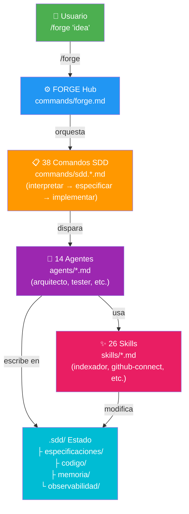
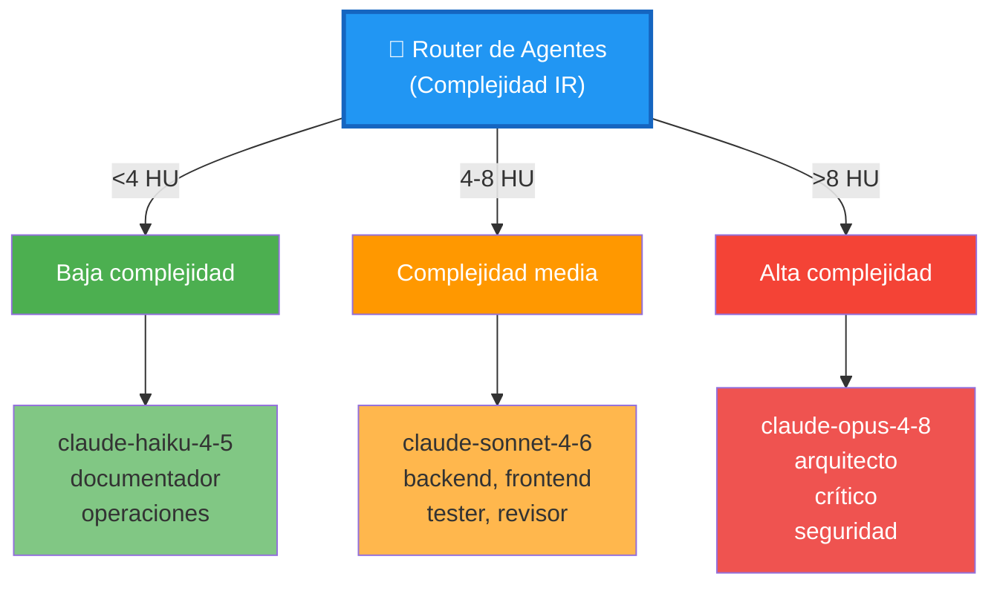
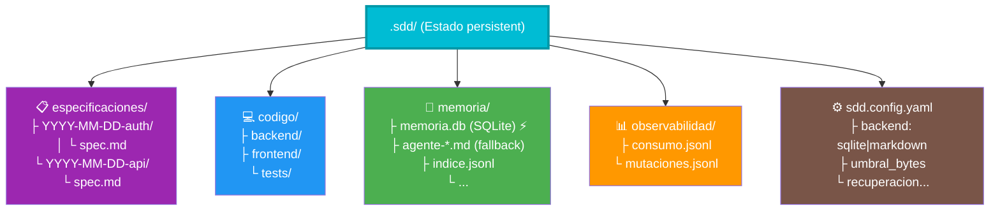

# Plan de Mejora: Diagramas Interactivos en docs-site

**Estado:** Planificación  
**Impacto:** UX/Comprensión visual del sistema  
**Esfuerzo:** 3-4 horas  
**Tecnología:** Mermaid + SVG inline + CSS interactivo

---

## Problemas actuales

### 1. Diagramas ASCII estáticos
- En `ARQUITECTURA.md` se usan cajas ASCII (líneas 3-44)
- No escalables, difíciles de mantener
- No responsivos en móvil
- Difíciles de entender para no-técnicos

### 2. docs-site sin visualización
- `docs-site/` tiene estructura HTML/JS/CSS (SPA)
- `data.js` es 78KB de contenido procesado
- No hay diagramas integrados ni interactivos
- Cargas de página lentas (probablemente sin compresión)

### 3. Flujo de usuarios confuso
Usuarios no entienden:
- Cuándo se activa cada agente
- Qué modelo usa cada uno
- Cómo se comunican entre sí
- Dónde están los datos en `.sdd/`

---

## Solución: Diagrama interactivo Mermaid

### Diagrama 1: Arquitectura del sistema

Convertir este ASCII:
```
┌─────────────────────────────────────────────────────────────────┐
│                        CLAUDE CODE (host)                        │
│  ┌──────────────┐    ┌─────────────────────────────────────┐    │
│  │  Usuario     │───▶│           FORGE Hub (/forge)         │    │
│  │  /forge "…"  │    │         commands/forge.md            │    │
│  └──────────────┘    └──────────────────┬──────────────────┘    │
│                                          │                        │
│                           ┌─────────────▼─────────────┐         │
│                           │     38 Comandos SDD        │         │
│                           │  commands/sdd.*.md         │         │
│                           └─────────────┬─────────────┘         │
```

A este diagrama Mermaid:


### Diagrama 2: Pipeline SDD (flujo de ejecución)


### Diagrama 3: Encaminamiento de agentes (modelo dinámico)



### Diagrama 4: Estructura de `.sdd/` y memoria



---

## Implementación en docs-site

### Paso 1: Añadir Mermaid al HTML

En `docs-site/index.html`:

```html
<script src="https://cdn.jsdelivr.net/npm/mermaid/dist/mermaid.min.js"></script>
<script>
  mermaid.initialize({ startOnLoad: true, theme: 'default' });
  mermaid.contentLoaded();
</script>
```

### Paso 2: Convertir markdown a SVG

En el build (`docs-site/build.js` o similar):

```javascript
import mermaid from 'mermaid';

async function diagramToSVG(diagram) {
  const svg = await mermaid.render('diagram', diagram);
  return svg.data;
}

// Para cada diagrama, generar SVG y incrustarlo
const diagramas = {
  arquitectura: `graph TD
    ... (copiar de arriba) ...`,
  pipeline: `graph LR
    ... (copiar de arriba) ...`,
  // etc.
};

for (const [nombre, definicion] of Object.entries(diagramas)) {
  const svg = await diagramToSVG(definicion);
  // Guardar en assets/diagramas/
}
```

### Paso 3: Añadir interactividad CSS

```css
/* Hover en nodos del diagrama */
.mermaid svg g:hover > g > text {
  font-weight: bold;
  fill: #2196F3;
}

/* Animación suave */
.mermaid svg {
  transition: opacity 0.3s ease-in-out;
}

.mermaid:hover {
  opacity: 0.95;
  box-shadow: 0 4px 12px rgba(0,0,0,0.15);
}
```

### Paso 4: Modal de detalles (opcional)

Al hacer click en un nodo, mostrar detalles:

```javascript
document.querySelectorAll('.mermaid svg g').forEach(node => {
  node.addEventListener('click', () => {
    const titulo = node.querySelector('text')?.textContent;
    showModal(titulo, getDetails(titulo));
  });
});

function getDetails(titulo) {
  const info = {
    'arquitecto': {
      modelo: 'claude-opus-4-8',
      rol: 'Diseño técnico de alto nivel',
      entrada: 'Especificación completa',
      salida: 'Plan + ADR (Architecture Decision Record)'
    },
    // ...
  };
  return info[titulo] || {};
}
```

---

## Mejoras secundarias

### 1. Comprimir data.js

```bash
# Analizar qué hay en data.js
# Probablemente contenido duplicado de markdown

# Soluciones:
# - Minificar + gzip
# - Lazy-load por sección
# - Eliminar duplicados de documentación
```

### 2. Buscador en docs-site

Integrar busca por texto en los diagramas:

```javascript
const buscar = (query) => {
  const resultados = [];
  document.querySelectorAll('.mermaid text').forEach(el => {
    if (el.textContent.includes(query)) {
      resultados.push(el);
      el.parentElement.setAttribute('data-highlight', 'true');
    }
  });
  return resultados;
};
```

### 3. Exportar diagramas

Permitir descargar como PNG/SVG:

```javascript
async function exportarDiagrama(nombre, formato) {
  const svg = document.querySelector(`#${nombre} svg`);
  if (formato === 'svg') {
    download(new XMLSerializer().serializeToString(svg), `${nombre}.svg`);
  } else if (formato === 'png') {
    // Usar canvas para convertir SVG → PNG
    const canvas = document.createElement('canvas');
    // ...
  }
}
```

---

## Estimación de esfuerzo

| Tarea | Horas | Prioridad |
|-------|-------|-----------|
| Crear 4 diagramas Mermaid | 1 | Alta |
| Integrar Mermaid en HTML | 0.5 | Alta |
| CSS + hover effects | 0.5 | Media |
| Modal de detalles (click) | 1 | Media |
| Comprimir data.js | 1 | Baja |
| Buscador en diagramas | 1.5 | Baja |
| Exportar PNG/SVG | 1 | Baja |
| **Total** | **5-6** | — |

**MVP (prioritario):** 4 diagramas + integración = 1.5-2h

---

## Impacto esperado

✅ Usuarios entienden arquitectura a primera vista  
✅ Documentación más amigable (no-técnicos)  
✅ Reducir preguntas de "¿cómo funciona X?"  
✅ Mejor SEO (diagramas son indexables)  
✅ Repositorio más profesional  

---

## Próximos pasos

1. Crear archivos `.mermaid` de los 4 diagramas
2. Integrar CDN de Mermaid en `index.html`
3. Actualizar `ARQUITECTURA.md` para referenciar diagramas
4. Probar en navegador y mobile
5. Opcional: Añadir interactividad
