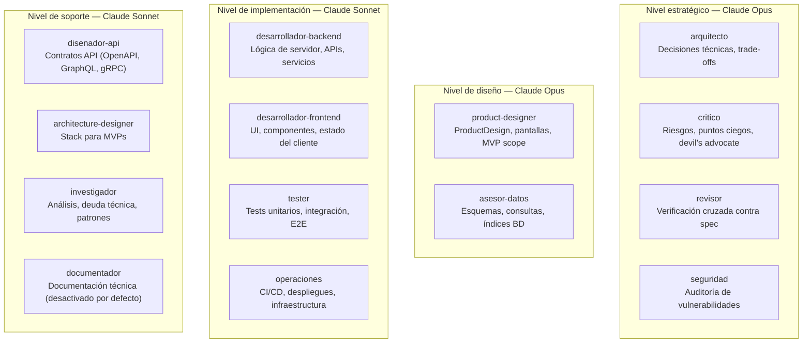

# Agentes

FORGE incluye 14 agentes especializados. Cada agente es un rol con instrucciones de sistema específicas, un modelo asignado y acceso restringido solo a las herramientas que necesita para su función.

---

## Visión general



---

## Tabla de referencia rápida

| Agente | Modelo | Activo | Etapas principales |
|--------|--------|--------|-------------------|
| `arquitecto` | Opus | ✅ | planificar, analizar, implementar |
| `critico` | Opus | ✅ | planificar, analizar |
| `revisor` | Opus | ✅ | verificar, analizar |
| `seguridad` | Opus | ✅ | planificar, verificar, desplegar |
| `product-designer` | Opus | ✅ | diseñar |
| `asesor-datos` | Opus | ✅ | especificar, planificar, implementar |
| `desarrollador-backend` | Sonnet | ✅ | implementar |
| `desarrollador-frontend` | Sonnet | ✅ | implementar |
| `tester` | Sonnet | ✅ | implementar, verificar |
| `operaciones` | Sonnet | ✅ | desplegar, canary |
| `disenador-api` | Sonnet | ✅ | especificar, planificar |
| `architecture-designer` | Sonnet | ✅ | diseñar, planificar |
| `investigador` | Sonnet | ✅ | descubrir, analizar |
| `documentador` | Sonnet | ❌ | snapshot, release |

---

## Perfiles de agentes

---

### arquitecto

**Propósito:** Tomar decisiones técnicas de alto nivel, diseñar estructuras de sistema y evaluar trade-offs arquitectónicos.

**Responsabilidades:**
- Diseñar la arquitectura del sistema antes de la implementación
- Evaluar opciones técnicas con criterios explícitos (mantenibilidad, escala, costo)
- Detectar cuando una decisión técnica contradice la constitución del proyecto
- Generar ADRs para decisiones de alto impacto
- Revisar el plan técnico producido por otros agentes

**Modelo:** Claude Opus
- **Proveedor:** Fijo en Anthropic (no intercambiable con OpenAI o Google)
- **Versión:** Configurable via `sdd.config.yaml`, pero siempre Opus
- **Fallback:** Si Anthropic indisponible, FORGE falla con error claro

**Herramientas:** Read, Write (documentos de arquitectura únicamente)

**Etapas:** `/sdd.planificar`, `/sdd.analizar`, `/sdd.implementar` (revisión de estructura)

**Cuándo NO se invoca:**
- Tareas puramente de implementación de bajo nivel
- Modo `prototipo` (puede omitirse para acelerar)

**Salidas típicas:**
- `plan.md` — decisiones arquitectónicas con justificación
- `.sdd/arquitectura/ADR-*.md` — registros de decisiones
- Sección de arquitectura en `spec.md`

---

### critico

**Propósito:** Actuar como devil's advocate — identificar riesgos, puntos ciegos, suposiciones no declaradas y problemas que el resto del equipo pasó por alto.

**Responsabilidades:**
- Cuestionar cada decisión técnica con preguntas difíciles
- Identificar escenarios de fallo que el plan no contempla
- Señalar deuda técnica implícita
- Evaluar si el alcance del MVP es realista
- Marcar cuando una spec es ambigua o contradictoria

**Modelo:** Claude Opus (proveedor fijo en Anthropic, versión configurable en sdd.config.yaml)

**Herramientas:** Read (solo lectura)

**Etapas:** `/sdd.planificar` (paso de crítica), `/sdd.analizar`

**Cuándo NO se invoca:**
- Modo `rapido` — se omite para acelerar
- Modo `prototipo` — se omite completamente

**Salidas típicas:**
- Lista de riesgos y puntos de atención en el plan
- Preguntas sin responder que deben resolverse antes de implementar

---

### revisor

**Propósito:** Verificación cruzada entre el código implementado y la especificación original. No revisa estilo — revisa correspondencia funcional.

**Responsabilidades:**
- Leer la spec activa y cada criterio de aceptación
- Verificar que el código implementado satisface cada criterio
- Detectar discrepancias entre lo prometido y lo entregado
- Revisar que la constitución fue respetada durante la implementación
- Producir un reporte de verificación claro (pasa/falla por criterio)

**Modelo:** Claude Opus (proveedor fijo en Anthropic, versión configurable en sdd.config.yaml)

**Herramientas:** Read (solo lectura)

**Etapas:** `/sdd.verificar`, `/sdd.analizar`

**Salidas típicas:**
- `.sdd/especificaciones/{id}/verificacion.json` — reporte estructurado
- Lista de discrepancias encontradas con severidad

---

### seguridad

**Propósito:** Auditar el código y las decisiones de diseño desde la perspectiva de seguridad. Detectar vulnerabilidades antes del despliegue.

**Responsabilidades:**
- Revisar código nuevo contra OWASP Top 10
- Detectar inyección SQL, XSS, CSRF, auth deficiente
- Verificar que secrets no están hardcodeados
- Comprobar que la gestión de dependencias es segura
- Revisar configuración de CORS, CSP, headers de seguridad
- Evaluar el modelo de autenticación/autorización

**Modelo:** Claude Opus (proveedor fijo en Anthropic, versión configurable en sdd.config.yaml)

**Herramientas:** Read (solo lectura)

**Etapas:** `/sdd.planificar` (revisión de diseño de seguridad), `/sdd.verificar`, `/sdd.desplegar`

**Cuándo NO se invoca:**
- Modo `prototipo` — se omite explícitamente (advertencia al usuario)

**Salidas típicas:**
- Sección de seguridad en el plan
- Lista de vulnerabilidades encontradas con nivel de riesgo
- Recomendaciones de mitigación

---

### product-designer

**Propósito:** Producir el diseño completo del producto: pantallas, flujo de usuario, dirección visual y alcance del MVP.

**Responsabilidades:**
- Analizar el IR y extraer las pantallas necesarias (P0, P1, P2)
- Definir el flujo de usuario principal
- Elegir una dirección visual entre las 5 disponibles
- Determinar el alcance mínimo viable del MVP
- Producir el artefacto `product-design.json`

**Modelo:** Claude Opus (proveedor fijo en Anthropic, versión configurable en sdd.config.yaml)

**Herramientas:** Read, Write

**Etapas:** `/sdd.diseñar`

**Salidas típicas:**
- `.sdd/product-design.json` — diseño estructurado del producto
- Wireframe HTML de pantalla P0 (vía skill `wireframe-mvp`)

---

### asesor-datos

**Propósito:** Diseñar y optimizar todo lo relacionado con persistencia de datos: esquemas, consultas, índices, migraciones y estrategias de acceso.

**Responsabilidades:**
- Diseñar el esquema de base de datos a partir de la spec
- Proponer índices necesarios para las consultas del sistema
- Escribir las migraciones iniciales
- Revisar consultas para detectar N+1, full table scans, locks
- Recomendar estrategia de acceso a datos (ORM, query builder, SQL directo)

**Modelo:** Claude Opus (proveedor fijo en Anthropic, versión configurable en sdd.config.yaml)

**Herramientas:** Read, Write

**Etapas:** `/sdd.especificar` (modelo de datos), `/sdd.planificar`, `/sdd.implementar` (tareas de BD)

**Salidas típicas:**
- Sección de modelo de datos en la spec
- Archivos de migración
- Queries optimizadas

---

### desarrollador-backend

**Propósito:** Implementar la lógica de negocio del servidor: APIs, servicios, middlewares, autenticación, validación.

**Responsabilidades:**
- Implementar endpoints de API siguiendo el contrato de `disenador-api`
- Escribir lógica de negocio conforme a la spec
- Implementar autenticación y autorización
- Escribir validación de entradas
- Integrar con la capa de datos diseñada por `asesor-datos`
- Asegurar que cada función tiene test correspondiente

**Modelo:** Claude Sonnet (configurable)

**Herramientas:** Read, Write, Edit, Bash (para instalar dependencias aprobadas)

**Etapas:** `/sdd.implementar` (tareas de backend)

---

### desarrollador-frontend

**Propósito:** Implementar la interfaz de usuario: componentes, gestión de estado, integración con API.

**Responsabilidades:**
- Implementar componentes siguiendo el ProductDesign
- Gestionar el estado del cliente
- Consumir la API del backend
- Implementar formularios con validación
- Asegurar accesibilidad básica (WCAG AA para elementos interactivos)
- Escribir tests de componentes

**Modelo:** Claude Sonnet (configurable)

**Herramientas:** Read, Write, Edit, Bash

**Etapas:** `/sdd.implementar` (tareas de frontend)

---

### tester

**Propósito:** Escribir y mantener los tests del proyecto: unitarios, integración y E2E.

**Responsabilidades:**
- Escribir tests unitarios para cada función de negocio
- Escribir tests de integración para endpoints de API
- Configurar y ejecutar tests E2E con Playwright (si está habilitado)
- Verificar que la cobertura alcanza el mínimo configurado
- Detectar y reportar tests que fallan

**Modelo:** Claude Sonnet (configurable)

**Herramientas:** Read, Write, Edit, Bash (para ejecutar tests)

**Etapas:** `/sdd.implementar` (tareas de testing), `/sdd.verificar`

---

### operaciones

**Propósito:** Configurar y ejecutar el ciclo de vida operacional: CI/CD, despliegue, infraestructura, monitoreo post-deploy.

**Responsabilidades:**
- Configurar pipelines de CI (GitHub Actions, etc.)
- Preparar configuraciones de despliegue (Docker, Railway, Vercel)
- Ejecutar el despliegue y verificar el health check
- Configurar monitoreo básico
- Gestionar variables de entorno de producción

**Modelo:** Claude Sonnet (configurable)

**Herramientas:** Read, Write, Edit, Bash

**Etapas:** `/sdd.desplegar`, `/sdd.canary`

---

### disenador-api

**Propósito:** Diseñar los contratos de API antes de la implementación: OpenAPI, GraphQL, gRPC o contratos de eventos.

**Responsabilidades:**
- Diseñar endpoints REST o esquemas GraphQL a partir de la spec
- Definir modelos de request/response
- Especificar códigos de error y sus condiciones
- Documentar autenticación requerida por endpoint
- Producir el contrato de API que `desarrollador-backend` implementará

**Modelo:** Claude Sonnet (configurable)

**Herramientas:** Read, Write

**Etapas:** `/sdd.especificar` (contrato de API), `/sdd.planificar`

---

### architecture-designer

**Propósito:** Recomendar el stack tecnológico completo para el proyecto a partir del ProductDesign y los requisitos.

**Responsabilidades:**
- Recomendar frontend, backend, base de datos y estrategia de despliegue
- Justificar cada elección con criterios concretos
- Estimar la complejidad del proyecto (`low` / `medium` / `high`)
- Identificar riesgos técnicos del stack elegido

**Modelo:** Claude Sonnet (configurable)

**Herramientas:** Read, Write

**Etapas:** `/sdd.diseñar`, `/sdd.planificar`

---

### investigador

**Propósito:** Analizar el estado actual del proyecto para informar decisiones. Lee el código existente sin modificarlo.

**Responsabilidades:**
- Mapear el stack tecnológico actual del proyecto
- Identificar deuda técnica visible
- Detectar patrones de código existentes para mantener consistencia
- Buscar dependencias desactualizadas o vulnerables
- Preparar el contexto inicial para el discovery de una nueva feature

**Modelo:** Claude Sonnet (configurable)

**Herramientas:** Read, Bash (solo lectura: grep, find, ls)

**Etapas:** `/sdd.descubrir`, `/sdd.analizar`

---

### documentador

**Propósito:** Generar y mantener documentación técnica del proyecto.

**Responsabilidades:**
- Actualizar `SNAPSHOT.md` con el estado actual del producto
- Generar documentación de API desde el código
- Escribir guías de onboarding para nuevos desarrolladores
- Mantener el CHANGELOG

**Modelo:** Claude Sonnet (configurable)

**Activo por defecto:** ❌ (desactivado)

Para activar:

```yaml
# .sdd/sdd.config.yaml
agentes:
  documentador:
    activo: true
    modelo: sonnet
```

**Etapas:** `/sdd.snapshot`, `/sdd.release`

---

## Configurar agentes

Todos los agentes se configuran en `.sdd/sdd.config.yaml`:

```yaml
agentes:
  arquitecto:
    activo: true
    modelo: opus       # opus | sonnet | haiku
    descripcion: "Decisiones técnicas de alto nivel"

  desarrollador-backend:
    activo: true
    modelo: sonnet     # puede cambiarse a opus para proyectos críticos

  documentador:
    activo: false      # desactivado por defecto
    modelo: sonnet
```

**Restricciones de configuración:**
- Los agentes `arquitecto`, `critico`, `revisor`, `seguridad`, `asesor-datos` y `product-designer` siempre usan Anthropic como proveedor, independientemente del `modelo` configurado.
- El campo `modelo` para estos agentes solo controla el nivel de calidad dentro de Anthropic (opus/sonnet/haiku).
- Desactivar `critico` o `seguridad` en modo normal no está recomendado — usar el modo `rapido` o `prototipo` como alternativa temporal.

---

## Crear un agente personalizado

Para añadir un agente con un rol que FORGE no cubre:

```
/sdd.crear-agente
```

El comando te guiará por:

1. Nombre del agente
2. Modelo asignado
3. Herramientas permitidas
4. Fase de activación principal
5. Descripción del rol

Crea el archivo `agents/{nombre}.md` y actualiza `.claude-plugin/plugin.json` automáticamente.

→ Ver [Extender FORGE](extending-forge.md) para el formato completo de un agente.
