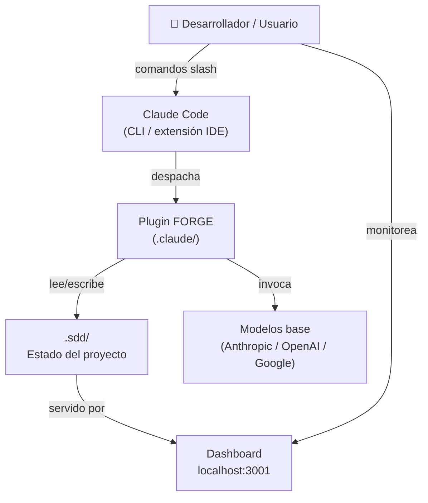
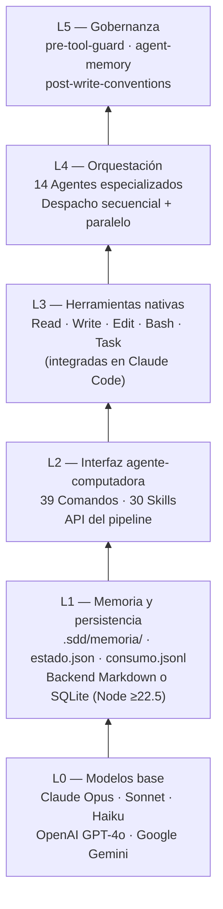
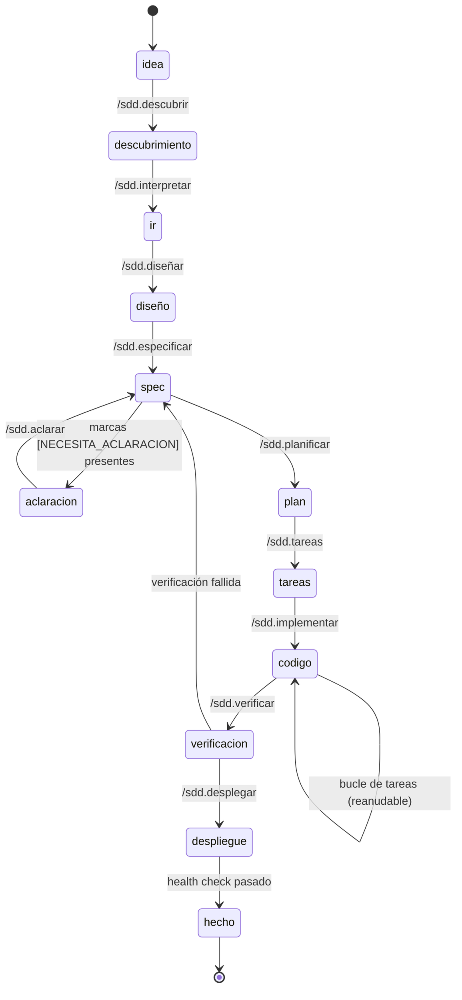
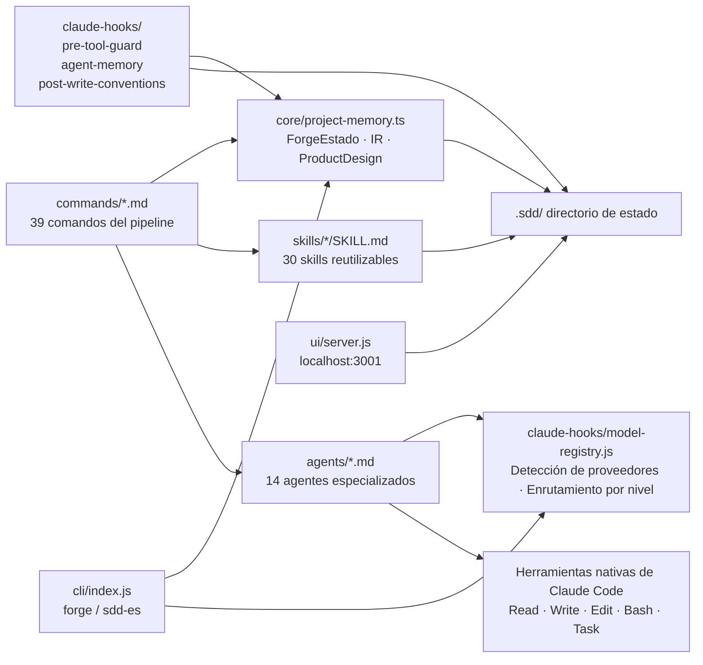
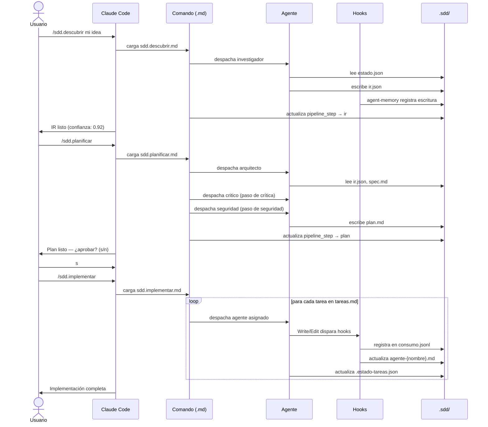
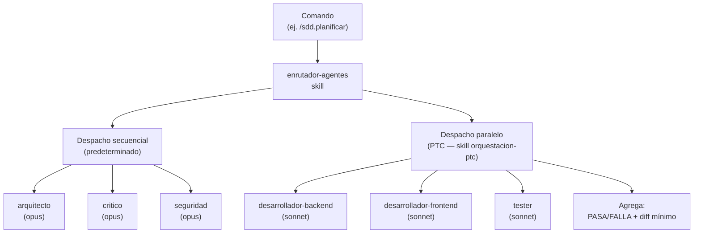
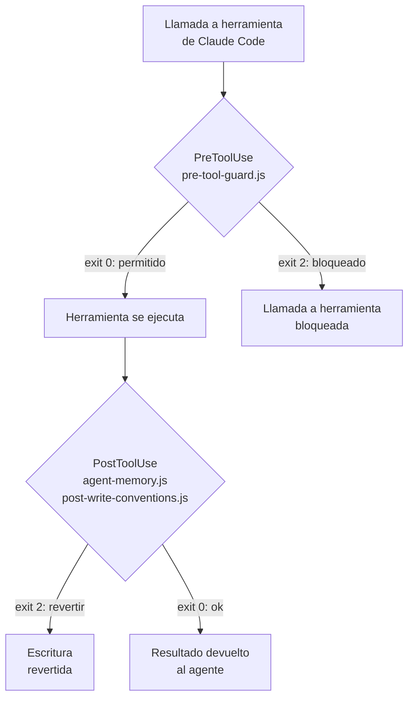
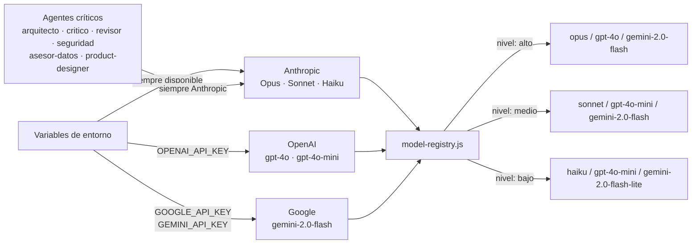
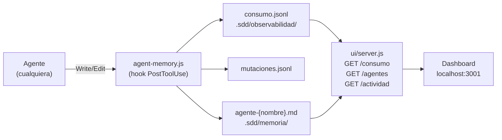

# Arquitectura

Este documento describe el diseño del sistema FORGE: el modelo de seis capas, cómo se relacionan los componentes y cómo fluyen los datos a través del pipeline.

---

## Visión general del sistema

FORGE es un **plugin** — corre dentro de Claude Code, no junto a él. No existe un proceso FORGE separado. El plugin consiste en archivos Markdown (comandos, agentes, skills) y hooks JavaScript que Claude Code carga y ejecuta de forma nativa.

---

## El modelo de seis capas

### L0 — Modelos base

Los modelos de lenguaje subyacentes que ejecutan cada tarea. FORGE es agnóstico de modelo en esta capa: los modelos Anthropic son el predeterminado y siempre están disponibles como respaldo, pero los proveedores OpenAI y Google son compatibles si la clave de API correspondiente está presente en el entorno.

La asignación de modelos es por agente y por nivel de esfuerzo. Los agentes estratégicos (arquitecto, crítico, revisor, seguridad) están fijados a Anthropic y siempre usan Opus. Los agentes de implementación usan Sonnet por defecto pero son configurables por proyecto.

### L1 — Memoria y persistencia

Todo el estado duradero vive en `.sdd/`. Hay dos backends de almacenamiento disponibles:

- **Markdown** (predeterminado) — archivos legibles por humanos, funciona con todas las versiones de Node
- **SQLite** (opcional) — requiere Node ≥22.5, habilita consultas indexadas más rápidas

La capa de memoria almacena: registros de actividad por agente, la máquina de estados del pipeline, artefactos JSON de IR y ProductDesign, documentos de especificación, registros ADR y el ledger de observabilidad.

### L2 — Interfaz Agente-Computadora (ACI)

Los 39 comandos y 30 skills forman la API pública de FORGE. Los comandos son archivos `.md` — prompts estructurados que definen una etapa del pipeline. Las skills son capacidades reutilizables que los comandos invocan. Ambos son Markdown; ninguno es código compilado.

### L3 — Herramientas nativas

Claude Code proporciona los primitivos: `Read`, `Write`, `Edit`, `Bash`, `Task`. FORGE no implementa su propio I/O de archivos ni ejecución de shell — los usa a través de los comandos que emite a los agentes. La herramienta `Task` habilita el despacho paralelo de agentes (Programmatic Tool Calling).

### L4 — Orquestación

Cuando un comando como `/sdd.implementar` se ejecuta, despacha tareas a agentes. Cada agente es un prompt de sistema específico de rol que restringe lo que el modelo puede hacer. Los agentes corren secuencialmente por defecto; `/sdd.analizar` y `/sdd.implementar` pueden despachar múltiples agentes en paralelo vía PTC (Programmatic Tool Calling) cuando la skill `orquestacion-ptc` está activa.

### L5 — Gobernanza

Tres hooks imponen restricciones a nivel de llamada a herramientas de Claude Code:

| Hook | Disparador | Acción |
|------|-----------|--------|
| `pre-tool-guard.js` | PreToolUse (Bash, Write, Edit) | Bloquea comandos destructivos; detecta secrets |
| `agent-memory.js` | PostToolUse (Write, Edit) | Registra cambios en memoria por agente |
| `post-write-conventions.js` | PostToolUse (Write, Edit) | Valida el archivo contra las convenciones del proyecto |

Estos hooks corren fuera del control del agente — el agente no puede eludirlos.

---

## Máquina de estados del pipeline

La etapa actual se almacena en `estado.json → pipeline_step`. Cada transición escribe en disco antes de continuar, haciendo el pipeline reanudable en cualquier punto.

---

## Mapa de dependencias entre componentes

---

## Flujo de datos: pipeline de extremo a extremo

---

## Estructura del directorio `.sdd/`

```mermaid
graph TD
    SDD[".sdd/"]
    SDD --> CFG["sdd.config.yaml\nConfiguración del proyecto"]
    SDD --> EST["estado.json\nMáquina de estados del pipeline"]
    SDD --> MEM["memoria/\nMemoria por agente"]
    SDD --> ESP["especificaciones/\nUn directorio por spec"]
    SDD --> ARC["arquitectura/\nRegistros ADR"]
    SDD --> DOM["dominio/\nglosario.md"]
    SDD --> OBS["observabilidad/\nconsumo.jsonl · mutaciones.jsonl"]
    SDD --> IR["ir.json\nRequisito interpretado"]
    SDD --> PD["product-design.json\nArtefacto ProductDesign"]
    SDD --> SNAP["SNAPSHOT.md\nInstantánea del estado del producto"]

    MEM --> CONST["constitucion.md\nConstitución del proyecto"]
    MEM --> AGM["agente-{nombre}.md\nRegistros por agente"]
    MEM --> IDX["indice.jsonl\nÍndice invertido para consultas"]
    MEM --> DB["memoria.db\n(SQLite, solo Node ≥22.5)"]

    ESP --> SPEC["spec.md\nCriterios de aceptación"]
    ESP --> PLAN["plan.md\nPlan técnico"]
    ESP --> TASKS["tareas.md\nLista de tareas atómicas"]
    ESP --> ETASKS[".estado-tareas.json\nCheckpoint de tareas"]
    ESP --> QA["qa.md\nResultados de QA"]
    ESP --> VER["verificacion.json\nReporte de verificación"]
```

---

## Modelo de despacho de agentes

El despacho paralelo reduce el uso de tokens en ~85% para la sobrecarga de orquestación — los agentes producen solo un resultado pasa/falla y un diff mínimo en lugar de todo el contexto de conversación.

---

## Modelo de ejecución de hooks

Códigos de salida de los hooks:
- `0` — permitir / continuar
- `2` — bloquear / rechazar (la llamada a herramienta no se ejecuta, o la escritura se revierte)

---

## Enrutamiento multi-proveedor de modelos

---

## Arquitectura de observabilidad

---

## Decisiones arquitectónicas clave

### ¿Por qué Markdown para comandos y agentes?

Que los comandos y agentes sean archivos Markdown significa que cualquiera puede editarlos sin escribir JavaScript. Pueden versionarse, compararse y revisarse en un pull request. Son la capa de configuración, no la capa de ejecución.

### ¿Por qué hooks en lugar de instrucciones en el prompt?

Las instrucciones en el prompt ("no borres archivos") pueden ignorarse u olvidarse a medida que el contexto crece. Los hooks se ejecutan a nivel de proceso del sistema operativo — no pueden ser ignorados por el modelo a mitad de una conversación.

### ¿Por qué `.sdd/` en lugar de una base de datos?

Los archivos locales son universalmente accesibles: `cat`, `git diff`, cualquier editor de texto, cualquier pipeline de CI. Una base de datos requeriría un servidor en ejecución y herramientas de migración. `.sdd/` es portable, inspeccionable y versionable.

### ¿Por qué módulos ESM con dependencias mínimas?

FORGE se instala en proyectos que pueden tener cualquier tipo de árbol de dependencias. Dos dependencias pequeñas (`acorn`, `sqlite-wasm`) mantienen `npm install` rápido y eliminan el riesgo de conflictos de versiones. Las APIs nativas de Node (`fs`, `http`, `readline`, `child_process`) son estables y no requieren npm.
