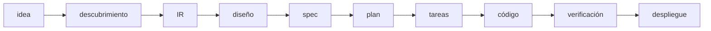

# Conceptos fundamentales

Este documento explica los conceptos centrales de FORGE. Entenderlos te permitirá usar el framework de manera efectiva y razonar sobre su comportamiento.

---

## Índice

1. [Desarrollo Guiado por Especificaciones (SDD)](#desarrollo-guiado-por-especificaciones)
2. [El Requisito Interpretado (IR)](#el-requisito-interpretado-ir)
3. [La Constitución del proyecto](#la-constitución-del-proyecto)
4. [El pipeline de etapas](#el-pipeline-de-etapas)
5. [Estado del pipeline](#estado-del-pipeline)
6. [Memoria de agentes](#memoria-de-agentes)
7. [El sistema de hooks](#el-sistema-de-hooks)
8. [Modos de conducción](#modos-de-conducción)
9. [Programmatic Tool Calling (PTC)](#programmatic-tool-calling-ptc)
10. [Registros de Decisiones Arquitectónicas (ADR)](#registros-de-decisiones-arquitectónicas-adr)

---

## Desarrollo Guiado por Especificaciones

**SDD (Spec-Driven Development)** es la metodología que organiza todo el trabajo en FORGE. Establece que ningún código se escribe sin que exista primero una especificación escrita y aprobada por un humano.

La especificación no es un documento de requisitos informal. Es un artefacto estructurado que contiene:

- **Criterios de aceptación** — condiciones precisas que el sistema debe satisfacer
- **Escenarios de usuario** — flujos concretos descritos desde la perspectiva del usuario
- **Restricciones técnicas** — límites de rendimiento, seguridad, compatibilidad
- **Definición de "hecho"** — qué debe ser verdad para que la feature se considere completada

La razón de esta disciplina es eliminar la ambigüedad antes de la implementación. Un agente que implementa contra una especificación precisa produce código verificable. Un agente que implementa contra instrucciones vagas produce código que parece correcto pero cuyo comportamiento es impredecible.

La etapa de verificación (`/sdd.verificar`) cierra el ciclo: comprueba el código real contra los criterios de aceptación de la especificación original, no contra lo que el agente cree que construyó.

---

## El Requisito Interpretado (IR)

El **IR (Interpreted Requirement)** es la primera transformación estructurada de una idea en lenguaje natural. Lo produce el comando `/sdd.interpretar` y se almacena en `.sdd/ir.json`.

### Estructura del IR

```json
{
  "id": "ir-2026-06-21-abc123",
  "created_at": "2026-06-21T10:00:00Z",
  "raw_input": "quiero un gestor de tareas para equipos",
  "confidence": 0.87,

  "product": {
    "name": "TaskFlow",
    "type": "saas",
    "tagline": "Gestión de tareas colaborativa para equipos",
    "value_proposition": "...",
    "target_users": "Equipos de desarrollo de 5-20 personas"
  },

  "features": {
    "core": ["crear tareas", "asignar a miembros", "notificaciones", "tablero kanban"],
    "nice_to_have": ["integración Slack", "reportes de tiempo"]
  },

  "constraints": {
    "timeline": "MVP en 4 semanas",
    "tech_preference": "Node.js + React"
  },

  "assumptions": ["el usuario tiene acceso a correo corporativo"],
  "ambiguities": [
    { "field": "notificaciones", "question": "¿por correo, push, o ambas?" }
  ],
  "requires_clarification": true
}
```

### La puntuación de confianza

El campo `confidence` (0.0–1.0) indica cuánta información tiene el IR para proceder sin aclaraciones adicionales. El umbral de preparación es `0.7`:

- `≥ 0.7` — el IR está listo; puede proceder al diseño
- `< 0.7` — se recomienda ejecutar `/sdd.aclarar` antes de continuar
- `requires_clarification: true` — hay ambigüedades explícitas que bloquean el avance

El IR es inmutable una vez aprobado. Si los requisitos cambian sustancialmente, se genera un nuevo IR y se crea una nueva rama de especificación.

---

## La Constitución del proyecto

La **constitución** es el documento de principios del proyecto. Se almacena en `.sdd/memoria/constitucion.md` y se establece con el comando `/sdd.constitucion`.

### Qué contiene

- **Stack tecnológico acordado** — lenguajes, frameworks, bibliotecas autorizadas
- **Principios de arquitectura** — patrones que se deben seguir, anti-patrones prohibidos
- **Restricciones de seguridad** — qué no se puede hacer bajo ninguna circunstancia
- **Convenciones de código** — nomenclatura, estructura de archivos, estilo
- **Criterios de calidad** — cobertura mínima de tests, umbrales de rendimiento

### Por qué es una restricción dura

La constitución no es una sugerencia. El hook `post-write-conventions.js` la lee en cada escritura y bloquea archivos que la violan (exit code 2). El agente `critico` la usa como criterio de evaluación. El agente `seguridad` comprueba que ninguna decisión técnica la contradiga.

Esto elimina la deriva arquitectónica — la tendencia de un asistente de IA a elegir soluciones convenientes que contradicen las decisiones tomadas al principio del proyecto.

### Ejemplo

```markdown
# Constitución — TaskFlow

## Stack
- Backend: Node.js 20 + Fastify + TypeScript
- Base de datos: PostgreSQL 16 (sin ORMs — SQL directo vía pg)
- Frontend: React 19 + Vite + TailwindCSS
- Tests: Vitest + Testing Library
- Deploy: Railway (contenedores Docker)

## Principios
- Sin dependencias no aprobadas explícitamente en esta constitución
- Toda función de negocio debe tener test de integración
- Sin secrets en código fuente bajo ninguna circunstancia
- Autenticación: JWT firmado con RS256, tokens de 15 minutos

## Prohibido
- `eval()`, `Function()`, `exec()` en código de aplicación
- Consultas SQL construidas por concatenación de strings
- `console.log` en producción (usar logger estructurado)
```

---

## El pipeline de etapas

El **pipeline** es la secuencia ordenada de transformaciones que llevan una idea a un producto desplegado. Cada etapa tiene:

- Un comando que la activa
- Entradas que lee de `.sdd/`
- Una salida que escribe en `.sdd/`
- Un checkpoint que permite reanudar desde esa etapa



### Por qué el orden importa

Cada etapa reduce la ambigüedad de la anterior. El IR convierte la idea vaga en estructura. El diseño convierte el IR en pantallas y stack concretos. La spec convierte el diseño en criterios de aceptación verificables. El plan convierte la spec en decisiones técnicas. Las tareas convierten el plan en trabajo atómico asignable.

Saltar etapas aumenta la probabilidad de que la implementación final no resuelva el problema original. FORGE permite saltarse etapas explícitamente (si ya tienes una spec, puedes empezar en `/sdd.planificar`) pero registra que se saltaron.

---

## Estado del pipeline

El **estado del pipeline** es la fuente de verdad sobre dónde está el proyecto. Se almacena en `.sdd/estado.json`.

### Campos principales

```typescript
interface ForgeEstado {
  schemaVersion: "1.0";
  pipeline_step: 'idea' | 'discovery' | 'ir' | 'design' | 'spec' |
                 'plan' | 'tasks' | 'code' | 'done';
  spec_activa?: string;           // ruta a la spec en curso
  plan_activo?: string;           // ruta al plan en curso
  ir_generado?: boolean;
  ir_path?: string;
  product_design_generado?: boolean;
  product_design_aprobado?: boolean;
  design_direction?: string;
  ultima_actualizacion?: string;

  artefactos_sesion?: {
    ir_confidence?: number;
    stack_decidido?: string;
    complejidad_estimada?: 'low' | 'medium' | 'high';
    agentes_activos_ultimo_plan?: string[];
  };
}
```

### Checkpoints de tareas

Dentro de cada spec activa, `.sdd/especificaciones/{id}/.estado-tareas.json` registra el estado de cada tarea individual:

```json
{
  "tareas": [
    { "id": "T-001", "titulo": "Crear schema BD", "estado": "completada", "agente": "asesor-datos" },
    { "id": "T-002", "titulo": "Implementar auth JWT", "estado": "en_progreso", "agente": "desarrollador-backend" },
    { "id": "T-003", "titulo": "Tests de integración", "estado": "pendiente", "agente": "tester" }
  ]
}
```

Este archivo es el mecanismo de reanudación. Cuando ejecutas `/sdd.implementar continuar`, FORGE lee este archivo, encuentra la primera tarea con estado `en_progreso` o `pendiente`, y la despacha al agente asignado.

---

## Memoria de agentes

La **memoria de agentes** es el mecanismo por el que el sistema recuerda qué hizo cada agente entre sesiones. Se gestiona automáticamente por el hook `agent-memory.js`.

### Cómo funciona

Cada vez que un agente escribe o edita un archivo, el hook PostToolUse:

1. Identifica el agente por la variable de entorno `CLAUDE_AGENT_NAME`
2. Añade una entrada al archivo `.sdd/memoria/agente-{nombre}.md`
3. Actualiza el índice invertido `.sdd/memoria/indice.jsonl`
4. Registra la entrada en el ledger `.sdd/observabilidad/consumo.jsonl`
5. Si el archivo supera `umbral_bytes`, invoca el compactador de memoria

### Estructura del archivo de memoria

```markdown
# Memoria — arquitecto

## 2026-06-21T10:15:00Z
**Archivo:** src/auth/jwt.service.ts
**Acción:** Creó implementación de JWT con RS256
**Contexto:** Spec T-002 requería autenticación stateless

## 2026-06-21T10:32:00Z
**Archivo:** src/config/database.ts
**Acción:** Configuró pool de conexiones PostgreSQL
**Decisión:** Pool máximo de 20 conexiones (ver ADR-003)
```

### Backend SQLite (Node ≥22.5)

Cuando se detecta Node ≥22.5, el hook puede usar SQLite como backend de memoria. Esto habilita consultas más rápidas y búsqueda semántica sobre el historial de agentes. La migración de Markdown a SQLite no es automática — requiere configuración explícita (`memoria.backend: sqlite`).

### Compactación automática

Cuando un archivo de memoria supera `memoria.umbral_bytes` (predeterminado: 50.000 bytes), la skill `memory-compactor` condensa las entradas antiguas en un resumen, preservando las entradas recientes intactas. Esto evita que los archivos de memoria crezcan indefinidamente.

---

## El sistema de hooks

Los **hooks** son scripts JavaScript que Claude Code ejecuta automáticamente antes (PreToolUse) o después (PostToolUse) de cada llamada a herramienta.

FORGE registra tres hooks en `.claude/settings.json`:

### pre-tool-guard.js (PreToolUse)

Se ejecuta antes de `Bash`, `Write`, `Edit`, `MultiEdit`. Bloquea:

**Comandos destructivos del sistema:**
- `rm -rf /`, `rm -rf ~`, `rm -rf .`
- `git push --force` a ramas protegidas
- `DROP DATABASE`, `DROP TABLE` (sin flag explícito)
- `chmod 777` y `chmod -R 777`

**Secrets hardcodeados** (8 patrones):
- API keys (`sk-`, `pk-`, claves de 32+ caracteres)
- Contraseñas en código fuente
- Tokens de acceso

**Restricciones por agente:**
- Agentes marcados como `read-only` en la constitución no pueden escribir archivos

**Edit sobre archivo inexistente:**
- Bloquea `Edit`/`MultiEdit` sobre rutas que no existen (sugiere usar `Write` en su lugar)

### agent-memory.js (PostToolUse)

Se ejecuta después de `Write`, `Edit`, `MultiEdit`. Registra la actividad del agente y actualiza todos los índices de memoria.

### post-write-conventions.js (PostToolUse)

Se ejecuta después de `Write`, `Edit`. Lee dinámicamente la constitución y detecta convenciones del proyecto existente (nomenclatura, indentación, uso de semicolons, etc.), luego valida el archivo recién escrito contra ellas.

---

## Modos de conducción

FORGE tiene dos modos que cambian cómo se presenta la información y cuánto se detiene el pipeline para aprobación humana.

### Modo `guiado`

Para usuarios no técnicos o proyectos que requieren supervisión estrecha:

- El pipeline pausa para aprobación humana en cada etapa mayor
- Los mensajes usan lenguaje llano, sin jerga técnica
- Las opciones se presentan como selecciones simples, no como configuración YAML
- Los errores se explican con causas y pasos de resolución, no con stack traces

Activar: `perfil: guiado` en `sdd.config.yaml`, o `npx forge-sdd init --guided`.

### Modo `experto`

Para desarrolladores que quieren control total y velocidad:

- El pipeline avanza sin pausas de confirmación (excepto despliegues)
- Los mensajes incluyen detalle técnico completo
- Los comandos aceptan flags avanzados
- Los errores exponen el contexto completo

Activar: `perfil: experto` en `sdd.config.yaml`.

### Modo de sesión

Independientemente del perfil, cada sesión puede estar en uno de tres modos:

| Modo | Qué omite | Cuándo usar |
|------|-----------|-------------|
| `normal` | Nada | Trabajo de producción |
| `rapido` | Agente `critico`, algunas verificaciones | Iteraciones internas rápidas |
| `prototipo` | `critico`, `seguridad`, generación de ADR | Exploración y pruebas de concepto |

Cambiar el modo de sesión: `/sdd.modo rapido` o editar `sesion.modo` en `sdd.config.yaml`.

---

## Programmatic Tool Calling (PTC)

**PTC (Programmatic Tool Calling)** es el mecanismo de despacho paralelo de agentes. Usa la herramienta `Task` nativa de Claude Code para ejecutar múltiples agentes simultáneamente.

### Sin PTC (despacho secuencial)

```
orquestador → arquitecto → [espera] → critico → [espera] → seguridad → [espera] → resultado
```

Cada agente produce una respuesta completa. El orquestador lee esa respuesta, la procesa y despacha el siguiente agente. El costo en tokens es lineal con el número de agentes.

### Con PTC (despacho paralelo)

```
orquestador → [backend, frontend, tester en paralelo] → agrega: PASA/FALLA + diff mínimo → resultado
```

Los agentes producen solo un resultado compacto (pasa/falla + diff mínimo). El orquestador agrega los resultados sin leer las conversaciones completas. Reducción de tokens de orquestación: ~85%.

PTC está disponible cuando la skill `orquestacion-ptc` está activa. `/sdd.implementar` y `/sdd.analizar` pueden usarla automáticamente cuando la complejidad de la tarea lo justifica.

---

## Registros de Decisiones Arquitectónicas (ADR)

Los **ADR (Architectural Decision Records)** son documentos cortos que registran por qué se tomó una decisión técnica significativa, qué alternativas se consideraron y cuáles son las consecuencias.

FORGE genera ADRs automáticamente cuando:

- El agente `arquitecto` toma una decisión de diseño significativa
- Un comentario en el código tiene el formato `// ADR: {...}` (el hook `agent-memory.js` lo extrae)
- El comando `/sdd.adr` se invoca explícitamente

Los ADRs se almacenan en `.sdd/arquitectura/ADR-{numero}-{slug}.md`.

### Formato de un ADR

```markdown
# ADR-003 — Pool de conexiones máximo 20

**Estado:** Aceptado
**Fecha:** 2026-06-21
**Agente:** arquitecto

## Contexto
El backend necesita manejar hasta 100 peticiones concurrentes con latencia < 100ms.

## Decisión
Configurar `pg` con pool máximo de 20 conexiones a PostgreSQL.

## Alternativas consideradas
- Pool de 50: excede los límites del plan Railway Starter (25 conexiones)
- Sin pool: latencia de 800ms+ por overhead de nueva conexión

## Consecuencias
- Máximo 20 consultas BD simultáneas
- Si se supera, las peticiones hacen cola (timeout: 5s)
- Necesario monitorear `pool.waitingCount` en producción
```

En modo `prototipo`, la generación de ADRs está desactivada. En modo `rapido`, solo se generan para decisiones marcadas como de alto impacto.
