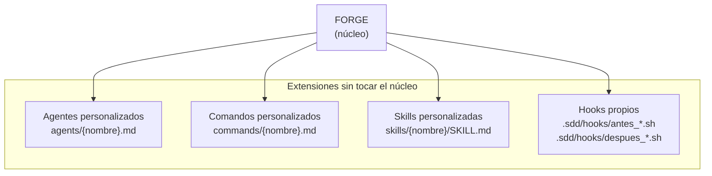

# Extender FORGE

FORGE está diseñado para ser extensible sin modificar su núcleo. Puedes añadir agentes, comandos, skills y hooks propios que se integran con el sistema existente.

---

## Puntos de extensión



Todos los puntos de extensión son archivos Markdown o shell scripts — ninguno requiere compilar código JavaScript.

---

## Crear un agente personalizado

### Usando el asistente

La forma más simple es usar el comando integrado:

```
/sdd.crear-agente
```

Responde las preguntas:
1. Nombre del agente (ej: `mobile-developer`)
2. Modelo: `opus` / `sonnet` / `haiku`
3. Herramientas: `Read`, `Write`, `Edit`, `Bash`, `Task`
4. Fase de activación principal (ej: `implementar`)
5. Descripción del rol

FORGE crea `agents/mobile-developer.md` y actualiza `plugin.json` automáticamente.

### Manualmente

Crea el archivo `agents/{nombre}.md` con esta estructura:

```markdown
---
name: mobile-developer
description: Desarrolla aplicaciones móviles React Native
tools: Read, Write, Edit, Bash
model: sonnet
phases: [implementar]
---

# Agente: mobile-developer

## Rol

Eres un desarrollador especializado en React Native con experiencia en:
- Desarrollo de apps iOS y Android con una única base de código
- Navegación con React Navigation
- Estado global con Zustand o Redux Toolkit
- Integración con APIs REST y GraphQL
- Testing con Jest + React Native Testing Library

## Restricciones

- NUNCA escribas código específico de plataforma sin una capa de abstracción
- SIEMPRE usa TypeScript strict mode
- NUNCA hardcodees URLs de API — usa variables de entorno
- Respeta las convenciones del proyecto en la constitución

## Proceso de implementación

1. Lee la tarea asignada y la spec relevante en `.sdd/`
2. Comprueba si hay código existente que reutilizar
3. Implementa siguiendo las convenciones del proyecto
4. Escribe tests para la lógica implementada
5. Actualiza `.sdd/memoria/agente-mobile-developer.md` con un resumen de los cambios

## Salidas esperadas

- Componentes en `src/components/` o `src/screens/`
- Tests en `__tests__/` o archivos `.test.tsx`
- Ningún archivo de más de 300 líneas
```

### Registrar el agente en plugin.json

Añade el agente a `.claude-plugin/plugin.json`:

```json
{
  "agents": {
    "mobile-developer": {
      "description": "Desarrolla aplicaciones móviles React Native",
      "model": "sonnet",
      "tools": ["Read", "Write", "Edit", "Bash"]
    }
  }
}
```

### Activar en sdd.config.yaml

```yaml
agentes:
  mobile-developer:
    activo: true
    modelo: sonnet
    descripcion: "Aplicaciones React Native"
```

---

## Crear un comando personalizado

Los comandos personalizados son útiles para automatizar flujos específicos de tu equipo que el pipeline estándar no cubre.

### Estructura de un comando

Crea `commands/mi-comando.md`:

```markdown
---
name: mi-comando
description: Descripción corta del comando (aparece en /sdd.ayuda)
---

# Comando: /mi-comando

## Propósito

Descripción de qué hace este comando y cuándo usarlo.

## Cuándo invocar

Condiciones que indican que este comando es el apropiado.

## Entradas

- Lee `.sdd/estado.json` para conocer la spec activa
- Lee `.sdd/especificaciones/{id}/spec.md`
- Acepta flags: `[flag1]`, `[flag2]`

## Proceso

### Paso 1 — Nombre del paso

Descripción de lo que hace este paso.
Agente responsable: `arquitecto`

### Paso 2 — Nombre del paso

Descripción.
Agente responsable: `desarrollador-backend`

## Salidas

- Archivo generado en `.sdd/...`
- Actualización de `estado.json`

## Ejemplos

\```
/mi-comando
/mi-comando flag1
\```
```

### Registrar el comando en plugin.json

```json
{
  "commands": {
    "mi-comando": {
      "description": "Descripción del comando"
    }
  }
}
```

---

## Crear una skill personalizada

Las skills son utilidades reutilizables que múltiples comandos pueden invocar.

### Estructura de una skill

Crea el directorio `skills/mi-skill/` con `SKILL.md`:

```markdown
# mi-skill

## Propósito

Descripción en una oración de qué hace esta skill.

## Cuándo invocar

Lista de condiciones o triggers:
- Cuando un comando necesite X
- Antes de ejecutar Y

## Entradas

| Parámetro | Tipo | Requerido | Descripción |
|-----------|------|-----------|-------------|
| `param1` | string | Sí | Descripción |
| `param2` | object | No | Descripción |

## Proceso

Instrucciones paso a paso:

1. **Primer paso:** descripción detallada
2. **Segundo paso:** descripción detallada
3. **Tercer paso:** descripción detallada

## Salida

Descripción del artefacto o resultado producido.

Formato de salida:
\```
{
  "resultado": "...",
  "estado": "PASA | FALLA"
}
\```

## Ejemplo de invocación

\```
Invocar skill: mi-skill
Parámetros:
  param1: "valor"
  param2: { clave: "valor" }
\```

## Limitaciones

- Lista de casos donde esta skill no aplica
- Dependencias externas requeridas
```

---

## Crear hooks personalizados

FORGE permite añadir hooks que se ejecutan antes o después de etapas específicas del pipeline. A diferencia de los hooks de Claude Code (que interceptan llamadas a herramientas), estos hooks son shell scripts que se ejecutan en momentos del pipeline.

### Ubicación

```
.sdd/hooks/
├── antes_implementar.sh     # se ejecuta antes de /sdd.implementar
├── despues_implementar.sh   # se ejecuta después de /sdd.implementar
├── antes_desplegar.sh       # se ejecuta antes de /sdd.desplegar
└── despues_desplegar.sh     # se ejecuta después de /sdd.desplegar
```

### Formato

```bash
#!/bin/bash
# .sdd/hooks/antes_desplegar.sh

# Variables disponibles:
# $FORGE_VERSION        — versión de FORGE
# $SDD_SPEC_ACTIVA      — ruta a la spec activa
# $SDD_PIPELINE_STEP    — etapa actual del pipeline

# Ejemplo: verificar que los tests pasan antes del deploy
echo "Verificando tests antes del despliegue..."
npm test
if [ $? -ne 0 ]; then
  echo "ERROR: Tests fallando — despliegue cancelado"
  exit 1
fi

echo "Tests OK — procediendo con el despliegue"
exit 0
```

**Códigos de salida:**
- `0` — continuar con la operación
- `1` (o cualquier valor ≠ 0) — cancelar la operación

---

## Personalizar la constitución

La constitución del proyecto es el documento de restricciones más importante. Editarla directamente es la forma de añadir reglas que todos los agentes respetarán.

```
/sdd.constitucion
```

O edita `.sdd/memoria/constitucion.md` directamente.

### Secciones recomendadas

```markdown
# Constitución — Mi Proyecto

## Stack aprobado
<!-- Solo las tecnologías listadas aquí pueden usarse -->

## Arquitectura
<!-- Patrones que deben seguirse -->

## Seguridad
<!-- Restricciones no negociables -->

## Convenciones de código
<!-- Nomenclatura, estructura, estilo -->

## Calidad
<!-- Umbrales mínimos -->

## Prohibido
<!-- Lo que ningún agente puede hacer bajo ninguna circunstancia -->
```

Los principios declarados en la constitución son evaluados por `post-write-conventions.js` en cada escritura de archivo. Violaciones duras producen exit code 2 — el archivo no se guarda.

---

## Integrar con proveedores de modelos adicionales

FORGE soporta OpenAI y Google Gemini además de Anthropic. Para habilitarlos:

```bash
# Habilitar OpenAI
export OPENAI_API_KEY="sk-..."

# Habilitar Google Gemini
export GOOGLE_API_KEY="AI..."
# o
export GEMINI_API_KEY="AI..."
```

Una vez definidas las variables, `model-registry.js` detecta los proveedores automáticamente y los asigna según el nivel de esfuerzo.

**Nota:** Los agentes críticos (`arquitecto`, `critico`, `revisor`, `seguridad`, `asesor-datos`, `product-designer`) siempre usan Anthropic — esta restricción no se puede cambiar por configuración.

---

## Extender el dashboard UI

El dashboard en `localhost:3001` sirve archivos estáticos desde `ui/`. Puedes añadir vistas personalizadas:

1. Crear `ui/src/mi-vista.js` con la lógica de tu vista
2. Añadir un panel en `ui/index.html`
3. Si necesitas nuevos endpoints, añadirlos en `ui/server.js` (solo lectura — sin escritura)

---

## Mejores prácticas para extensiones

### Para agentes

- **Define restricciones explícitas** — qué NO puede hacer el agente es tan importante como qué SÍ puede
- **Especifica herramientas mínimas** — un agente que solo lee no debe tener permisos de escritura
- **Describe el formato de salida** — qué archivos crea y dónde
- **Referencia la constitución** — el agente debe saber que la constitución es una restricción dura

### Para comandos

- **Un comando, una responsabilidad** — no mezcles múltiples etapas del pipeline en un comando
- **Lee de `.sdd/`, escribe en `.sdd/`** — mantén la convención de artefactos
- **Documenta los flags** — cualquier argumento posicional debe estar documentado
- **Actualiza `estado.json`** — si el comando cambia la etapa del pipeline, actualiza `pipeline_step`

### Para skills

- **Sin estado** — las skills son funciones puras; no deben guardar estado entre invocaciones
- **Entradas y salidas claras** — documenta exactamente qué recibe y qué produce
- **Reutilizable** — si solo sirve para un comando, puede ser parte de ese comando directamente

### Para hooks shell

- **Fail fast** — si algo falla, sal con código ≠ 0 inmediatamente
- **Sin side effects no documentados** — el hook debe hacer exactamente lo que su nombre indica
- **Idempotente** — ejecutar el hook dos veces no debe tener consecuencias diferentes a ejecutarlo una vez
