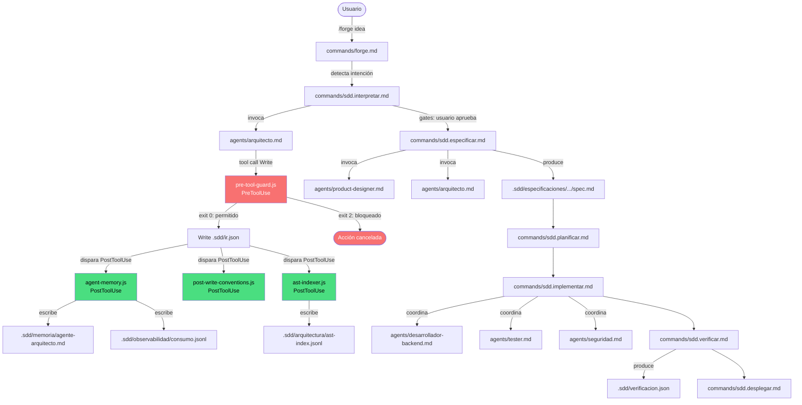
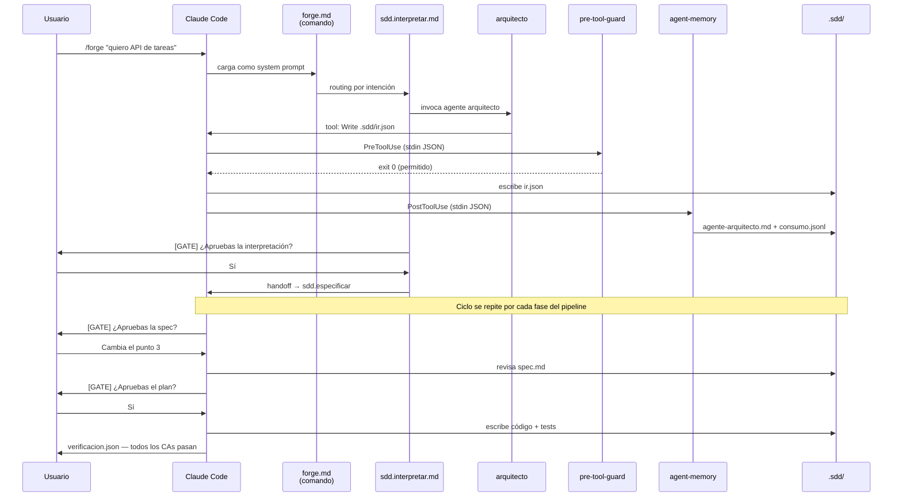

# FORGE — Arquitectura Técnica

> Versión del sistema: **v4.0.0** (package.json / plugin.json) — submódulo apunta a v5.0.0 | Basado en análisis estático del repositorio | Sin contenido inventado

---

## 1. SYSTEM OVERVIEW

### Qué es FORGE

FORGE es un **plugin de Claude Code** que implementa un pipeline de Spec-Driven Development (SDD) + Test-Driven Development (TDD). Opera exclusivamente dentro del runtime de Claude Code (Anthropic). No es una aplicación standalone ni un SDK importable.

### Tipo de sistema

| Dimensión | Valor |
|---|---|
| Categoría | Plugin de Claude Code / framework SDD+TDD |
| Interfaz de usuario | Slash commands dentro de Claude Code (`/forge`, `/sdd.*`) |
| Runtime host | Claude Code CLI — sin él, el sistema no ejecuta |
| Distribución | npm binary (`npx forge init`) |
| Binario CLI | `cli/index.js` (Node.js ESM, zero-deps) |
| Hooks de integración | PreToolUse / PostToolUse (API de Claude Code) |
| Almacenamiento de estado | Sistema de archivos local (`.sdd/`) |
| Dependencias en runtime | `@sqlite.org/sqlite-wasm` (opcional), `acorn` (indexación AST) |

### Objetivo funcional

Orquestar un equipo de 14 agentes de IA especializados que transformen una idea en texto libre en software verificado: especificado, planificado, implementado y testeado.

### Alcance real (v5.0.0)

- **Funciona:** pipeline completo idea → spec → plan → código → verificación
- **Funciona:** guardrails en tiempo real (PreToolUse hook)
- **Funciona:** memoria persistente por agente (Markdown, SQLite opcional)
- **Funciona:** observabilidad completa (`consumo.jsonl`, dashboard local)
- **Funciona:** templates de inicio rápido (api-rest, cli-tool, saas-mvp)
- **Parcial:** despliegue (requiere MCP externo instalado)
- **Observabilidad, no routing real:** model-registry.js registra provider en consumo.jsonl pero no cambia el modelo que invoca Claude Code

---

## 2. PROJECT STRUCTURE

```
FORGE/
├── cli/
│   └── index.js                  ← Entrypoint CLI (forge init, doctor, update, config, ui)
│
├── claude-hooks/                 ← Hooks que ejecuta Claude Code en cada tool call
│   ├── pre-tool-guard.js         ← PreToolUse: bloquea operaciones destructivas
│   ├── agent-memory.js           ← PostToolUse: memoria persistente + ledger consumo
│   ├── post-write-conventions.js ← PostToolUse: valida convenciones del proyecto
│   ├── ast-indexer.js            ← PostToolUse: indexa AST de archivos JS/TS modificados
│   ├── ast-query.js              ← Librería: consulta índice AST (usado por agent-memory)
│   ├── model-registry.js         ← Librería: resolución de provider/modelo por agente
│   └── query-memory.js           ← Librería: consulta índice de memoria de agentes
│
├── core/                         ← Contratos TypeScript (type-check, no compilados en runtime)
│   ├── ir.types.ts               ← Interfaces IR, ProductDesign, Ambiguity, Screen, UIElement
│   ├── project-memory.ts         ← Clase ProjectMemory + ForgeEstado interface
│   ├── ir-to-spec-mapper.ts      ← Mapper IR → secciones de spec (TypeScript)
│   └── ir-to-spec-mapper.js      ← Mismo mapper en JavaScript (usado en runtime)
│
├── commands/                     ← 39 archivos .md — instrucciones de sistema por fase
│   ├── forge.md                  ← Hub principal: routing de lenguaje natural → SDD
│   ├── sdd.md                    ← Hub técnico
│   ├── sdd.interpretar.md        ← Fase 1: idea → IR
│   ├── sdd.descubrir.md          ← Fase 0: discovery contextual
│   ├── sdd.diseñar.md            ← Fase 2: diseño de producto (wireframes, user flow)
│   ├── sdd.especificar.md        ← Fase 3: IR → spec ejecutable
│   ├── sdd.planificar.md         ← Fase 4: spec → plan de tareas
│   ├── sdd.tareas.md             ← Gestión de tareas del plan
│   ├── sdd.implementar.md        ← Fase 5: código + TDD
│   ├── sdd.qa.md                 ← Fase 6: testing
│   ├── sdd.verificar.md          ← Fase 7: verificación contra spec
│   ├── sdd.desplegar.md          ← Fase 8: despliegue
│   └── [27 comandos de soporte]  ← estado, snapshot, optimizar, analizar, etc.
│
├── agents/                       ← 14 archivos .md — definición de agentes (system prompt)
│   ├── arquitecto.md             ← Opus: decisiones técnicas, ADRs
│   ├── product-designer.md       ← Opus: UX, pantallas, MVP scope
│   ├── critico.md                ← Opus: riesgos, deuda técnica
│   ├── seguridad.md              ← Opus: vulnerabilidades
│   ├── asesor-datos.md           ← Opus: bases de datos, esquemas
│   ├── revisor.md                ← Opus: code review
│   ├── desarrollador-backend.md  ← Sonnet: implementación servidor
│   ├── desarrollador-frontend.md ← Sonnet: implementación UI
│   ├── tester.md                 ← Sonnet: tests TDD
│   ├── operaciones.md            ← Sonnet: CI/CD, infraestructura
│   ├── disenador-api.md          ← Sonnet: contratos OpenAPI/GraphQL/gRPC
│   ├── investigador.md           ← Sonnet: análisis de contexto
│   ├── architecture-designer.md  ← Sonnet: selección de stack
│   └── documentador.md           ← Sonnet: documentación técnica
│
├── skills/                       ← 29 directorios con SKILL.md — capacidades especiales
│   ├── explicame/                ← Explica pipeline en lenguaje humano
│   ├── deploy-vercel/            ← Deploy via MCP Vercel
│   ├── github-connect/           ← Integración GitHub via MCP
│   ├── vercel-deploy/            ← Deploy Vercel (duplicado funcional)
│   ├── modo-guiado/              ← Modo guiado para no-developers
│   ├── effort-router/            ← Routing por complejidad
│   ├── wireframe-mvp/            ← Generación de wireframes HTML
│   ├── share-progress/           ← Exportar progreso
│   ├── compresion-tokens/        ← Reducción de tokens
│   └── [20 skills adicionales]
│
├── design-systems/               ← 5 sistemas de diseño (usados por product-designer + wireframe-mvp)
│   ├── bold-brutalist/DESIGN.md
│   ├── editorial-minimal/DESIGN.md
│   ├── neutral-modern/DESIGN.md  ← Default en ProjectMemory.getActiveDesignSystem()
│   ├── vibrant-consumer/DESIGN.md
│   └── warm-editorial/DESIGN.md
│
├── presets/                      ← Configuraciones y templates de inicio rápido
│   ├── lean.yaml                 ← Configuración mínima
│   ├── startup.yaml              ← Configuración balanceada
│   ├── enterprise.yaml           ← Máxima robustez
│   └── templates/
│       ├── api-rest/             ← IR pre-generado (confidence 0.85) + spec + config
│       ├── cli-tool/             ← IR pre-generado (confidence 0.85) + spec + config
│       └── saas-mvp/             ← IR pre-generado (confidence 0.85) + spec + config
│
├── plantillas/                   ← 14 templates Markdown para artefactos (.sdd/)
│   ├── especificacion.md
│   ├── plan.md
│   ├── constitucion.md
│   └── [11 más]
│
├── craft/                        ← Standards de calidad de diseño (4 archivos)
│   ├── anti-ai-slop.md           ← Guía anti-mediocridad
│   ├── accessibility-baseline.md ← A11y mínimo WCAG AA
│   ├── color.md
│   └── typography.md
│
├── ui/                           ← Dashboard web local
│   ├── server.js                 ← HTTP server Node.js (6 endpoints, solo loopback)
│   ├── index.html                ← SPA del dashboard
│   └── assets/
│
├── tests/                        ← 13 archivos de test (node:test, sin Jest)
│   └── fixtures/                 ← ir.json y estado.json de prueba
│
├── docs/                         ← 29 archivos .md de documentación
├── docs-site/                    ← SPA de documentación (bilingual ES/EN)
├── mcp-figma/                    ← Integración MCP Figma (JS + package.json propio)
│
├── .claude-plugin/
│   ├── plugin.json               ← Manifiesto del plugin (38 commands, 14 agents, 29 skills)
│   └── .claude/settings.json    ← Registro de hooks en Claude Code
│
├── configuracion-ejemplo/        ← Ejemplo de configuración completa para el usuario
│   ├── forge.config.json         ← Guardrails y routing avanzado (memoria, routing, guardrails, ignore_patterns)
│   └── hooks-ejemplo/            ← Hooks de usuario (bash scripts)
│
├── package.json                  ← name: forge-sdd, version: 4.0.0, bin: forge + sdd-es
├── cli/index.js                  ← ~1,210 líneas, zero-deps
├── instalar.sh / instalar.ps1    ← Scripts alternativos de instalación
└── README.md
```

**Entrypoints del sistema:**

| Entrypoint | Propósito |
|---|---|
| `cli/index.js` | CLI de usuario (`forge init`, `forge doctor`, etc.) |
| `claude-hooks/pre-tool-guard.js` | Invocado por Claude Code en PreToolUse |
| `claude-hooks/agent-memory.js` | Invocado por Claude Code en PostToolUse(Write\|Edit) |
| `claude-hooks/post-write-conventions.js` | Invocado por Claude Code en PostToolUse(Write\|Edit) |
| `commands/forge.md` | Leído por Claude Code como instrucción de sistema al escribir `/forge` |
| `ui/server.js` | Lanzado por `forge ui` (proceso independiente) |

---

## 3. CORE ARCHITECTURE

### Capas del sistema

```
┌─────────────────────────────────────────────────────────────────┐
│                    CAPA 0: USUARIO                               │
│  Escribe en Claude Code: /forge "quiero construir X"            │
└─────────────────────────────────┬───────────────────────────────┘
                                  │
┌─────────────────────────────────▼───────────────────────────────┐
│                 CAPA 1: COMANDOS (39 archivos .md)               │
│  forge.md → routing de intención → sdd.interpretar.md           │
│  Cada archivo .md es leído como system prompt por Claude Code   │
└────────────────┬────────────────────────────────────────────────┘
                 │ invoca
┌────────────────▼────────────────────────────────────────────────┐
│              CAPA 2: AGENTES (14 archivos .md)                   │
│  Cada agente tiene frontmatter: name, model, tools              │
│  Los de análisis: solo Read/Grep/Glob/Bash (sin Write)          │
│  Los de implementación: Read + Write + Grep + Glob + Bash       │
└────────────────┬────────────────┬───────────────────────────────┘
                 │ cada tool call  │
     ┌───────────▼──┐         ┌───▼───────────┐
     │ PreToolUse   │         │ PostToolUse   │
     │ (antes)      │         │ (después)     │
     └──────┬───────┘         └──────┬────────┘
            │                        │
  ┌─────────▼──────────┐   ┌────────▼──────────────────────────┐
  │ CAPA 3: HOOKS (JS) │   │ CAPA 3: HOOKS (JS)                │
  │ pre-tool-guard.js  │   │ agent-memory.js                   │
  │ · Bloquea/permite  │   │ post-write-conventions.js         │
  │ · exit 0 / exit 2  │   │ ast-indexer.js                    │
  └────────────────────┘   └──────────────┬────────────────────┘
                                           │ escribe
┌──────────────────────────────────────────▼───────────────────────┐
│                    CAPA 4: ESTADO (.sdd/)                         │
│  estado.json        ← pipeline step actual                        │
│  ir.json            ← Intermediate Representation                 │
│  especificaciones/  ← spec.md por spec                           │
│  memoria/           ← agente-{nombre}.md + indice.jsonl          │
│  arquitectura/      ← ADRs.jsonl + ast-index.jsonl               │
│  observabilidad/    ← consumo.jsonl + mutaciones.jsonl           │
└──────────────────────────────────────────────────────────────────┘
```

### Responsabilidades por capa

| Capa | Componente | Responsabilidad |
|---|---|---|
| Comandos | `commands/*.md` | Instrucciones de sistema por fase del pipeline. Claude Code los lee como system prompt. |
| Agentes | `agents/*.md` | Rol, modelo LLM, herramientas disponibles. Operan con memoria entre sesiones. |
| Skills | `skills/*/SKILL.md` | Capacidades especiales invocables desde comandos o directamente. |
| Hook PreToolUse | `pre-tool-guard.js` | Intercepta tool calls antes de ejecutar. Exit 2 bloquea. Exit 0 permite. |
| Hook PostToolUse | `agent-memory.js` | Registra contexto en `.sdd/memoria/`. Escribe en `consumo.jsonl`. |
| Hook PostToolUse | `post-write-conventions.js` | Valida convenciones del código recién escrito. |
| Hook PostToolUse | `ast-indexer.js` | Actualiza índice AST del archivo modificado. |
| Librerías hooks | `ast-query.js`, `query-memory.js`, `model-registry.js` | Sin I/O directa. Helpers para los hooks principales. |
| CLI | `cli/index.js` | Instalación, configuración, diagnóstico, dashboard. Sin deps de runtime. |
| Core TypeScript | `core/*.ts` | Interfaces y validaciones de tipos. No se compilan en runtime (noEmit). |
| Estado | `.sdd/` | Fuente de verdad del pipeline. Todos los componentes lo leen/escriben. |
| Dashboard | `ui/server.js` | Solo lectura del estado. Proceso independiente en localhost:3001. |

### Diagrama Mermaid — Flujo entre capas



### Carga de contexto por fase (selectiva)

FORGE nunca carga todos los `commands/` ni todos los `agents/` a la vez. Cada fase lee solo los archivos que necesita:

| Fase | Archivos cargados en contexto |
|------|-------------------------------|
| Hub (`forge.md`) | `.sdd/estado.json` — para detectar si el proyecto existe |
| Hub técnico (`sdd.md`) | `estado.json` + `sdd.config.yaml` (50 líneas) + lista de specs |
| Planificación (`sdd.planificar.md`) | spec activa + constitución + glosario + snapshot + config + código (`head -80`) |
| Implementación (`sdd.implementar.md`) | spec + plan + tareas + `.estado-tareas.json` + constitución |

Los archivos `commands/*.md` son **system prompts leídos por Claude Code al invocar el comando** — no son archivos de datos que se leen en runtime entre agentes. Solo se carga el command activo, no los 39 simultáneamente.

---

## 4. EXECUTION FLOW

### Flujo de instalación

```
npx forge init [flags]
│
├── 1. Valida Node >= 18
├── 2. Detecta directorio destino (.claude/ o $HOME/.claude si --global)
├── 3. copyMd(commands/) → .claude/commands/
├── 4. copyMd(agents/)   → .claude/agents/
├── 5. copyDir(skills/)  → .claude/skills/
├── 6. copyDir(claude-hooks/) → .claude/claude-hooks/
├── 7. copiarSettings() → .claude/settings.json (no sobreescribe si existe)
├── 8. Si no --global:
│   ├── Crea .sdd/ con subdirectorios (memoria, especificaciones, cambios, ...)
│   ├── Copia sdd.config.yaml desde configuracion-ejemplo/
│   └── Crea estado.json con schemaVersion: "1.0"
├── 9. Si --guided:   wizardGuiado() — perfil, modelo, modo
├── 10. Si --template: aplicarTemplate(name) — copia ir.json + spec.md pre-generados
├── 11. Si --preset:  aplicarPreset(name) — sobreescribe sdd.config.yaml
├── 12. integrarClaudeMd() — crea/actualiza CLAUDE.md sección ## FORGE
└── 13. Si --ui:      instalarUi() — copia ui/ a .forge-ui/
```

### Flujo de un tool call

```
Agente ejecuta tool (Write/Edit/Bash/Read/...)
│
├── Claude Code dispara PreToolUse
│   └── Ejecuta: node claude-hooks/pre-tool-guard.js
│       ├── Lee stdin: {"tool_name":"Write","tool_input":{...}}
│       ├── Evalúa patrones de bloqueo
│       ├── exit 2 → Claude Code cancela el tool call (muestra error)
│       └── exit 0 → Claude Code ejecuta el tool call
│
├── Tool call se ejecuta (Write escribe archivo, Bash ejecuta comando, etc.)
│
└── Claude Code dispara PostToolUse (solo para Write|Edit)
    ├── Ejecuta: node claude-hooks/agent-memory.js
    │   ├── Lee stdin: {"tool_name":"Write","tool_input":{...},"tool_response":"..."}
    │   ├── detectarAgente() → lee CLAUDE_AGENT_NAME env
    │   ├── Extrae resumen del contenido escrito
    │   ├── Busca patrones ADR en el contenido // ADR: {...}
    │   ├── Actualiza .sdd/memoria/agente-{nombre}.md
    │   ├── Actualiza .sdd/memoria/indice.jsonl (índice invertido)
    │   ├── rotarJSONL() si consumo.jsonl > maxMB
    │   ├── registrarLedger() → escribe en consumo.jsonl
    │   └── compactarMemoria() si agente-X.md > umbral_bytes
    │
    ├── Ejecuta: node claude-hooks/post-write-conventions.js
    │   ├── Lee constitución del proyecto (.sdd/memoria/constitucion.md)
    │   ├── Detecta convenciones (naming, indent, quotes, semicolons)
    │   ├── Evalúa archivo escrito contra las convenciones
    │   ├── exit 2 → violación bloqueante (Claude Code lo ve y puede corregir)
    │   └── exit 0 → sugerencia o silencio
    │
    └── Ejecuta: node claude-hooks/ast-indexer.js
        ├── Parsea el archivo escrito con acorn (solo JS/TS)
        ├── Extrae exports, imports, funciones
        └── Actualiza .sdd/arquitectura/ast-index.jsonl
```

### Diagrama de secuencia — pipeline completo



### Routing de intenciones (sdd.md, PASO 2)

`sdd.md` mapea intenciones en lenguaje natural a comandos SDD. Tabla de routing (extracto de líneas 80–128):

| Intención del usuario | Comando ejecutado |
|-----------------------|-------------------|
| "tengo una idea", "quiero crear" | `/sdd.interpretar [idea]` |
| "diseña el producto" | `/sdd.diseñar` |
| "construye todo" | `/sdd.construir` |
| "quiero crear una feature" | `/sdd.especificar [resto]` |
| "haz el plan" | `/sdd.planificar` |
| "implementa", "empieza a codear" | `/sdd.implementar` |
| "prueba en navegador" | `/sdd.qa` |
| "verifica que cumple la spec" | `/sdd.verificar` |
| "despliega", "publica" | `/sdd.desplegar` |
| "qué sigue", "estado" | `/sdd.estado` |
| "ayuda" | `/sdd.ayuda` |
| "retrospectiva" | `/sdd.retro` |

En **modo guiado** (`forge.md`), 10 frases adicionales de lenguaje natural se traducen a comandos internos sin exponérselos al usuario (tabla interna, no visible en la interfaz).

### Workflows completos

**Flujo FORGE** (idea → MVP desde cero):
```
/sdd.interpretar → /sdd.diseñar → /sdd.especificar → /sdd.planificar → /sdd.tareas → /sdd.implementar → /sdd.verificar → /sdd.desplegar
```

**Flujo Clásico** (añadir feature a código existente):
```
/sdd.especificar → /sdd.planificar → /sdd.tareas → /sdd.implementar → /sdd.verificar
```

### Gestión de contexto en sesiones largas

Tres mecanismos automáticos evitan que el contexto sature la ventana del modelo:

#### 1. Memory Compactor (automático, umbral configurable)
- **Activación:** `agent-memory.js` lo dispara cuando `agente-{nombre}.md > umbral_bytes` (default: 50KB en `sdd.config.yaml`, 40KB en `forge.config.json`)
- **Qué hace:** deduplicación de entradas por archivo + compresión caveman (diccionario de 80+ pares de reemplazos)
- **Backup:** crea `.original.md` antes de comprimir
- **Resultado típico:** 150KB → 15KB (~90% reducción)
- **Manual:** `/sdd.optimizar memoria` o `/sdd.comprimir aplicar [archivo]`

#### 2. Checkpoint automático cada 5 tareas (sdd.implementar)
- **Activación:** contador interno en `sdd.implementar.md` — tras cada 5 tareas completadas en el ciclo actual
- **Qué hace:** ejecuta `/sdd.comprimir aplicar` silenciosamente sin confirmación del usuario
- **Propósito:** mantener presupuesto de tokens en implementaciones largas

#### 3. Compresión de tokens (skill `compresion-tokens`, 4 niveles)

| Nivel | Reducción | Uso recomendado |
|-------|-----------|-----------------|
| `lite` | 20–30% | Artefactos de usuario |
| `full` (default) | 40–50% | Documentos internos |
| `ultra` | 60–75% | Comunicación inter-agente |
| `normal` | < 20% | Preservar legibilidad máxima |

Pares activos del diccionario (ejemplos): `sin embargo → pero`, `CREATE TABLE → CT`, `autenticación → auth`, `base de datos → BD`, `por lo tanto → por eso`.

---

## 5. MODULES BREAKDOWN

### `cli/index.js`

| Atributo | Valor |
|---|---|
| Ubicación | `cli/index.js` |
| Responsabilidad | CLI del usuario: instalar, actualizar, diagnosticar, configurar, lanzar dashboard |
| Entradas | Argumentos de línea de comandos (`process.argv`) |
| Salidas | Sistema de archivos (.claude/, .sdd/, CLAUDE.md), stdout de terminal |
| Dependencias | Node.js built-ins solamente (fs, path, child_process, readline, http) |
| Estado | Core |

**Funciones públicas (comandos):**
- `cmdInit(global, guided, withUi, preset, template)` — instalación
- `cmdUpdate(global)` — actualización del núcleo
- `cmdDoctor()` — diagnóstico completo
- `cmdConfig(subcommand, key, value)` — gestión de sdd.config.yaml
- `cmdUi(port, noOpen)` — lanzar dashboard

---

### `claude-hooks/pre-tool-guard.js`

| Atributo | Valor |
|---|---|
| Ubicación | `claude-hooks/pre-tool-guard.js` |
| Responsabilidad | Bloquear operaciones destructivas antes de ejecutarse |
| Entradas | stdin JSON: `{ tool_name, tool_input }` |
| Salidas | exit 0 (permitir) / exit 2 (bloquear) + stderr con explicación |
| Dependencias | Node.js built-ins, `forge.config.json` (opcional) |
| Estado | Core — producción |

**Categorías de bloqueo hard (exit 2):**
1. Eliminación destructiva de directorios raíz (`rm -rf /`, `rm -rf ~`, `rm -rf .`)
2. Git push forzado (`--force` sin `--force-with-lease`, `-f`)
3. Borrado de rama remota (`git push origin :rama`)
4. Git destructivo local (`--hard`, `clean -xfd`, `reflog expire`, `gc --prune=now`)
5. SQL destructivo (`DROP DATABASE`, `DROP SCHEMA`)
6. Credenciales en git config (`password`, `credential.*store`)
7. Acceso fuera del workspace (`/etc/`, `/usr/`, `/bin/`, `C:\Windows\`)
8. Exposición de `.env` (`cat .env`, `type .env`, `Get-Content .env`)
9. Permisos inseguros (`chmod 777`, `chmod -R 777`)

**Categorías de advertencia (exit 0 + mensaje):**
`git push`, `git merge`, `git rebase`, `git reset`, `rm -r`, `npm install`, `pip install`, acceso a `.env`, `.git`, `.sdd`, `package.json`

---

### `claude-hooks/agent-memory.js`

| Atributo | Valor |
|---|---|
| Ubicación | `claude-hooks/agent-memory.js` |
| Responsabilidad | Memoria persistente de agentes + ledger de telemetría |
| Entradas | stdin JSON: `{ tool_name, tool_input, tool_response }` |
| Salidas | `.sdd/memoria/`, `.sdd/observabilidad/consumo.jsonl`, `.sdd/arquitectura/ADRs.jsonl` |
| Dependencias | Node.js built-ins, `model-registry.js`, `query-memory.js` |
| Estado | Core — producción (Markdown y SQLite) |

**Backends de memoria (auto-detección):**
- `markdown` (default, Node ≥18): `.sdd/memoria/agente-{nombre}.md` — append-only, compactable
- `sqlite` (Node ≥22.5): `.sdd/memoria/memoria.db` — tabla `entradas(agente, archivo, resumen, ts)` — activado automáticamente sin configuración manual cuando Node ≥22.5

**Flujo de escritura:**
1. Detecta agente desde `CLAUDE_AGENT_NAME` env
2. Extrae resumen del contenido (primera línea, 120 chars)
3. Busca patrones ADR en el contenido `// ADR: {...}`
4. Actualiza `.sdd/memoria/agente-{nombre}.md`
5. Actualiza `.sdd/memoria/indice.jsonl` (índice invertido)
6. Rota `consumo.jsonl` si supera `consumo_max_mb` (default 10MB) — `.jsonl.1`, `.jsonl.2`, `.jsonl.3`
7. Escribe entrada en `consumo.jsonl`: `{ts, agente, archivo, bytes, proveedor, modelo}`
8. Si archivo de memoria supera `umbral_bytes` (default 50KB): compacta

---

### `claude-hooks/post-write-conventions.js`

| Atributo | Valor |
|---|---|
| Ubicación | `claude-hooks/post-write-conventions.js` |
| Responsabilidad | Validar convenciones del proyecto en archivos recién escritos |
| Entradas | stdin JSON: `{ tool_name, tool_input, tool_response }` |
| Salidas | exit 2 (violación bloqueante) / exit 0 + stderr (sugerencia) / exit 0 silencioso |
| Dependencias | Node.js built-ins, `.sdd/memoria/constitucion.md`, `sdd.config.yaml` |
| Estado | Core — producción |

**Detección dinámica de convenciones:**
- Extrae `maxFunctionLines`, `minCoverage`, `prohibitedPatterns` de la constitución
- Detecta estilo de código analizando archivos JS/TS existentes (naming, indent, quotes, semicolons)

---

### `claude-hooks/ast-indexer.js`

| Atributo | Valor |
|---|---|
| Ubicación | `claude-hooks/ast-indexer.js` |
| Responsabilidad | Indexar exports, imports y funciones de archivos JS/TS |
| Entradas | Archivo modificado (de tool_input.file_path) o argumentos CLI |
| Salidas | `.sdd/arquitectura/ast-index.jsonl` (append) |
| Dependencias | `acorn` (parser AST) |
| Estado | Beta — TypeScript/JSX solo con limpieza básica de anotaciones |

**Limitación conocida:** Acorn no parsea TypeScript nativo. El indexer aplica un regex de limpieza básico antes de parsear. Fallos silenciosos en código TS complejo.

---

### `claude-hooks/model-registry.js`

| Atributo | Valor |
|---|---|
| Ubicación | `claude-hooks/model-registry.js` |
| Responsabilidad | Detectar providers disponibles y resolver modelo/tier por agente |
| Entradas | Variables de entorno (`OPENAI_API_KEY`, `GOOGLE_API_KEY`, `GEMINI_API_KEY`) |
| Salidas | Provider string, model string, tier string |
| Dependencias | Ninguna (solo env vars) |
| Estado | Experimental — observabilidad, NO routing real |

**IMPORTANTE:** Este módulo registra en `consumo.jsonl` qué modelo se usaría para cada agente según el tier. No cambia el modelo que Claude Code invoca. El modelo efectivo está definido en el frontmatter `.md` de cada agente y Claude Code no expone un mecanismo de override desde hooks en la versión actual.

**Tabla de resolución:**

| Tier | Anthropic | OpenAI | Google |
|---|---|---|---|
| high | claude-opus-4-8 | gpt-4o | gemini-2.0-flash |
| medium | claude-sonnet-4-6 | gpt-4o-mini | gemini-2.0-flash |
| low | claude-haiku-4-5-20251001 | gpt-4o-mini | gemini-2.0-flash-lite |

**Agentes siempre Anthropic (ANTHROPIC_ONLY):** arquitecto, critico, revisor, seguridad, asesor-datos, product-designer

---

### `core/project-memory.ts`

| Atributo | Valor |
|---|---|
| Ubicación | `core/project-memory.ts` |
| Responsabilidad | Leer, escribir y validar `.sdd/estado.json` |
| Entradas | Sistema de archivos (`.sdd/estado.json`) |
| Salidas | Objeto `ForgeEstado` (con cache por mtime) |
| Dependencias | Node.js fs (built-in). No compilado en runtime — noEmit TypeScript. |
| Estado | Beta — type-check activo, no compilado |

**Interface ForgeEstado:**
```typescript
{
  schemaVersion?: "1.0";
  pipeline_step?: 'idea'|'discovery'|'ir'|'design'|'spec'|'plan'|'tasks'|'code'|'done';
  spec_activa?: string;
  plan_activo?: string;
  ir_generado?: boolean;
  ir_path?: string;
  product_design_generado?: boolean;
  product_design_aprobado?: boolean;
  product_design_path?: string;
  design_direction?: string;
  design_system_path?: string;
  ultima_actualizacion?: string;
}
```

**Métodos públicos:**
- `read()` — lee estado.json con cache por mtime
- `update(fields)` — actualiza campos y persiste
- `validate()` — retorna `{ valid: boolean, errors: string[] }`
- `migrate()` — añade schemaVersion a estados legados sin perder datos
- `saveIR(ir)` / `loadIR()` — persiste/recupera ir.json
- `saveProductDesign(pd)` / `loadProductDesign()` — persiste/recupera product-design.json
- `setPipelineStep(step)` — actualiza pipeline_step y ultima_actualizacion
- `getActiveDesignSystem()` — retorna path del design system (default: neutral-modern)
- `summary()` — resumen legible del estado actual

---

### `core/ir.types.ts`

| Atributo | Valor |
|---|---|
| Ubicación | `core/ir.types.ts` |
| Responsabilidad | Definir contratos de tipos para IR y ProductDesign |
| Estado | Core — contratos estables |

**Interfaces:** `IR`, `Ambiguity`, `ProductDesign`, `Screen`, `UIElement`

**Regla crítica:** `confidence >= 0.7` para continuar sin preguntas adicionales. Si `confidence < 0.7` y `requires_clarification: true`, el sistema emite `questions_for_user` (máximo 1–2 preguntas).

---

### `core/ir-to-spec-mapper.js`

| Atributo | Valor |
|---|---|
| Ubicación | `core/ir-to-spec-mapper.js` |
| Responsabilidad | Mapear campos del IR a secciones de spec.md |
| Entradas | Objeto IR válido |
| Salidas | Secciones de spec en formato Markdown |
| Estado | Core — producción |

---

### `ui/server.js`

| Atributo | Valor |
|---|---|
| Ubicación | `ui/server.js` |
| Responsabilidad | Dashboard web local de solo lectura |
| Entradas | Archivos en `.sdd/` |
| Salidas | Respuestas HTTP JSON / HTML |
| Dependencias | Node.js http built-in (zero-deps) |
| Estado | Beta |

**Endpoints:**

| Endpoint | Fuente | Formato |
|---|---|---|
| `GET /` | `ui/index.html` | HTML |
| `GET /estado` | `.sdd/estado.json` | JSON |
| `GET /tareas` | `.sdd/estado-tareas.json` | JSON |
| `GET /verificar` | `.sdd/verificacion.json` | JSON |
| `GET /consumo` | `consumo.jsonl` (últimas 50) | JSON array |
| `GET /actividad` | `consumo.jsonl` (formateado) | JSON array |

**Seguridad:**
- Solo escucha en `127.0.0.1` (loopback)
- Valida path traversal en rutas estáticas
- Autoclose: 30 minutos sin peticiones

---

## 6. AGENT SYSTEM

### Tipos de agentes y roles

FORGE tiene 14 agentes definidos en `agents/*.md`. Cada archivo es un system prompt que Claude Code carga cuando se invoca el agente por nombre desde un comando.

**Modelo de agente:**
- El archivo `.md` define el comportamiento mediante texto
- El frontmatter YAML especifica `name`, `model`, `tools` (array de herramientas permitidas)
- Claude Code aplica las restricciones de `tools` directamente — un agente con `tools: [Read, Grep]` no puede ejecutar `Write` aunque el system prompt lo indique

**Estructura de frontmatter de agente (verificada en código):**
```yaml
---
name: arquitecto          # ID del agente (leído por CLAUDE_AGENT_NAME en hooks)
description: "Rol y cuándo activar — una línea"
model: opus               # opus | sonnet | haiku
color: blue               # categoría visual en Claude Code
tools: ["Read", "Grep", "Glob", "Bash"]  # restricción estricta aplicada por Claude Code
---
```

**Agentes Opus (decisiones críticas):**

| Agente | Restricción de tools | Rol |
|---|---|---|
| `arquitecto` | Read, Grep, Glob, Bash | Arquitectura técnica, ADRs, evaluación de trade-offs |
| `product-designer` | Read, Write | UX, wireframes, MVP scope, dirección visual |
| `critico` | Read, Grep, Glob, Bash | Riesgos, asunciones implícitas, deuda técnica |
| `seguridad` | Read, Grep, Glob, Bash | Vulnerabilidades reales, no teóricas |
| `asesor-datos` | Read, Grep, Glob, Bash | Esquemas BD, índices, migraciones |
| `revisor` | Read, Grep, Glob, Bash | Code review contra spec |

**Agentes Sonnet (implementación):**

| Agente | Restricción de tools | Rol |
|---|---|---|
| `desarrollador-backend` | Read, Write, Grep, Glob, Bash | Lógica de servidor, APIs |
| `desarrollador-frontend` | Read, Write, Grep, Glob, Bash | UI, componentes |
| `tester` | Read, Write, Grep, Glob, Bash | Tests TDD |
| `operaciones` | Read, Write, Grep, Glob, Bash | CI/CD, infraestructura |
| `disenador-api` | Read, Write, Grep, Glob, Bash | Contratos OpenAPI/GraphQL/gRPC |
| `investigador` | Read, Grep, Glob, Bash | Análisis de contexto |
| `architecture-designer` | Read, Write | Stack técnico para el MVP |
| `documentador` | Read, Write, Grep, Glob, Bash | Documentación técnica |

### Ciclo de vida de un agente

```
1. Comando SDD invoca al agente por nombre
2. Claude Code carga agents/{nombre}.md como system prompt
3. El agente lee su memoria: cat .sdd/memoria/agente-{nombre}.md
4. El agente ejecuta su trabajo con las tools permitidas
5. Cada tool call:
   - PreToolUse → pre-tool-guard.js evalúa
   - Ejecución (si no bloqueado)
   - PostToolUse → agent-memory.js registra + ast-indexer.js indexa
6. El agente produce un artefacto (escribe un archivo)
7. El comando SDD evalúa el artefacto y actualiza estado.json
```

### Patrón de carga de memoria (3 capas)

Cada agente implementa una carga en capas para minimizar tokens:

```
CAPA 0 (~200 tokens): cat .sdd/estado.json + head sdd.config.yaml
CAPA 1 (~300 tokens): cat .sdd/especificaciones/[activa]/spec.md (si existe)
CAPA 2 (~500 tokens): cat .sdd/memoria/agente-{nombre}.md (específico del agente)
```

Los agentes de análisis (arquitecto, crítico, seguridad, revisor) cargan las 3 capas antes de actuar.

### Interacción entre agentes

Los agentes no se comunican directamente. La comunicación ocurre a través de los archivos en `.sdd/`:

```
arquitecto → escribe .sdd/ir.json
product-designer → escribe .sdd/diseño/product-design.json
architecture-designer → escribe .sdd/arquitectura/stack.md
asesor-datos → escribe .sdd/arquitectura/modelo-datos.md
critico → escribe .sdd/arquitectura/riesgos.md
[todos los anteriores disponibles en .sdd/]
desarrollador-backend → lee todos los anteriores, escribe código
tester → lee spec.md + código, escribe tests
revisor → lee spec.md + código + tests, escribe revisión
```

---

## 7. TOOLS SYSTEM

### Herramientas disponibles por tipo

Las herramientas son las nativas de Claude Code. FORGE no registra herramientas propias — solo restringe cuáles puede usar cada agente mediante el frontmatter `tools:`.

| Tool | Tipo | Disponible para |
|---|---|---|
| `Read` | filesystem | Todos los agentes |
| `Write` | filesystem | product-designer, architecture-designer, todos los implementadores |
| `Edit` | filesystem | Mismos que Write |
| `Grep` | filesystem search | Todos excepto architecture-designer y product-designer |
| `Glob` | filesystem search | Todos excepto architecture-designer y product-designer |
| `Bash` | shell | Todos excepto architecture-designer y product-designer |
| `WebFetch` | red | Solo si está en `settings.json#permissions.allow` |
| `WebSearch` | red | Solo si está en `settings.json#permissions.allow` |
| `mcp__*` | MCP externo | Solo si el MCP está instalado en Claude Code |

### Restricciones por agente (extraídas de frontmatter)

**Solo Read (análisis puro):** arquitecto, critico, seguridad, asesor-datos, revisor, investigador

**Read + Write (análisis + producción):** product-designer, architecture-designer

**Read + Write + Grep + Glob + Bash (implementación completa):** desarrollador-backend, desarrollador-frontend, tester, operaciones, disenador-api, documentador

### Registro de tools en Claude Code

Las restricciones se registran en `.claude-plugin/.claude/settings.json`:

```json
{
  "hooks": {
    "PreToolUse": [{ "hooks": [{ "type": "command", "command": "node claude-hooks/pre-tool-guard.js" }] }],
    "PostToolUse": [
      { "matcher": "Write|Edit", "hooks": [
        { "type": "command", "command": "node claude-hooks/agent-memory.js" },
        { "type": "command", "command": "node claude-hooks/post-write-conventions.js" }
      ]}
    ]
  }
}
```

---

## 8. CONFIGURATION SYSTEM

### Archivos de configuración

| Archivo | Ubicación | Formato | Propósito |
|---|---|---|---|
| `sdd.config.yaml` | `.sdd/sdd.config.yaml` | YAML | Configuración principal del proyecto |
| `forge.config.json` | `./forge.config.json` | JSON | Guardrails y comportamiento del runtime |
| `settings.json` | `.claude/settings.json` | JSON | Hooks y permisos de Claude Code |
| `plugin.json` | `.claude-plugin/plugin.json` | JSON | Manifiesto del plugin |
| `estado.json` | `.sdd/estado.json` | JSON | Estado del pipeline (schemaVersion: "1.0") |

### Opciones de `sdd.config.yaml`

| Clave | Tipo | Default | Descripción |
|---|---|---|---|
| `idioma` | string | `"español"` | Idioma de mensajes de agentes |
| `perfil` | enum | `"guiado"` | `guiado` \| `experto` |
| `sesion.modo` | enum | `"normal"` | `normal` \| `rapido` \| `prototipo` |
| `agentes.*.activo` | boolean | `true` | Activar/desactivar agente por nombre |
| `agentes.*.modelo` | enum | varía | `opus` \| `sonnet` \| `haiku` por agente |
| `memoria.umbral_bytes` | number | `50000` | Umbral de compactación por agente |
| `memoria.backend` | enum | `"markdown"` | `markdown` \| `sqlite` |
| `memoria.recuperacion_por_defecto` | number | `10` | Entradas a recuperar en query |
| `observabilidad.consumo_max_mb` | number | `10` | Tamaño máximo de consumo.jsonl |
| `calidad.cobertura_tests_minima` | number | `80` | Porcentaje mínimo de cobertura |
| `calidad.longitud_funcion_maxima` | number | `50` | Líneas máximas por función |
| `calidad.longitud_archivo_maxima` | number | `400` | Líneas máximas por archivo |
| `comportamiento.requerir_aprobacion_plan` | boolean | `true` | Gate de aprobación del plan |
| `comportamiento.deteccion_tamano_automatica` | boolean | `true` | Ajuste por tamaño del proyecto |
| `protecciones.no_tocar_archivos` | string[] | `[".env*", "*.key"]` | Archivos que FORGE nunca modifica |
| `protecciones.ramas_protegidas` | string[] | `["main","master"]` | Ramas sin push directo |
| `compresion.modo_salida_usuario` | enum | `"lite"` | `lite` \| `normal` \| `full` \| `ultra` |
| `compresion.modo_agentes_internos` | enum | `"ultra"` | Verbosidad interna entre agentes |

### Opciones de `forge.config.json`

```json
{
  "memoria": {
    "umbral_compresion_bytes": 40000,
    "max_archivos_agente": 3
  },
  "routing": {
    "usar_complexity_ir": true,
    "complexity_umbral_opus": "high"
  },
  "guardrails": {
    "write_safety": true,
    "verify_local_imports": false
  },
  "ignore_patterns": ["dist/**", "coverage/**"]
}
```

### Variables de entorno

| Variable | Propósito | Requerida |
|---|---|---|
| `CLAUDE_AGENT_NAME` | Identifica agente activo en hooks | Automática (Claude Code) |
| `OPENAI_API_KEY` | Habilita OpenAI como provider en registry | No |
| `GOOGLE_API_KEY` / `GEMINI_API_KEY` | Habilita Google como provider en registry | No |
| `FORGE_UI_PORT` | Puerto del dashboard (default: 3001) | No |
| `NODE_ENV` | Leído por algunos tests | No |

### Presets disponibles

| Preset | Archivo | Uso |
|---|---|---|
| `lean` | `presets/lean.yaml` | Proyectos personales — mínimo costo |
| `startup` | `presets/startup.yaml` | MVPs — balanceado |
| `enterprise` | `presets/enterprise.yaml` | Corporativo — máxima robustez |

**Aplicar:** `forge init --preset startup`

---

## 9. API SURFACE

### CLI commands (binario `forge`)

```bash
forge init                          # Instala FORGE en el proyecto
forge init --global                 # Instala globalmente ($HOME/.claude)
forge init --guided                 # Wizard interactivo
forge init --ui                     # Incluye dashboard
forge init --preset lean|startup|enterprise
forge init --template api-rest|cli-tool|saas-mvp

forge update                        # Actualiza núcleo sin tocar .sdd/
forge update --global

forge doctor                        # Diagnóstico completo del sistema

forge config show [seccion]         # Muestra sdd.config.yaml
forge config get <clave>            # Lee valor (notación punto: sesion.modo)
forge config set <clave> <valor>    # Escribe valor
forge config validate               # Valida estructura

forge ui [--port N] [--no-open]     # Lanza dashboard en localhost

forge --version                     # Versión del plugin
forge --help                        # Ayuda
```

### Slash commands (en Claude Code)

**Comandos principales:**

| Comando | Descripción |
|---|---|
| `/forge "idea"` | Inicia el pipeline desde lenguaje natural |
| `/forge.explicame` | Explica estado actual en lenguaje humano |
| `/forge.desplegar vercel` | Deploy via MCP Vercel |
| `/forge.compartir` | Exporta resumen de progreso |
| `/sdd.interpretar [texto]` | Genera IR desde idea |
| `/sdd.diseñar` | Diseño de producto |
| `/sdd.especificar` | Genera spec desde IR activo |
| `/sdd.planificar` | Plan técnico desde spec |
| `/sdd.tareas` | Lista tareas del plan |
| `/sdd.implementar` | Implementación con TDD |
| `/sdd.qa` | Testing |
| `/sdd.verificar` | Verificación contra spec |
| `/sdd.desplegar` | Despliegue |
| `/sdd.estado` | Estado actual |
| `/sdd.snapshot` | Snapshot del estado |
| `/sdd.optimizar` | Optimizar tokens/memoria |
| `/sdd.analizar` | Analizar código vs spec |

**Comandos de soporte:**

| Comando | Descripción |
|---|---|
| `/sdd.aclarar` | Aclarar ambigüedades con preguntas |
| `/sdd.adr` | Indexar decisiones arquitectónicas |
| `/sdd.checklist` | Checklist ejecutable desde spec |
| `/sdd.compliance` | Verificar cumplimiento de constitución |
| `/sdd.comprimir` | Comprimir documentación |
| `/sdd.configurar` | Wizard de configuración |
| `/sdd.constitucion` | Definir constitución del proyecto |
| `/sdd.construir` | Orquestador de construcción |
| `/sdd.crear-agente` | Crear agente personalizado |
| `/sdd.crear-app` | Boilerplate de proyecto |
| `/sdd.crear-mcp` | Boilerplate de servidor MCP |
| `/sdd.defect-report` | Reporte de bug estructurado |
| `/sdd.descubrir` | Discovery pre-especificación |
| `/sdd.exportar` | Exportar a PDF/JSON/Markdown |
| `/sdd.glosario` | Glosario de términos |
| `/sdd.importar` | Importar spec de otro proyecto |
| `/sdd.mapear` | Generar mapas estáticos |
| `/sdd.modo` | Cambiar modo de trabajo |
| `/sdd.optimizar-memoria` | Compactar memoria de agentes |
| `/sdd.release` | Proceso de release |
| `/sdd.retro` | Retrospectiva |
| `/sdd.canary` | Despliegue canary |

### Contratos de artefactos (`.sdd/`)

**`estado.json`:**
```json
{
  "schemaVersion": "1.0",
  "pipeline_step": "idea|ir|design|spec|plan|tasks|code|done",
  "spec_activa": "string|null",
  "plan_activo": "object|null",
  "ir_generado": "boolean",
  "ultima_actualizacion": "ISO 8601"
}
```

**`ir.json`:**
```json
{
  "id": "string",
  "created_at": "ISO 8601",
  "confidence": "number (0.0–1.0)",
  "product": { "name": "string", "type": "api|saas|web|cli|mobile|other" },
  "features": { "core": ["string"], "nice_to_have": ["string"] },
  "requires_clarification": "boolean",
  "estimated_complexity": "baja|media|alta"
}
```

**`consumo.jsonl`** (una línea JSON por entrada):
```json
{"ts":"ISO 8601","agente":"string","tool":"string","archivo":"string","bytes":0,"proveedor":"string","modelo":"string"}
```

**`verificacion.json`:**
```json
{
  "timestamp": "ISO 8601",
  "passed": "boolean",
  "criterios": [{"id":"CA-001-01","descripcion":"string","passed":"boolean"}],
  "fallidos": ["string"]
}
```

### API del hook (Claude Code)

**PreToolUse — stdin:**
```json
{ "tool_name": "string", "tool_input": { "command": "string", "file_path": "string", "content": "string" } }
```

**PostToolUse — stdin:**
```json
{ "tool_name": "string", "tool_input": {...}, "tool_response": "string" }
```

**Exit codes:**
- `0` — permitir / procesado
- `2` — bloquear (solo PreToolUse)

---

## 10. EXTENSIBILITY MODEL

### Añadir un agente

1. Crear `agents/<nombre>.md`:
```yaml
---
name: mi-agente
description: "Una línea — rol del agente"
model: claude-sonnet-4-6
color: "#ff6b6b"
tools: ["Read", "Grep", "Glob"]
---

# Mi Agente

## Rol
Descripción de responsabilidad.

## Proceso
1. Cargar memoria: cat .sdd/memoria/agente-mi-agente.md
2. [pasos de trabajo]

## Restricciones
Qué nunca debe hacer este agente.
```

2. Registrar en `.claude-plugin/plugin.json` bajo `"agents"`.
3. Verificar con `npm test` — `consistency.test.js` valida existencia y frontmatter.

**Restricciones del modelo:**
- Usar `opus` para agentes de análisis crítico
- Usar `sonnet` para implementación
- No añadir `Write` a agentes que deben ser read-only

---

### Añadir un skill

1. Crear `skills/<nombre>/SKILL.md`:
```yaml
---
id: mi-skill
nombre: Mi Skill
descripcion: "Qué hace en una línea"
aliases: ["/forge.mi-skill", "/forge.alias"]
version: 1.0.0
---

# Skill: Mi Skill

## Propósito
Qué problema resuelve.

## Cuándo activar
Condición de activación.

## Instrucciones para el agente
Pasos concretos.
```

2. Registrar en `.claude-plugin/plugin.json` bajo `"skills"`.
3. Si tiene alias, añadir a tabla de routing en `commands/forge.md`.
4. Verificar con `npm test`.

---

### Añadir un comando SDD

1. Crear `commands/sdd.<nombre>.md`:
```yaml
---
description: "Descripción del comando (aparece en /help)"
allowed-tools: [Read, Write, Bash]
handoffs:
  - etiqueta: "Siguiente paso"
    comando: "sdd.siguiente"
    prompt: "Continúa con..."
---

# /sdd.<nombre>

## VERIFICACIONES PRE-EJECUCIÓN
```bash
[ -f ".sdd/estado.json" ] || { echo "FORGE no inicializado"; exit 1; }
```

## INSTRUCCIONES
[qué debe hacer el agente]

## ACTUALIZAR ESTADO
```bash
jq '.pipeline_step = "nueva_fase"' .sdd/estado.json > .sdd/estado.json.tmp \
  && mv .sdd/estado.json.tmp .sdd/estado.json
```
```

2. Registrar en `.claude-plugin/plugin.json` bajo `"commands"`.
3. Verificar con `npm test`.

---

### Añadir un hook de usuario

Crear scripts en `.sdd/hooks/` — se ejecutan automáticamente:

```bash
# .sdd/hooks/antes_especificar.sh
#!/bin/bash
[ -f "package.json" ] || { echo "ERROR: necesitas package.json"; exit 1; }
```

No requiere modificar el código de FORGE.

---

### Casos de uso pre-configurados (templates)

Tres templates en `presets/templates/` aceleran el inicio eliminando la fase de interpretación:

| Template | Activación | Pre-configura |
|----------|-----------|---------------|
| `api-rest` | `forge init --template api-rest` | `ir.json` con features JWT + CRUD + validación; `confidence: 0.85` |
| `cli-tool` | `forge init --template cli-tool` | `ir.json` para herramientas de línea de comandos con arg parsing |
| `saas-mvp` | `forge init --template saas-mvp` | `ir.json` con auth + dashboard + pagos |

Cada template incluye `ir.json` pre-procesado (confidence pre-cargado), `spec.md` lista y `sdd.config.yaml` optimizado para el caso de uso. El comando `sdd.interpretar` se salta automáticamente.

---

### Integrar un MCP externo

1. Añadir a `.mcp.json`:
```json
{ "mcpServers": { "mi-servicio": { "command": "npx", "args": ["@org/mcp@latest"] } } }
```

2. Crear skill que usa las herramientas del MCP.
3. Añadir detección en `cmdDoctor()` en `cli/index.js`.
4. Documentar en `docs/INTEGRACIONES.md`.

---

### Extender el sistema de memoria

**Añadir nuevo backend:**
- Editar `claude-hooks/agent-memory.js`
- Implementar `leerMemoriaBackend(cwd, agente)` y `escribirMemoriaBackend(cwd, agente, entrada)`
- Registrar nuevo backend en la condición de `leerConfig(cwd).backend`

**Añadir nuevo campo a consumo.jsonl:**
- Editar `registrarLedger()` en `agent-memory.js`
- Actualizar `ForgeEstado` en `core/project-memory.ts`
- Actualizar tests en `tests/schema.test.js`

---

## 11. LIMITATIONS

### Limitaciones funcionales (basadas en código)

| Limitación | Evidencia en código |
|---|---|
| **No hay routing real de modelos** | `model-registry.js` escribe en consumo.jsonl pero no invoca APIs externas. El modelo efectivo está en el frontmatter .md del agente. |
| **AST indexer no soporta TypeScript complejo** | `ast-indexer.js` usa regex de limpieza básica antes de parsear con acorn. Fallos silenciosos en TS avanzado (decorators, generics complejos, namespaces). |
| **SQLite requiere Node ≥22.5** | `agent-memory.js` auto-detecta Node ≥22.5 → activa SQLite sin config. En Node 18/20 → fallback automático a Markdown (O(n)). Ambos backends son producción estable. |
| **Sin colaboración multi-usuario** | `estado.json` es un archivo único sin locking. Dos sesiones simultáneas en el mismo directorio producen condición de carrera. |
| **Sin fallback entre providers** | Si la API de Anthropic falla, la sesión se interrumpe. `model-registry.js` no implementa retry ni fallback automático. |
| **Despliegue requiere MCP externo** | `skills/deploy-vercel/SKILL.md` y `sdd.desplegar.md` requieren MCP Vercel instalado. Sin él, se generan instrucciones manuales. |
| **post-write-conventions.js: analysis heurístico** | La detección de convenciones (naming, indent) es estadística, no determinística. En proyectos con estilos mixtos, puede dar falsos positivos. |
| **Dashboard sin autenticación** | `ui/server.js` solo escucha en loopback — no hay auth, solo aislamiento por red. |

### Componentes incompletos

| Componente | Estado | Evidencia |
|---|---|---|
| Multi-LLM routing | Observabilidad únicamente | `model-registry.js` no invoca APIs externas |
| Despliegue canary | Beta | `sdd.canary.md` existe pero flujo incompleto |
| `documentador` agente | Opt-in | Desactivado por default en sdd.config.yaml |
| Apps móviles nativas | Missing | No hay comando ni agente para Swift/Kotlin |
| Marketplace de templates | Missing | No hay infraestructura de distribución |

### Riesgos arquitectónicos

| Riesgo | Descripción |
|---|---|
| **Dependencia del host** | Claude Code no es open-source. Un cambio en el formato de hooks (PreToolUse/PostToolUse) puede romper FORGE sin aviso. `tests/hooks-contract.test.js` detecta cambios, pero no previene la rotura. |
| **Sin tests E2E del pipeline** | Los 903 tests cubren infraestructura, contratos de esquema y comportamiento de artefactos. No hay test que simule un flujo completo idea → code. |
| **Estado centralizado sin locking** | `.sdd/estado.json` puede corromperse con sesiones simultáneas. `ProjectMemory.migrate()` recupera estados legados pero no resuelve conflictos concurrentes. |
| **Memoria por agente sin TTL** | Los archivos `agente-{nombre}.md` crecen indefinidamente hasta `umbral_bytes`. La compactación elimina entradas antiguas pero no hay expiración por tiempo. |

---

## 12. ARCHITECTURAL QUALITY ANALYSIS

### Modularidad

**Alta.** Cada componente tiene una responsabilidad única:
- Los 39 comandos `.md` son instrucciones de sistema — texto declarativo, sin lógica ejecutable
- Los 14 agentes `.md` son system prompts — independientes entre sí
- Los 7 hooks `.js` son scripts autónomos — leen stdin, escriben a .sdd/, retornan exit code
- El CLI es independiente del runtime del pipeline

**Debilidad:** `agent-memory.js` tiene múltiples responsabilidades (memoria, ledger, ADRs, rotación, compactación). Podría dividirse.

### Acoplamiento

**Bajo entre capas, alto dentro de hooks:**
- Comandos ↔ Agentes: sin acoplamiento de código (solo invocación por nombre)
- Hooks ↔ `.sdd/`: acoplado por paths hardcodeados. Si la estructura de `.sdd/` cambia, todos los hooks se rompen.
- `agent-memory.js` usa `model-registry.js` y `query-memory.js` — dependencias directas de módulos de la misma capa.

### Escalabilidad

**Limitaciones reales:**
- Memoria Markdown: O(n) en consultas. Proyectos con >500 archivos y muchas sesiones degradan la recuperación.
- `consumo.jsonl`: append-only con rotación. Escala bien hasta el umbral de rotación (10MB).
- AST index: append-only. Sin mecanismo de cleanup de entradas huérfanas (archivos eliminados).

### Claridad del diseño

**Alta en la capa de comandos y agentes.** Cada archivo `.md` es autodocumentado.

**Media en los hooks.** `agent-memory.js` (~19KB) mezcla lógica de múltiples responsabilidades. La falta de comentarios en secciones críticas (rotación, SQLite, índice invertido) reduce la claridad.

**Alta en el CLI.** Las funciones tienen nombres descriptivos y flujo lineal.

### Consistencia del framework

**Alta en naming:** todos los archivos de comandos siguen `sdd.<verbo>.md`, todos los agentes tienen frontmatter con `name/model/tools`, todas las skills tienen `SKILL.md` con `id/nombre/descripcion/aliases`.

**Inconsistencia identificada:** `skills/deploy-vercel/` y `skills/vercel-deploy/` son duplicados funcionales. Ambos existen en el repositorio con contenido similar.

---

## 13. MINIMAL WORKING FLOW

El flujo mínimo funcional requiere exactamente estos componentes:

**Componentes requeridos:**
1. `commands/forge.md` — routing de intención
2. `commands/sdd.interpretar.md` — fase 1
3. `commands/sdd.especificar.md` — fase 3
4. `commands/sdd.planificar.md` — fase 4
5. `commands/sdd.implementar.md` — fase 5
6. `commands/sdd.verificar.md` — fase 7
7. `agents/arquitecto.md` — análisis técnico
8. `agents/desarrollador-backend.md` — implementación
9. `agents/tester.md` — tests
10. `claude-hooks/pre-tool-guard.js` — guardrails
11. `claude-hooks/agent-memory.js` — persistencia
12. `.sdd/` — estructura de estado

**Componentes opcionales (no bloquean el flujo):**
- `agents/critico.md`, `agents/seguridad.md` — calidad adicional
- `claude-hooks/post-write-conventions.js` — convenciones
- `claude-hooks/ast-indexer.js` — indexación
- `ui/server.js` — observabilidad visual
- `skills/` — capacidades extra

**Ejecución end-to-end:**

```bash
# 1. Instalar
npx forge init

# 2. En Claude Code, escribir:
/forge "una API REST para gestionar tareas con autenticación JWT"

# 3. FORGE interpreta → genera .sdd/ir.json (confidence ≥0.7)
# → Usuario aprueba en el gate

# 4. FORGE especifica → genera .sdd/especificaciones/.../spec.md
# → Usuario aprueba en el gate

# 5. FORGE planifica → genera plan técnico + ADRs
# → Usuario aprueba en el gate

# 6. FORGE implementa → escribe código + tests TDD
# → desarrollador-backend + tester trabajando en paralelo

# 7. FORGE verifica → genera .sdd/verificacion.json
# → "passed: true" si todos los CAs pasan

# 8. Resultado: código en el directorio del proyecto
#    Tests pasando, spec cumplida, ADRs documentadas
```

**Tiempo estimado:** 20–45 minutos dependiendo de la complejidad del proyecto y la velocidad de la API.

**Costo estimado:** $10–25 USD por proyecto mediano (API Anthropic) con todos los agentes activos.

---

*Documento generado por análisis estático del repositorio FORGE v4.0.0 · 2026-06-21*
*Basado exclusivamente en código existente. Sin contenido inventado o especulativo.*
