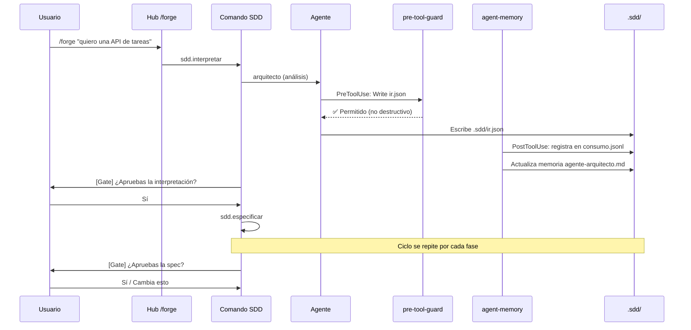

# FORGE — Documentación Oficial del Framework

> **Versión:** 5.0.0 · **Licencia:** MIT · **Runtime:** Claude Code (Anthropic)

---

## Tabla de contenidos

1. [Visión General](#1-visión-general)
2. [Capacidades](#2-capacidades)
3. [Limitaciones](#3-limitaciones)
4. [Arquitectura](#4-arquitectura)
5. [Componentes](#5-componentes)
6. [Configuración](#6-configuración)
7. [Extensibilidad](#7-extensibilidad)
8. [Flujos Operativos](#8-flujos-operativos)
9. [API Pública](#9-api-pública)
10. [Guía para Nuevos Desarrolladores](#10-guía-para-nuevos-desarrolladores)
11. [Análisis de Madurez](#11-análisis-de-madurez)
12. [Recomendaciones](#12-recomendaciones)

---

## 1. Visión General

### Qué es FORGE

FORGE es un **framework de Spec-Driven Development (SDD) + Test-Driven Development (TDD)** que opera exclusivamente dentro de Claude Code (Anthropic). Convierte ideas expresadas en lenguaje natural en software real: especificado, planificado, implementado, probado y verificado por un equipo de 14 agentes de IA especializados que trabajan en paralelo bajo una orquestación centralizada.

No es un asistente conversacional. No es un generador de código simple. Es un **sistema de ingeniería de software completo**, donde cada fase del pipeline produce artefactos verificables y cada decisión queda registrada.

### Misión

> Hacer que cualquier persona técnica —sin ser developer de oficio— pueda construir software propio con el mismo rigor metodológico que un equipo de ingeniería profesional.

FORGE apunta al espacio vacío entre las herramientas sin código (Bubble, Lovable) y los entornos para developers (Cursor, VSCode). Su usuario construye su propia lógica, en su propia arquitectura, con código que le pertenece.

### Tipo de herramienta

| Dimensión | Descripción |
|---|---|
| **Categoría** | Plugin de Claude Code / Framework SDD+TDD |
| **Interfaz principal** | Slash commands (`/forge`, `/sdd.*`) dentro de Claude Code |
| **Runtime host** | Claude Code CLI (Anthropic) |
| **Distribución** | npm (`npx forge init`) |
| **Dependencias en runtime** | Zero — sin `node_modules` en producción |
| **Lenguaje** | Node.js ESM (JS) + TypeScript (type-check únicamente) |

### Casos de uso principales

| Caso de uso | Ejemplo concreto | Perfil de usuario |
|---|---|---|
| API REST desde cero | "Quiero una API para gestionar inventario con autenticación JWT" | CTO técnico, backend novato |
| SaaS MVP | "Necesito un dashboard donde mis clientes vean sus facturas" | Fundador técnico |
| Herramienta CLI | "Automatizar el procesamiento de archivos CSV con flags configurables" | Data scientist |
| Prototipo verificado | Spec → Plan → Código con tests → Criterios de aceptación cumplidos | Product manager técnico |
| Refactoring guiado | Analizar proyecto existente y planificar mejoras con ADRs | Developer junior |

### Perfil de usuario objetivo

**Primario — Técnico no-developer:**
- Entiende qué quiere construir (dominio claro)
- Cómodo con terminal y Node.js básico
- No escribe código de producción por decisión o tiempo
- Quiere un resultado mantenible y testeado, no una plantilla

**Secundario — Developer con metodología:**
- Developer junior/intermedio que quiere aplicar SDD+TDD sin diseñar el proceso desde cero
- Teams que quieren estandarizar su proceso de especificación

---

## 2. Capacidades

### Pipeline SDD+TDD completo (38 comandos)

**Descripción:** FORGE implementa el ciclo completo de desarrollo de software con metodología Spec-Driven Development, desde la idea hasta el despliegue en producción.

**Fases del pipeline:**

| Fase | Comando | Artefacto producido | Estado |
|---|---|---|---|
| Interpretación | `/sdd.interpretar` | `.sdd/ir.json` (IR con confidence ≥0.7) | Producción |
| Descubrimiento | `/sdd.descubrir` | Contexto enriquecido del producto | Producción |
| Diseño | `/sdd.diseñar` | `product-design.json`, wireframes HTML | Producción |
| Especificación | `/sdd.especificar` | `spec.md` con HUs, CAs, RF, NFR | Producción |
| Validación de spec | `/sdd.checklist` | Reporte de completitud | Producción |
| Aclaración | `/sdd.aclarar` | Spec revisada | Producción |
| Planificación | `/sdd.planificar` | Plan técnico + ADRs + arquitectura | Producción |
| Desglose de tareas | `/sdd.tareas` | `estado-tareas.json` (5–20 tareas atómicas) | Producción |
| Implementación | `/sdd.implementar` | Código + tests TDD | Producción |
| QA | `/sdd.qa` | Reporte de calidad | Producción |
| Verificación | `/sdd.verificar` | `verificacion.json` (pass/fail por CA) | Producción |
| Despliegue | `/sdd.desplegar` | App en producción | Beta |

**Componentes involucrados:** 38 archivos en `commands/`, 14 agentes en `agents/`, hooks en `claude-hooks/`

---

### Sistema de 14 agentes especializados

**Descripción:** Cada agente tiene un rol, modelo LLM asignado y conjunto de herramientas específico. Operan con memoria persistente entre sesiones.

| Agente | Modelo | Rol | Tipo de acceso |
|---|---|---|---|
| `arquitecto` | Opus | Decisiones técnicas, ADRs, diseño de sistema | Solo lectura |
| `product-designer` | Opus | UX, user flow, pantallas, alcance MVP | Solo lectura |
| `critico` | Opus | Riesgos, puntos ciegos, deuda técnica | Solo lectura |
| `seguridad` | Opus | Auditoría de vulnerabilidades | Solo lectura |
| `asesor-datos` | Opus | Modelado BD, queries, migraciones | Solo lectura |
| `revisor` | Opus | Code review contra spec y calidad | Solo lectura |
| `desarrollador-backend` | Sonnet | Implementación servidor, APIs | Lectura/escritura |
| `desarrollador-frontend` | Sonnet | UI, componentes, estado cliente | Lectura/escritura |
| `operaciones` | Sonnet | CI/CD, deploy, infraestructura | Lectura/escritura |
| `disenador-api` | Sonnet | Contratos OpenAPI/GraphQL/gRPC | Solo lectura |
| `tester` | Sonnet | Tests unitarios, integración, E2E | Lectura/escritura |
| `architecture-designer` | Sonnet | Stack técnico para MVP | Solo lectura |
| `documentador` | Sonnet | Documentación técnica (opt-in) | Lectura/escritura |
| `investigador` | Sonnet | Análisis de contexto técnico existente | Solo lectura |

**Madurez:** Producción. Todos tienen memoria persistente y restricciones de herramientas implementadas.

---

### Memoria persistente por agente

**Descripción:** Cada agente mantiene archivos de memoria específicos que persisten entre sesiones. El sistema soporta dos backends.

**Backends disponibles:**

| Backend | Requisito | Características |
|---|---|---|
| SQLite | Node.js ≥22.5 | O(log n), índice invertido, queries selectivas |
| Markdown | Node.js ≥18 | O(n), compatibilidad universal, texto plano |

**Mecanismo:**
- Archivos: `.sdd/memoria/agente-{nombre}.md`
- Índice invertido: `.sdd/memoria/indice.jsonl` (append-only)
- Auto-compresión: cuando supera `umbral_bytes` (default 50KB), elimina duplicados
- Recuperación selectiva: `query-memory.js` reduce tokens vs. lectura completa

**Madurez:** Beta (SQLite), Producción (Markdown).

---

### Guardrails de seguridad en tiempo real

**Descripción:** El hook `pre-tool-guard.js` intercepta cada tool call antes de ejecutarse y aplica reglas de seguridad configurables.

**Bloqueos duros (exit 2 — no ejecutable):**
- Comandos destructivos: `rm -rf /`, `git push --force`, `DROP DATABASE`, `chmod 777`
- Credenciales en git config
- Secrets hardcodeados: detecta patrones de OpenAI keys, Slack tokens, GitHub PAT, AWS Access Keys, private keys PEM

**Advertencias (requieren confirmación explícita):**
- `git push`, `npm publish`, `terraform apply`, `kubectl delete`
- Sobreescritura de archivos existentes (configurable)

**Restricciones por agente:**
- 6 agentes de análisis (`arquitecto`, `critico`, `seguridad`, etc.) son estrictamente read-only: no pueden ejecutar `Write`, `Edit` ni `Bash`

**Componente:** `claude-hooks/pre-tool-guard.js` (PreToolUse hook)

**Madurez:** Producción.

---

### Observabilidad completa del pipeline

**Descripción:** Cada acción de cada agente queda registrada en archivos JSONL estructurados.

**Archivos de observabilidad:**

| Archivo | Contenido | Rotación |
|---|---|---|
| `.sdd/observabilidad/consumo.jsonl` | Telemetría: ts, agente, tool, archivo, bytes, provider, effort_level | Cada 10MB → `.1`, `.2`, `.3` |
| `.sdd/observabilidad/mutaciones.jsonl` | Cambios de agentes: qué archivo, qué agente, timestamp | Sin rotación automática |
| `.sdd/observabilidad/agent-tool-audit.jsonl` | Auditoría de accesos a herramientas | Sin rotación automática |
| `.sdd/arquitectura/ADRs.jsonl` | Decisiones arquitectónicas extraídas de comentarios `// ADR: {...}` | Sin rotación |

**Dashboard web:** `forge ui` abre `localhost:3001` con 4 vistas en tiempo real (Pipeline, Tareas, Verificación, Actividad).

**Madurez:** Producción (JSONL), Beta (Dashboard).

---

### Templates de inicio rápido

**Descripción:** 3 templates pre-configurados que reducen el tiempo hasta el primer resultado de >10 minutos a <5 minutos.

| Template | Tipo | IR pre-generado | Spec pre-generada |
|---|---|---|---|
| `api-rest` | REST API con JWT + CRUD | ✅ confidence 0.85 | ✅ 3 HUs, 7 RF |
| `cli-tool` | CLI con subcomandos y output coloreado | ✅ confidence 0.88 | ✅ 3 HUs |
| `saas-mvp` | SaaS con auth + dashboard + CRUD | ✅ confidence 0.82 | ✅ 5 HUs (recurso principal como placeholder) |

**Uso:** `npx forge init --template api-rest`

**Componentes:** `presets/templates/`, función `aplicarTemplate()` en `cli/index.js`

**Madurez:** Beta.

---

### Integración nativa con CLAUDE.md

**Descripción:** Al inicializar, FORGE registra su presencia en el `CLAUDE.md` del proyecto de forma idempotente, añadiendo comandos, archivos del sistema e instrucciones de interpretación.

**Comportamiento:**
- Si `CLAUDE.md` existe → añade o actualiza sección `## FORGE` sin sobreescribir el resto
- Si no existe → crea archivo con sección FORGE mínima
- `forge doctor` verifica que la sección existe y está en la versión correcta

**Madurez:** Beta.

---

### Registro multi-LLM (observabilidad)

**Descripción:** `model-registry.js` detecta providers disponibles (Anthropic, OpenAI, Google) via variables de entorno y registra qué provider usaría cada agente en `consumo.jsonl`.

**Aclaración importante:** Esta funcionalidad es actualmente **observabilidad, no routing real**. Claude Code no expone un mecanismo para cambiar el modelo de invocación de un agente en tiempo de ejecución desde un hook. El registry registra qué proveedor se usaría, pero el modelo real de cada agente está definido en su frontmatter `.md`.

**Roadmap:** Routing real planificado para v5.1 cuando Claude Code exponga el mecanismo de override.

**Madurez:** Experimental.

---

### Integración con MCPs externos

**Descripción:** FORGE puede operar con MCPs instalados en Claude Code para extender sus capacidades.

| MCP | Skill asociada | Capacidad |
|---|---|---|
| Vercel | `skills/deploy-vercel/` + `skills/vercel-deploy/` | Deploy automático desde el pipeline |
| GitHub | `skills/github-connect/` (9 archivos) | Gestión de repositorios, PRs, workflows |
| Figma | Referenciado en docs | Importar especificaciones de diseño |
| Playwright | `.mcp.json` (incluido) | Browser testing en E2E |

**Madurez:** Beta (Vercel, GitHub), Experimental (Figma).

---

### Sistema de design systems

**Descripción:** 5 sistemas de diseño pre-construidos que los agentes pueden aplicar durante la implementación de UI.

| Sistema | Estética |
|---|---|
| `bold-brutalist` | Fuerte, contrastado, tipografía dominante |
| `editorial-minimal` | Limpio, espaciado, contenido primero |
| `neutral-modern` | Profesional, corporativo, accesible |
| `vibrant-consumer` | Colorido, energético, consumer-facing |
| `warm-editorial` | Cálido, cercano, narrativo |

**Componentes:** `design-systems/`, skill `elegir-direccion`, agente `product-designer`

**Madurez:** Beta.

---

## 3. Limitaciones

### Qué NO puede hacer actualmente

#### Routing real de modelos LLM

El sistema registra qué modelo debería usar cada agente, pero no puede cambiarlo en tiempo de ejecución. El modelo efectivo está definido en el frontmatter del archivo `.md` de cada agente y Claude Code no expone actualmente un mecanismo de override desde hooks.

**Impacto:** Los providers OpenAI y Google aparecen en `consumo.jsonl` como "disponibles" si tienen API key, pero todos los agentes usan Anthropic en la práctica.

#### Apps móviles nativas

FORGE puede generar código de aplicaciones web responsive, pero no genera proyectos nativos iOS/Android (Swift, Kotlin/Jetpack Compose). Está en el roadmap v3.0.

#### Ejecución sin Claude Code

FORGE no funciona fuera de Claude Code. Es un plugin del host, no una herramienta standalone. Sin Claude Code instalado y autenticado, ningún comando funciona.

**Dependencias críticas:**
- Claude Code CLI instalado y en PATH
- Cuenta Anthropic activa con créditos API
- Node.js ≥18 (CLI), ≥22.5 para backend SQLite

#### Indexación de TypeScript y JSX

El hook `ast-indexer.js` usa `acorn` para parsear AST, que solo soporta JavaScript estándar. Proyectos en TypeScript (.ts, .tsx) o JSX (.jsx) fallarán silenciosamente en la indexación — los archivos existirán pero no aparecerán en el índice AST.

#### Verificación automática de importaciones TypeScript

El guardrail `verify_local_imports` de `pre-tool-guard.js` solo verifica imports relativos en JavaScript. TypeScript path aliases, `tsconfig.paths`, o imports de módulos npm no se verifican.

#### Despliegue sin MCP externo

`/sdd.desplegar` genera las instrucciones y configuración de despliegue, pero el despliegue efectivo a Vercel o similar requiere el MCP correspondiente instalado en Claude Code. Sin el MCP, el usuario recibe instrucciones manuales.

#### Colaboración multi-usuario simultánea

El estado del pipeline se almacena en `.sdd/estado.json` — un archivo único sin sistema de bloqueo o merge. Dos sesiones simultáneas de Claude Code sobre el mismo directorio pueden producir conflictos de estado.

#### Ruteo automático entre providers en caso de fallo

Si la API de Anthropic falla, FORGE no tiene fallback automático a OpenAI o Google. La sesión se interrumpe.

#### Límites de tamaño de proyecto

La memoria por agente se auto-comprime cuando supera `umbral_bytes` (default 50KB), pero en proyectos con muchos archivos (>500 archivos, >100K líneas) el índice AST y la telemetría pueden crecer significativamente y degradar la velocidad de recuperación en el backend Markdown.

---

## 4. Arquitectura

### Visión de alto nivel

```
┌─────────────────────────────────────────────────────────────────────────┐
│                          CLAUDE CODE (host runtime)                      │
│                                                                          │
│  Usuario                                                                 │
│     │                                                                    │
│     │  /forge "idea" ──────────────────────────────────────────────┐    │
│     │                                                               │    │
│  ┌──▼──────────────────────────────────────────────────────────┐   │    │
│  │                    FORGE Hub (/forge)                        │   │    │
│  │               commands/forge.md                              │   │    │
│  │   routing natural language → SDD commands                   │   │    │
│  └──────────────────────────┬───────────────────────────────────┘   │    │
│                             │                                        │    │
│  ┌──────────────────────────▼───────────────────────────────────┐   │    │
│  │              38 Comandos SDD (commands/sdd.*.md)             │   │    │
│  │  interpretar → diseñar → especificar → planificar →          │   │    │
│  │  implementar → verificar → desplegar                         │   │    │
│  └──────────────────────────┬───────────────────────────────────┘   │    │
│                             │                                        │    │
│         ┌───────────────────┴───────────────────────┐               │    │
│         │                                           │               │    │
│  ┌──────▼──────────────────┐    ┌──────────────────▼─────────────┐  │    │
│  │   14 Agentes            │    │   26 Skills                    │  │    │
│  │  agents/*.md            │    │   skills/*/SKILL.md            │  │    │
│  │                         │    │                                │  │    │
│  │  [Opus]                 │    │  modo-guiado                   │  │    │
│  │  · arquitecto           │    │  explicame                     │  │    │
│  │  · product-designer     │    │  effort-router                 │  │    │
│  │  · critico              │    │  github-connect                │  │    │
│  │  · seguridad            │    │  vercel-deploy                 │  │    │
│  │  · asesor-datos         │    │  observabilidad-consumo        │  │    │
│  │  · revisor              │    │  compresion-tokens             │  │    │
│  │                         │    │  wireframe-mvp                 │  │    │
│  │  [Sonnet]               │    │  … 18 más                      │  │    │
│  │  · desarrollador-back   │    └────────────────────────────────┘  │    │
│  │  · desarrollador-front  │                                         │    │
│  │  · tester               │                                         │    │
│  │  · operaciones          │                                         │    │
│  │  · disenador-api        │                                         │    │
│  │  · investigador         │                                         │    │
│  │  · architecture-designer│                                         │    │
│  │  · documentador         │                                         │    │
│  └─────────────────────────┘                                         │    │
│                                                                      │    │
│  ┌───────────────────────────────────────────────────────────────┐  │    │
│  │              4 Hooks transversales                             │  │    │
│  │                                                                │  │    │
│  │  PreToolUse:                    PostToolUse:                   │  │    │
│  │  · pre-tool-guard.js            · agent-memory.js             │  │    │
│  │    (guardrails + secrets)         (memoria + ledger)          │  │    │
│  │                                 · post-write-conventions.js   │  │    │
│  │                                   (convenciones de código)    │  │    │
│  │                                 · ast-indexer.js              │  │    │
│  │                                   (índice AST de JS/TS)       │  │    │
│  └───────────────────────────────────────────────────────────────┘  │    │
│                                                                      │    │
└──────────────────────────────────────────────────────────────────────┘    │
                              │                                              │
              ┌───────────────▼──────────────────┐                          │
              │        .sdd/ (estado local)       │                          │
              │  ├── estado.json (pipeline step)  │◄─────────────────────────┘
              │  ├── ir.json                      │
              │  ├── sdd.config.yaml              │
              │  ├── especificaciones/            │
              │  ├── arquitectura/ADRs.jsonl      │
              │  ├── memoria/agente-*.md          │
              │  ├── memoria/indice.jsonl         │
              │  ├── observabilidad/consumo.jsonl │
              │  └── observabilidad/mutaciones.jsonl│
              └────────────────────────────────────┘
```

### Flujo de datos entre componentes



### Patrones de diseño identificados

| Patrón | Dónde se aplica | Propósito |
|---|---|---|
| **Pipeline con gates** | 38 comandos SDD | Puntos de aprobación humana entre fases críticas |
| **Observer (hooks)** | PreToolUse/PostToolUse | Interceptar cada tool call sin modificar el agente |
| **Strategy** | Backends de memoria (SQLite/Markdown) | Intercambiable sin cambiar la lógica de uso |
| **Registry** | `model-registry.js` | Mapa de provider/tier por agente |
| **Chain of Responsibility** | `pre-tool-guard.js` | Reglas de guardrail evaluadas en cascada |
| **Append-only log** | `consumo.jsonl`, `mutaciones.jsonl` | Trazabilidad sin escrituras destructivas |
| **Rotation** | JSONL → `.1`, `.2`, `.3` | Bounded storage sin pérdida de historial reciente |
| **Handoff** | Frontmatter de comandos SDD | Transiciones automáticas entre comandos con prompt pre-cargado |

---

## 5. Componentes

### Hub de comandos (`commands/forge.md`)

**Propósito:** Punto de entrada único para el usuario no-developer. Recibe lenguaje natural y enruta al comando SDD correcto.

**Responsabilidades:**
- Detectar intención del usuario (crear, continuar, verificar, desplegar, etc.)
- Aplicar modo guiado o experto según perfil configurado
- Mantener lenguaje humano — nunca exponer jerga técnica al usuario en modo guiado
- Gestionar alias especiales: `/forge.explicame`, `/forge.desplegar vercel`, `/forge.compartir`

**Entradas:** Texto libre del usuario en Claude Code

**Salidas:** Delegación al comando SDD correspondiente con contexto pre-cargado

**Tabla de routing:**

| El usuario dice | Comando interno |
|---|---|
| "quiero construir X" | `sdd.interpretar [idea]` |
| "continúa", "sigue" | `sdd.implementar continuar` |
| "¿cómo voy?", "qué falta" | `sdd.estado` |
| "despliega", "publícalo" | `sdd.desplegar` |
| "explícame", "¿qué sigue?" | skill `explicame` |
| "comparte el progreso" | skill `share-progress` |
| "despliega en vercel" | skill `deploy-vercel` |

---

### Comandos SDD (`commands/sdd.*.md`)

**Propósito:** 38 archivos Markdown que definen el comportamiento de cada fase del pipeline. Claude Code los lee como instrucciones de sistema para la sesión.

**Estructura de cada comando:**
```yaml
---
description: "[Descripción de una línea]"
allowed-tools: [Read, Write, Bash, Glob, Grep]
handoffs:
  - etiqueta: "Siguiente paso"
    comando: "sdd.planificar"
    prompt: "Procede con la planificación técnica"
---

# /sdd.comando

## VERIFICACIONES PRE-EJECUCIÓN
[Bash: verifica estado.json, prerequisitos]

## INSTRUCCIONES
[Texto de instrucción para el agente de Claude Code]

## SALIDA ESPERADA
[Formato del artefacto que debe producirse]
```

**Dependencias:** `estado.json` (lee pipeline step actual), agentes correspondientes, skills invocadas

---

### Sistema de agentes (`agents/*.md`)

**Propósito:** 14 especialistas con roles, modelos y restricciones de herramientas definidas. Cada uno opera con memoria persistente de sesiones anteriores.

**Estructura de cada agente:**
```yaml
---
name: arquitecto
description: "Diseña la arquitectura técnica y toma decisiones de stack"
model: claude-opus-4-8
color: "#6ea8fe"
tools: ["Read", "Glob", "Grep"]   # Solo lectura
---

# Arquitecto

## Mentalidad
[YAGNI, reversibilidad, sin sobre-ingeniería]

## Proceso
1. Cargar memoria: cat .sdd/memoria/agente-arquitecto.md
2. CAPA 0: estado global (200 tokens)
3. CAPA 1: spec activa si existe (300-400 tokens)
4. CAPA 2: contexto arquitectónico completo (500+ tokens)
```

**Patrón de carga de memoria (3 capas):**
- CAPA 0 (200 tokens): estado pipeline + config global
- CAPA 1 (300 tokens): spec activa del proyecto
- CAPA 2 (500+ tokens): contexto arquitectónico completo

---

### Hook de guardrails (`claude-hooks/pre-tool-guard.js`)

**Propósito:** Intercepta cada tool call antes de ejecutarse. Protección en tiempo real.

**Entradas:** JSON desde stdin con esquema PreToolUse:
```json
{
  "tool_name": "Bash",
  "tool_input": { "command": "rm -rf node_modules" }
}
```

**Salidas:**
- `exit 0` → Herramienta permitida
- `exit 2` → Herramienta bloqueada (Claude Code aborta la acción)
- `stderr` → Mensaje explicando por qué se bloqueó

**Configuración** (via `forge.config.json`):
```json
{
  "guardrails": {
    "write_safety": true,
    "verify_local_imports": false
  }
}
```

---

### Hook de memoria (`claude-hooks/agent-memory.js`)

**Propósito:** Persiste el contexto de cada agente entre sesiones y mantiene el ledger de observabilidad.

**Entradas:** JSON desde stdin con esquema PostToolUse:
```json
{
  "tool_name": "Write",
  "tool_input": { "file_path": "src/api.js", "content": "..." },
  "tool_response": "File written successfully"
}
```

**Salidas (archivos escritos):**
- `.sdd/memoria/agente-{nombre}.md` — Contexto del agente
- `.sdd/observabilidad/consumo.jsonl` — Entrada de telemetría
- `.sdd/arquitectura/ADRs.jsonl` — Si detecta comentarios `// ADR: {...}`
- `.sdd/observabilidad/mutaciones.jsonl` — Registro del cambio

**Módulos internos:**
- `model-registry.js` — Resuelve provider/tier para el registro
- `query-memory.js` — Recuperación selectiva de memoria
- `ast-query.js` — Queries sobre el índice AST

---

### Interfaz TypeScript (`core/`)

**Propósito:** Contratos de tipos para los artefactos principales. No se compila en runtime — solo type-check.

**Tipos principales:**

```typescript
// ir.types.ts
interface IR {
  id: string;
  confidence: number;          // 0.0–1.0; ≥0.7 = ready to proceed
  product: {
    name: string;
    type: 'saas'|'web'|'api'|'cli'|'mobile'|'other';
    value_proposition: string;
    target_users: string;
  };
  features: {
    core: string[];            // 2–5 items MVP
    nice_to_have?: string[];
  };
  requires_clarification: boolean;
  estimated_complexity: 'baja'|'media'|'alta';
}

// project-memory.ts
interface ForgeEstado {
  schemaVersion?: "1.0";
  pipeline_step?: 'idea'|'ir'|'design'|'spec'|'plan'|'tasks'|'code'|'done';
  spec_activa?: string;
  plan_activo?: object | null;
  ir_generado?: boolean;
  ultima_actualizacion?: string;
}
```

**Verificación:** `npm run typecheck` ejecuta `tsc --noEmit` sin generar output.

---

### Dashboard UI (`ui/`)

**Propósito:** Servidor local zero-deps con 4 vistas en tiempo real del estado del pipeline.

**Servidor:** `ui/server.js` — HTTP nativo Node.js, solo loopback (127.0.0.1:3001), cierre automático a 30 minutos.

**Endpoints:**

| Endpoint | Fuente | Descripción |
|---|---|---|
| `GET /estado` | `.sdd/estado.json` | Pipeline step actual |
| `GET /tareas` | `.sdd/estado-tareas.json` | Lista de tareas con estados |
| `GET /verificar` | `.sdd/verificacion.json` | Resultado de la última verificación |
| `GET /consumo` | `consumo.jsonl` (últimas 50 líneas) | Telemetría raw |
| `GET /actividad` | `consumo.jsonl` (formateado) | Feed legible: hora, agente, tool, bytes |

**Frontend:** `ui/index.html` — SPA vanilla JS, polling cada 3–5 segundos, 4 pestañas.

---

### CLI (`cli/index.js`)

**Propósito:** Instalador y punto de entrada de terminal. Zero-deps — no requiere `node_modules` instalados.

**Comandos disponibles:**

```bash
forge init                    # Instala FORGE en el proyecto actual
forge init --global           # Instala para todos los proyectos
forge init --template <name>  # api-rest | cli-tool | saas-mvp
forge init --guided           # Wizard interactivo de configuración
forge init --preset <name>    # lean | startup | enterprise
forge init --ui               # Incluye dashboard
forge update                  # Actualiza núcleo sin tocar .sdd/
forge doctor                  # Diagnóstico completo
forge ui [--port N]           # Abre dashboard en navegador
forge config show             # Muestra sdd.config.yaml
forge config get <key>        # Lee valor específico
forge config set <key> <val>  # Modifica valor
forge config validate         # Valida estructura del config
forge --version               # Versión instalada
```

---

## 6. Configuración

### Variables de entorno

| Variable | Propósito | Requerida |
|---|---|---|
| `OPENAI_API_KEY` | Habilita registro de OpenAI como provider en consumo.jsonl | No (opcional) |
| `GOOGLE_API_KEY` / `GEMINI_API_KEY` | Habilita registro de Google como provider | No (opcional) |
| `CLAUDE_AGENT_NAME` | Identifica el agente actual al hook de memoria | Automática (Claude Code) |
| `FORGE_UI_PORT` | Puerto del dashboard UI (default: 3001) | No |

### `sdd.config.yaml` — Configuración del proyecto

Ubicación: `.sdd/sdd.config.yaml` (por proyecto) o `~/.claude/sdd.config.yaml` (global)

**Tabla completa de opciones:**

| Clave | Tipo | Default | Descripción |
|---|---|---|---|
| `idioma` | string | `"español"` | Idioma de los mensajes de agentes |
| `perfil` | `guiado`\|`experto` | `"guiado"` | Modo de interacción |
| `sesion.modo` | `normal`\|`rapido`\|`prototipo` | `"normal"` | Qué agentes se activan |
| `agentes.*.activo` | boolean | `true` | Activar/desactivar agente |
| `agentes.*.modelo` | `opus`\|`sonnet`\|`haiku` | Varía por agente | Modelo LLM del agente |
| `memoria.umbral_bytes` | number | `50000` | Tamaño máximo antes de auto-compresión |
| `memoria.backend` | `sqlite`\|`markdown` | `"markdown"` | Backend de persistencia |
| `memoria.recuperacion_por_defecto` | number | `10` | Entradas recuperadas en cada query |
| `observabilidad.consumo_max_mb` | number | `10` | Tamaño máximo de consumo.jsonl |
| `calidad.cobertura_tests_minima` | number | `80` | Porcentaje mínimo de cobertura |
| `calidad.longitud_funcion_maxima` | number | `50` | Líneas máximas por función |
| `calidad.longitud_archivo_maxima` | number | `400` | Líneas máximas por archivo |
| `comportamiento.requerir_aprobacion_plan` | boolean | `true` | Gate de aprobación del plan |
| `comportamiento.deteccion_tamano_automatica` | boolean | `true` | Ajusta pipeline según tamaño del proyecto |
| `protecciones.no_tocar_archivos` | string[] | `[".env*", "*.key"]` | Archivos que FORGE nunca modifica |
| `protecciones.ramas_protegidas` | string[] | `["main", "master"]` | Ramas en las que no se hace push directo |
| `compresion.modo_salida_usuario` | `lite`\|`normal`\|`full`\|`ultra` | `"lite"` | Verbosidad para el usuario |
| `compresion.modo_agentes_internos` | `lite`\|`normal`\|`full`\|`ultra` | `"ultra"` | Compresión interna entre agentes |

**Modos de sesión:**

| Modo | Agentes activos | Uso recomendado |
|---|---|---|
| `normal` | Todos (14 agentes) | Pipeline completo con crítico, seguridad y ADR |
| `rapido` | Sin `critico` | Ahorra ~30% tokens en proyectos pequeños |
| `prototipo` | Solo desarrolladores y tester | Iteración rápida, sin revisores |

### `forge.config.json` — Configuración de guardrails

Ubicación: raíz del proyecto (opcional)

```json
{
  "memoria": {
    "umbral_compresion_bytes": 40000,
    "max_archivos_agente": 3
  },
  "routing": {
    "usar_complexity_ir": true,
    "complexity_umbral_opus": "high"
  },
  "guardrails": {
    "write_safety": true,
    "verify_local_imports": false
  },
  "ignore_patterns": ["dist/**", "coverage/**"]
}
```

### Presets de configuración

| Preset | Uso | Características |
|---|---|---|
| `lean` | Proyectos personales | Haiku para tareas simples, Sonnet para dev |
| `startup` | MVP ágil | Sonnet como default, Opus solo para arquitectura |
| `enterprise` | Proyectos corporativos | Opus extensivo, todos los guardrails activos, ADR obligatorio |

**Uso:** `forge init --preset startup`

---

## 7. Extensibilidad

### Añadir un nuevo agente

1. Crear `agents/<nombre>.md` con frontmatter:

```yaml
---
name: mi-agente
description: "Descripción breve del rol"
model: claude-sonnet-4-6
color: "#ff6b6b"
tools: ["Read", "Glob", "Grep"]
---

# Mi Agente

## Rol
[Descripción de responsabilidad]

## Proceso
1. Cargar memoria: cat .sdd/memoria/agente-mi-agente.md
2. [Pasos de trabajo]

## Restricciones
[Qué nunca debe hacer este agente]
```

2. Registrar en `.claude-plugin/plugin.json`:
```json
{ "agents": ["mi-agente"] }
```

3. Referenciar desde el comando SDD que lo invocará.

4. Verificar con `npm test` — `consistency.test.js` valida existencia y frontmatter.

---

### Añadir un nuevo skill

1. Crear `skills/<nombre>/SKILL.md`:

```yaml
---
id: mi-skill
nombre: Mi Skill
descripcion: "Qué hace en una línea"
aliases: ["/forge.mi-skill"]
version: 1.0.0
---

# Skill: Mi Skill

## Propósito
[Qué problema resuelve]

## Cuándo activar
[Condiciones de activación]

## Instrucciones para el agente
[Pasos concretos]
```

2. Registrar en `.claude-plugin/plugin.json` bajo `"skills"`.

3. Si tiene alias, añadir a la tabla de routing en `commands/forge.md`.

4. Verificar con `npm test`.

---

### Añadir un nuevo comando SDD

1. Crear `commands/sdd.<nombre>.md`:

```yaml
---
description: "Descripción del comando"
allowed-tools: [Read, Write, Bash]
handoffs:
  - etiqueta: "Siguiente"
    comando: "sdd.siguiente"
    prompt: "Continúa con..."
---

# /sdd.<nombre>

## VERIFICACIONES PRE-EJECUCIÓN
```bash
[ -f ".sdd/estado.json" ] || { echo "FORGE no inicializado"; exit 1; }
```

## INSTRUCCIONES
[Qué debe hacer el agente]

## ACTUALIZAR ESTADO
```bash
# Actualizar pipeline_step en estado.json
```
```

2. Registrar en `.claude-plugin/plugin.json` bajo `"commands"`.

---

### Integrar un MCP externo

1. Añadir el MCP a `.mcp.json`:
```json
{
  "mcpServers": {
    "mi-servicio": {
      "command": "npx",
      "args": ["@mi-org/mcp-servidor@latest"]
    }
  }
}
```

2. Crear el skill que lo usa (`skills/mi-servicio/SKILL.md`), describiendo las herramientas del MCP disponibles.

3. Añadir detección en `forge doctor` en `cli/index.js`:
```javascript
const tieneMiMcp = detectarMcp("mi-servicio");
console.log(`  Mi Servicio: ${tieneMiMcp ? "✅" : "⚠️  no instalado (opcional)"}`);
```

4. Documentar en `docs/INTEGRACIONES.md`.

---

### Añadir un hook de usuario

FORGE soporta hooks personalizados por proyecto en `.sdd/hooks/`:

```bash
# .sdd/hooks/antes_especificar.sh
#!/bin/bash
# Se ejecuta antes de sdd.especificar
echo "Verificando prerequisitos del proyecto..."
[ -f "package.json" ] || { echo "ERROR: necesitas package.json"; exit 1; }
```

Los hooks de usuario se invocan automáticamente si existen. No requieren modificar el código de FORGE.

---

## 8. Flujos Operativos

### Flujo de instalación

```
npx forge init
│
├── 1. Detecta modo: --global, --guided, --template, --preset, --ui
│
├── 2. Verifica Claude Code en PATH
│   └── Si no existe: aviso pero continúa
│
├── 3. Copia núcleo a .claude/
│   ├── commands/ (38 archivos)
│   ├── agents/ (14 archivos)
│   ├── skills/ (26 directorios)
│   └── claude-hooks/ (7 archivos)
│
├── 4. Instala settings.json (registra los 4 hooks)
│   └── Modo: no sobreescribe si ya existe
│
├── 5. Crea estructura .sdd/
│   ├── estado.json (schemaVersion 1.0)
│   ├── sdd.config.yaml (desde --preset o default)
│   ├── memoria/, especificaciones/, arquitectura/
│   ├── observabilidad/, cambios/, hooks/, plantillas/
│   └── .claudeignore
│
├── 6. Si --template: aplica template
│   ├── Copia ir.json pre-generado
│   ├── Copia spec.md pre-generada
│   └── Copia sdd.config.yaml del template
│
├── 7. Integra CLAUDE.md (crea o actualiza sección ## FORGE)
│
├── 8. Si --ui: instala dashboard en .forge-ui/
│
└── 9. Muestra mensaje de onboarding contextual
    └── Con ejemplo específico si hay --template
```

### Flujo principal del pipeline

```
Usuario: /forge "quiero una API para gestionar tareas"
│
├── Hub /forge detecta: "crear nuevo"
│
├── sdd.interpretar
│   ├── arquitecto analiza la idea
│   ├── Genera .sdd/ir.json (confidence ≥0.7)
│   └── [GATE] ¿Apruebas la interpretación? → Sí
│
├── sdd.diseñar
│   ├── product-designer define UX y pantallas
│   ├── architecture-designer define stack técnico
│   └── Genera product-design.json + wireframes HTML
│
├── sdd.especificar
│   ├── arquitecto + product-designer generan spec
│   ├── Genera .sdd/especificaciones/{fecha}/spec.md
│   └── [GATE] ¿Apruebas la spec? → Sí / Cambia esto
│
├── sdd.planificar
│   ├── arquitecto diseña plan técnico
│   ├── asesor-datos define modelo de datos
│   ├── disenador-api define contratos
│   ├── critico revisa riesgos
│   ├── Genera ADRs en .sdd/arquitectura/ADRs.jsonl
│   └── [GATE] ¿Apruebas el plan? → Sí
│
├── sdd.tareas
│   ├── Desglosa plan en 5–20 tareas atómicas
│   └── Genera .sdd/estado-tareas.json
│
├── sdd.implementar
│   ├── desarrollador-backend: código de servidor
│   ├── desarrollador-frontend: UI (si aplica)
│   ├── tester: tests TDD en paralelo
│   ├── seguridad: auditoría de cambios sensibles
│   └── revisor: code review por lote
│
├── sdd.verificar
│   ├── Ejecuta criterios de aceptación de la spec
│   ├── Genera .sdd/verificacion.json
│   └── [GATE] ✅ Todos pasan / ❌ Itera
│
└── sdd.desplegar
    ├── operaciones: configura CI/CD
    ├── Si MCP Vercel disponible: despliega directamente
    └── Si no: genera instrucciones manuales
```

### Flujo de recuperación de errores

```
Error detectado durante la ejecución
│
├── Si error en un agente individual:
│   └── El agente registra en consumo.jsonl y el pipeline continúa
│       (salvo errores que bloqueen el artefacto requerido)
│
├── Si estado.json corrupto:
│   ├── forge doctor detecta el problema
│   ├── ProjectMemory.migrate() intenta reparar
│   └── Si falla: el usuario debe restaurar desde .sdd/SNAPSHOT.md
│
├── Si hook bloqueó una acción (exit 2):
│   ├── pre-tool-guard escribe a stderr la razón
│   ├── Claude Code muestra el mensaje al usuario
│   └── El usuario puede aprobar manualmente si es legítimo
│
└── Si consumo.jsonl supera 10MB:
    └── rotarJSONL() mueve a .1, .2, .3 automáticamente
```

---

## 9. API Pública

### Contratos de hooks (Claude Code)

**PreToolUse — Esquema de entrada:**
```json
{
  "tool_name": "string",
  "tool_input": {
    "command": "string",        // Para Bash/PowerShell
    "file_path": "string",      // Para Write/Edit/Read
    "content": "string"         // Para Write
  }
}
```

**PostToolUse — Esquema de entrada:**
```json
{
  "tool_name": "string",
  "tool_input": { "...igual que PreToolUse..." },
  "tool_response": "string"
}
```

**Exit codes:**
- `0` → Herramienta permitida / procesado correctamente
- `2` → Herramienta bloqueada (solo PreToolUse)

**Documentación:** `docs/COMPATIBILIDAD.md`

---

### Contratos de artefactos

**`ir.json` — Intermediate Representation:**
```json
{
  "id": "string",
  "created_at": "ISO 8601",
  "confidence": 0.85,
  "product": {
    "name": "string",
    "type": "api | saas | web | cli | mobile | other",
    "value_proposition": "string",
    "target_users": "string"
  },
  "features": {
    "core": ["string"],
    "nice_to_have": ["string"]
  },
  "requires_clarification": false,
  "estimated_complexity": "baja | media | alta"
}
```

**`estado.json` — Estado del pipeline:**
```json
{
  "schemaVersion": "1.0",
  "pipeline_step": "idea | ir | design | spec | plan | tasks | code | done",
  "spec_activa": "string | null",
  "plan_activo": "object | null",
  "ir_generado": true,
  "ultima_actualizacion": "ISO 8601"
}
```

**`consumo.jsonl` — Líneas de telemetría:**
```json
{
  "ts": "ISO 8601",
  "agente": "string",
  "tool": "string",
  "archivo": "string",
  "bytes": 1024,
  "provider": "anthropic | openai | google | null",
  "effort_level": "high | medium | low | null"
}
```

**`verificacion.json` — Resultado de verificación:**
```json
{
  "timestamp": "ISO 8601",
  "passed": true,
  "criterios": [
    { "id": "CA-001-01", "descripcion": "string", "passed": true }
  ],
  "fallidos": []
}
```

---

### Slash commands públicos

| Comando | Descripción | Modo |
|---|---|---|
| `/forge "idea"` | Inicia o continúa el pipeline | Guiado + Experto |
| `/forge.explicame` | Explica el estado actual en lenguaje humano | Guiado |
| `/forge.desplegar vercel` | Despliega en Vercel via MCP | Guiado + Experto |
| `/forge.compartir` | Genera resumen Markdown del progreso | Guiado + Experto |
| `/sdd` | Hub técnico (alias avanzado de /forge) | Experto |
| `/sdd.interpretar [texto]` | Interpreta una idea directamente | Experto |
| `/sdd.especificar` | Genera spec desde IR activo | Experto |
| `/sdd.planificar` | Genera plan desde spec activa | Experto |
| `/sdd.implementar` | Inicia implementación | Experto |
| `/sdd.verificar` | Verifica criterios de aceptación | Experto |
| `/sdd.desplegar` | Despliega el proyecto | Experto |
| `/sdd.estado` | Muestra estado actual del pipeline | Ambos |
| `/sdd.ayuda` | Ayuda contextual | Ambos |
| `/sdd.optimizar` | Comprime tokens y optimiza contexto | Ambos |
| `/sdd.snapshot` | Guarda snapshot del estado | Ambos |

---

## 10. Guía para Nuevos Desarrolladores

### Instalación

**Requisitos:**
- Node.js ≥18 (≥22.5 para SQLite backend)
- Claude Code instalado y autenticado (`claude --version`)
- Cuenta Anthropic con créditos API

**Instalación básica:**
```bash
# En el directorio de tu proyecto
npx forge init

# Verificar instalación
npx forge doctor
```

**Con template (recomendado para empezar rápido):**
```bash
# API REST con autenticación JWT
npx forge init --template api-rest

# CLI con subcomandos
npx forge init --template cli-tool

# SaaS MVP con auth y dashboard
npx forge init --template saas-mvp
```

**Con wizard interactivo:**
```bash
npx forge init --guided
# Responde 3 preguntas: perfil, modelo, modo de sesión
```

### Primer uso

Después de `forge init`, abre Claude Code en el directorio y escribe:

```
/forge "describe tu idea aquí"
```

Ejemplos concretos:
```
/forge "una API para que mi equipo registre sus horas de trabajo diarias"
/forge "una CLI que convierta archivos CSV a JSON con validación de esquema"
/forge "un dashboard web donde mis clientes vean el estado de sus pedidos"
```

### Flujo mínimo verificable

```bash
# 1. Instalar con template
npx forge init --template api-rest

# 2. En Claude Code:
# /forge "añade endpoint para búsqueda de tareas por texto"

# 3. Aprobar cada gate que aparezca (spec, plan)

# 4. Verificar resultado
npx forge doctor

# 5. Ver dashboard de progreso
npx forge ui
```

### Buenas prácticas

**Para el pipeline:**
- Lee la spec antes de aprobarla — es el contrato de lo que se construirá
- En proyectos pequeños usa `sesion.modo: rapido` (ahorra ~30% tokens)
- Usa `/sdd.snapshot` antes de pausar sesiones largas

**Para la configuración:**
- Empieza con el preset `lean` y ajusta según necesidad
- No desactives el agente `tester` — genera los tests que verifican tu spec
- Mantén `requerir_aprobacion_plan: true` hasta conocer bien el sistema

**Para la observabilidad:**
- `forge ui` muestra el estado en tiempo real — ábrelo en sesiones largas
- El archivo `consumo.jsonl` te dice cuántos tokens usa cada agente
- Los ADRs en `.sdd/arquitectura/` documentan las decisiones de arquitectura

**Para extensión:**
- Añade hooks de usuario en `.sdd/hooks/` para validaciones específicas de tu proyecto
- Los design systems en `design-systems/` son el punto de partida para customización de UI
- Usa `forge config set agentes.documentador.activo true` para activar el documentador (desactivado por defecto)

---

## 11. Análisis de Madurez

| Área | Clasificación | Justificación |
|---|---|---|
| **Pipeline SDD (38 comandos)** | Producción | Implementación completa, handoffs probados, gates funcionales, documentación extensa |
| **14 agentes especializados** | Producción | Frontmatter estable, memoria por agente operativa, restricciones de herramientas implementadas |
| **Guardrails (pre-tool-guard)** | Producción | 1211 líneas, patrones de detección exhaustivos, configurables, probados en producción |
| **Memoria persistente (Markdown)** | Producción | Backend estable, auto-compresión, índice invertido, recuperación selectiva |
| **Memoria persistente (SQLite)** | Beta | Requiere Node ≥22.5 — incompatible con la mayoría de entornos estándar |
| **Observabilidad (consumo.jsonl)** | Producción | Rotación automática, campos estables, telemetría completa |
| **Dashboard UI** | Beta | Funcional pero sin autenticación, sin WebSockets (polling), sin estado de error robusto |
| **Templates de inicio rápido** | Beta | 3 templates disponibles, IR y spec pre-generados, flujo verificado |
| **Integración CLAUDE.md** | Beta | Idempotente, con versión, actualizable — comportamiento en edge cases no exhaustivamente probado |
| **CLI (forge init/doctor/ui)** | Producción | Zero-deps, multiplataforma (Windows/macOS/Linux), diagnósticos exhaustivos |
| **TypeScript type-check** | Beta | noEmit funcional, tipos estrictos — pero sin compilación ni output de runtime |
| **Registro multi-LLM** | Experimental | Solo observabilidad, no routing real. Dependiente de futuras capacidades de Claude Code |
| **Integración Vercel MCP** | Beta | Skill documentada, skill de skill de usuario — pendiente de pruebas de integración E2E |
| **Integración GitHub MCP** | Beta | Carpeta con 9 archivos — implementación más madura que Vercel |
| **Design systems** | Beta | 5 sistemas disponibles — integración con agentes parcialmente documentada |
| **Tests de contrato (hooks)** | Producción | 15 tests que detectan cambios en la API de Claude Code |
| **Tests de pipeline** | Beta | 18 tests de artefactos — no cubren flujos de usuario E2E |
| **Routing routing Opus/Sonnet/Haiku** | Experimental | Sólo registro. El modelo real está en el frontmatter del agente |

---

## 12. Recomendaciones

### Alta prioridad

**1. Tests de integración E2E del pipeline**

*Impacto:* Crítico para la confianza del sistema. Actualmente los 903 tests cubren infraestructura pero no el flujo de usuario. Una regresión en `sdd.interpretar` que cambia el formato de `ir.json` podría pasar desapercibida.

*Acción:* Crear `tests/e2e/pipeline-flow.test.js` que simule un ciclo completo idea → ir → spec → estado usando fixtures, sin llamar al LLM.

**2. Routing real de modelo LLM**

*Impacto:* La feature más diferenciadora de FORGE (routing Opus/Sonnet/Haiku por criticidad) actualmente no funciona como se documenta. Cuando Claude Code exponga el mecanismo de override, activarlo convierte el registro en routing real sin cambiar la lógica.

*Acción:* Monitorear la API de Claude Code. Cuando esté disponible, `model-registry.js` ya tiene la lógica lista — solo falta el punto de inyección.

**3. Backend SQLite para Node.js estándar**

*Impacto:* Node ≥22.5 es el 15–20% de los entornos. La mayoría usa 18 o 20. Mientras SQLite requiera 22.5, el 80% de usuarios usa Markdown con O(n) — degradación en proyectos grandes.

*Acción:* Evaluar `better-sqlite3` como alternativa con soporte hasta Node 18, o publicar documentación clara sobre la diferencia de rendimiento.

---

### Media prioridad

**4. Indexación de TypeScript y JSX en ast-indexer**

*Impacto:* `acorn` no parsea TypeScript ni JSX. En proyectos TS (la mayoría de proyectos nuevos), el índice AST queda vacío y las búsquedas contextuales de agentes son menos precisas.

*Acción:* Añadir `@babel/parser` o `@typescript-eslint/typescript-estree` como parsers alternativos según extensión del archivo. Mantener `acorn` como fallback para JS puro.

**5. Modo colaborativo básico**

*Impacto:* Dos sesiones simultáneas en el mismo proyecto pueden corromper `estado.json`. Sin locking, el primer desarrollador en escribir gana.

*Acción:* Implementar file locking optimista con `.sdd/estado.lock` y detección de conflictos en `agent-memory.js`.

**6. Verificación de versión de Claude Code en doctor**

*Impacto:* El contrato de hooks puede cambiar con actualizaciones de Claude Code. `forge doctor` debería comparar la versión instalada con la documentada en `COMPATIBILIDAD.md` y advertir si hay discrepancia.

*Acción:* Añadir `claude --version` al diagnóstico y comparar con la versión probada en `docs/COMPATIBILIDAD.md`.

---

### Baja prioridad

**7. WebSockets en el dashboard**

*Impacto:* El polling cada 3–5 segundos introduce latencia visible en cambios rápidos. WebSockets eliminaría el lag pero añade complejidad y una dependencia.

*Acción:* Evaluar Server-Sent Events (SSE) como alternativa zero-dep intermedia.

**8. Marketplace de templates**

*Impacto:* Los 3 templates actuales cubren los casos más comunes. Una comunidad de templates aumentaría la conversión de nuevos usuarios.

*Acción:* Definir el formato de template (ir.json + spec.md + sdd.config.yaml ya están estables) y crear un repositorio de templates de la comunidad.

**9. Documentación en inglés de los comandos SDD**

*Impacto:* Los 38 comandos SDD están en español. La comunidad internacional de Claude Code no puede contribuir ni extender sin barrera de idioma.

*Acción:* Añadir soporte bilingüe al sistema de commands (ya implementado en el docs-site). Los archivos `.md` podrían tener secciones `## EN` y `## ES`.

---

*Documentación generada para FORGE v5.0.0 · Última actualización: 2026-06-21*
