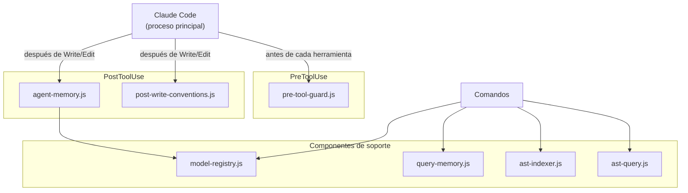
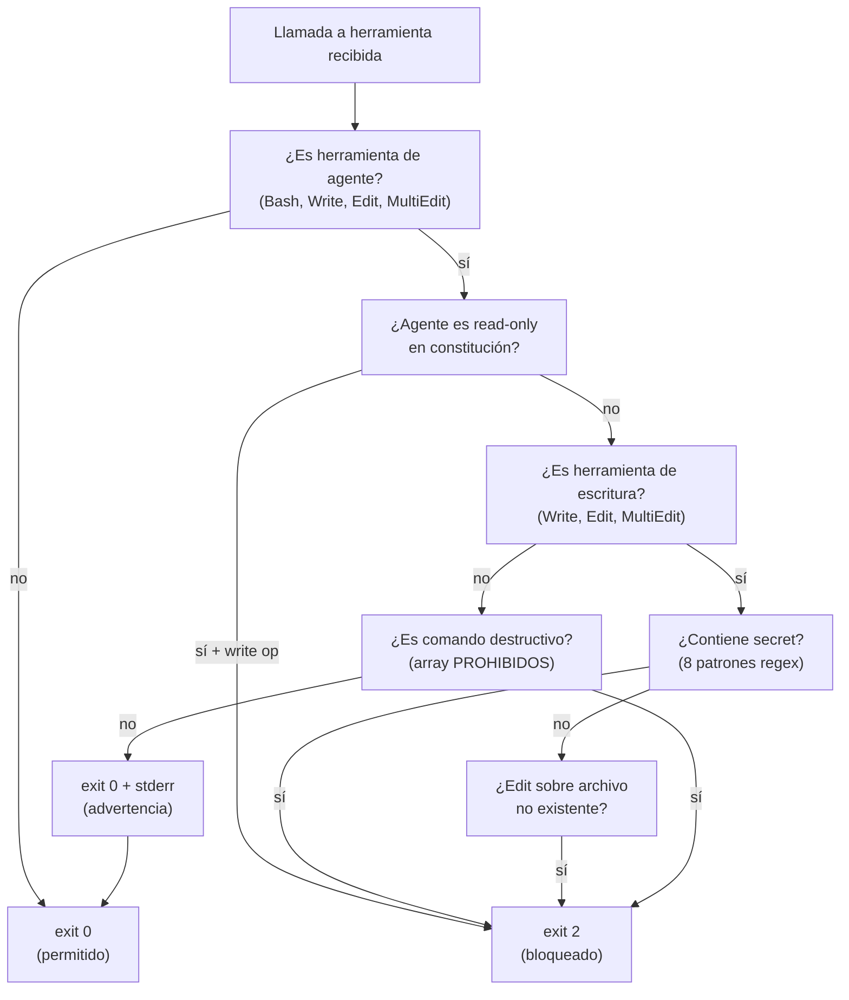
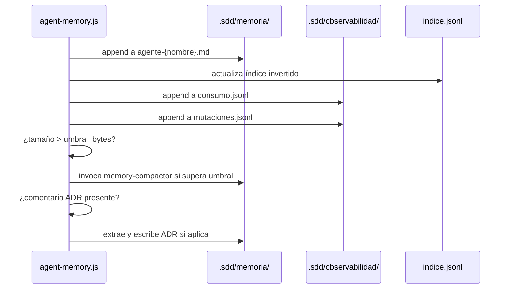
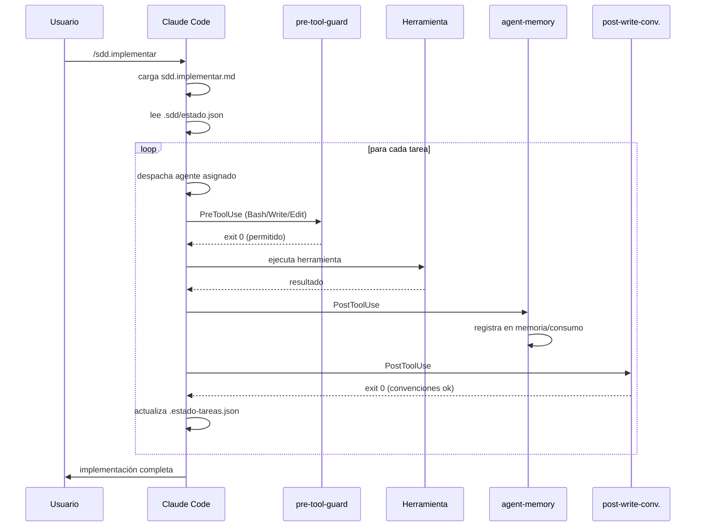

# Runtime

Este documento describe los componentes que se ejecutan en tiempo de ejecución: los hooks de Claude Code, el registro de modelos y el sistema de memoria persistente.

---

## Visión general del runtime



Los componentes del runtime son scripts JavaScript en `.claude/hooks/`. No son servidores — cada ejecución de hook es un proceso de Node.js independiente que inicia, ejecuta su lógica y termina. El estado se comunica exclusivamente a través de archivos en `.sdd/`.

---

## pre-tool-guard.js

### Propósito

Interceptar cada llamada a `Bash`, `Write`, `Edit` y `MultiEdit` antes de que se ejecute, y bloquear operaciones que violarían las restricciones del proyecto.

### Entradas

Recibe un objeto JSON por stdin con la estructura:

```json
{
  "tool_name": "Bash",
  "tool_input": {
    "command": "rm -rf /tmp/test"
  }
}
```

### Lógica de evaluación



### Lista de comandos bloqueados (PROHIBIDOS)

Patrones regex que producen exit code 2:

```javascript
/rm\s+-rf\s+[\/~\.]/,           // rm -rf en rutas peligrosas
/git\s+push\s+.*--force/,       // git push --force
/DROP\s+DATABASE/i,             // DROP DATABASE
/DROP\s+TABLE/i,                // DROP TABLE
/chmod\s+777\b/,                // chmod 777
/chmod\s+-R\s+777\b/,           // chmod -R 777
```

### Detección de secrets (8 patrones)

```javascript
/sk-[a-zA-Z0-9]{32,}/,          // OpenAI API key
/pk-[a-zA-Z0-9]{32,}/,          // API key genérica
/[a-zA-Z0-9]{40}/,              // Token de 40 chars (GitHub PAT, etc.)
/password\s*=\s*["'][^"']{8,}/i, // Password hardcodeado
/secret\s*=\s*["'][^"']{8,}/i,  // Secret hardcodeado
/api_key\s*=\s*["'][^"']{8,}/i, // API key hardcodeada
/Bearer\s+[a-zA-Z0-9._-]{20,}/, // Bearer token
/ghp_[a-zA-Z0-9]{36}/,          // GitHub personal access token
```

### Códigos de salida

| Código | Significado | Efecto |
|--------|-------------|--------|
| `0` | Permitido | La herramienta se ejecuta normalmente |
| `2` | Bloqueado | La herramienta no se ejecuta; el mensaje de stderr se muestra al agente |

---

## agent-memory.js

### Propósito

Registrar automáticamente la actividad de cada agente después de cada escritura o edición de archivo, manteniendo un historial persistente entre sesiones.

### Variables de entorno requeridas

| Variable | Descripción |
|----------|-------------|
| `CLAUDE_AGENT_NAME` | Nombre del agente activo (ej: `"arquitecto"`) |

Si `CLAUDE_AGENT_NAME` no está definida, el hook registra la actividad bajo el nombre `"desconocido"`.

### Entradas

Recibe un objeto JSON por stdin con la estructura:

```json
{
  "tool_name": "Write",
  "tool_input": {
    "file_path": "/proyecto/src/auth/jwt.service.ts",
    "content": "..."
  },
  "tool_response": {
    "success": true
  }
}
```

### Acciones que ejecuta



### Formato de entrada en consumo.jsonl

Cada línea es un objeto JSON:

```json
{
  "timestamp": "2026-06-21T10:15:00Z",
  "agente": "arquitecto",
  "herramienta": "Write",
  "archivo": "src/auth/jwt.service.ts",
  "provider": "anthropic",
  "effort_level": "high",
  "sesion_id": "abc123"
}
```

### Detección de ADRs en código

Si el archivo escrito contiene un comentario con formato `// ADR: {...}`, el hook extrae y materializa el ADR:

```javascript
// ADR: {"titulo": "Pool BD = 20", "decision": "...", "alternativas": [...]}
```

Se crea automáticamente `.sdd/arquitectura/ADR-{n}-{slug}.md`.

### Backend de memoria

| Condición | Backend activo |
|-----------|---------------|
| Node < 22.5 | Markdown (archivos `.md` por agente) |
| Node ≥ 22.5 + `memoria.backend: sqlite` | SQLite (`memoria.db`) |
| Node ≥ 22.5 + `memoria.backend: markdown` | Markdown (forzado) |

---

## post-write-conventions.js

### Propósito

Validar cada archivo recién escrito contra las convenciones detectadas del proyecto y los principios de la constitución. Actúa como un linter semántico que aprende las reglas de tu proyecto leyendo el código existente.

### Qué valida

**Desde la constitución** (`.sdd/memoria/constitucion.md`):
- Restricciones de herramientas prohibidas (`eval`, `exec`, etc.)
- Patrones de seguridad requeridos
- Convenciones de nomenclatura declaradas

**Desde `sdd.config.yaml`**:
- `calidad.longitud_funcion_maxima` — alerta si se supera
- `calidad.longitud_archivo_maxima` — alerta si se supera
- `calidad.permitir_codigo_comentado` — bloquea si está en `false`

**Desde el código existente** (análisis dinámico):
- Convención de quotes (`"` vs `'`)
- Uso de semicolons (`true` / `false`)
- Tipo de indentación (tabs vs espacios) y tamaño
- Patrón de nomenclatura de funciones (camelCase, snake_case)

### Respuestas

| Severidad | Exit code | Efecto |
|-----------|-----------|--------|
| Violación dura (constitución) | `2` | Escritura revertida |
| Advertencia (convención de estilo) | `0` + mensaje stderr | Escritura guardada, agente informado |

---

## model-registry.js

### Propósito

Resolver qué modelo usar para cada agente en función del proveedor disponible y el nivel de esfuerzo requerido.

### Detección de proveedores

Al iniciarse, `model-registry.js` comprueba las variables de entorno:

```javascript
const providers = {
  anthropic: true,  // siempre disponible como fallback
  openai: !!process.env.OPENAI_API_KEY,
  ollama: /* detecta si FORGE_LLM_PROVIDER=ollama */,
};
```

### Tabla de resolución de modelos

| Nivel | Anthropic | OpenAI | Ollama |
|-------|-----------|--------|--------|
| `high` | `claude-opus-4-8` | `gpt-4o` | `qwen2.5-coder:7b` |
| `medium` | `claude-sonnet-4-6` | `gpt-4o-mini` | `llama3` |
| `low` | `claude-haiku-4-5-20251001` | `gpt-4o-mini` | `mistral` |

**Nota:** Google/Gemini no está soportado en v4.2.0. No existe implementación en `core/llm-providers/`.

### Agentes que siempre usan Anthropic

Los siguientes agentes están fijados a Anthropic independientemente de los proveedores disponibles:

- `arquitecto`
- `critico`
- `revisor`
- `seguridad`
- `asesor-datos`
- `product-designer`

Esta restricción no es configurable. Estos agentes toman decisiones que afectan a la seguridad y la arquitectura — la predictibilidad del proveedor es prioritaria sobre el costo.

### Uso desde comandos

Los comandos y skills pueden consultar el registro de modelos para obtener el ID de modelo correcto:

```javascript
// En un hook o script de utilidad
import { resolveModel } from './model-registry.js';

const modelo = resolveModel('desarrollador-backend', 'medium');
// → 'claude-sonnet-4-6' (si solo Anthropic disponible)
// → 'gpt-4o-mini' (si OPENAI_API_KEY está definida y agente no es crítico)
```

---

## query-memory.js

### Propósito

Realizar búsquedas selectivas en la memoria de agentes sin cargar todos los archivos en contexto.

### Cómo funciona

Usa `indice.jsonl` — un índice invertido de términos → entradas de memoria — para recuperar solo las N entradas más relevantes para una consulta dada.

```javascript
// Invocado desde comandos cuando necesitan contexto de memoria
// node claude-hooks/query-memory.js "jwt autenticación" --agente arquitecto --limit 5
```

Salida: las 5 entradas de memoria del agente `arquitecto` más relevantes para "jwt autenticación", sin cargar el archivo completo.

---

## ast-indexer.js y ast-query.js

### Propósito

Generar y consultar índices AST (Abstract Syntax Tree) de archivos JavaScript/TypeScript para navegación estructural sin leer archivos completos.

### ast-indexer.js

Usa `acorn` para parsear archivos JS/TS y extraer:
- Nombres de funciones y sus posiciones
- Exportaciones del módulo
- Importaciones y dependencias
- Clases y sus métodos

El índice se escribe en `.sdd/` y es consultado por `/sdd.mapear`.

### ast-query.js

Permite búsquedas estructurales sobre el índice AST:

```bash
# Encontrar todas las funciones que empiezan con "validate"
node claude-hooks/ast-query.js --pattern "validate*" --type function

# Encontrar todos los archivos que importan 'pg'
node claude-hooks/ast-query.js --import "pg"
```

Estos componentes son invocados por la skill `indexador` y el comando `/sdd.mapear`. No están registrados como hooks automáticos.

---

## El servidor de dashboard (ui/server.js)

### Características de seguridad

- Solo escucha en `127.0.0.1` (loopback) — inaccesible desde la red
- Valida path traversal en todas las rutas de archivos estáticos
- Sin autenticación necesaria (loopback only)
- Se cierra automáticamente tras 30 minutos sin peticiones (`IDLE_TIMEOUT_MS`)
- Solo lectura — no tiene endpoints de escritura

### Endpoints disponibles

| Endpoint | Descripción |
|----------|-------------|
| `GET /` | Dashboard HTML |
| `GET /assets/*` | Archivos estáticos (con protección path traversal) |
| `GET /estado` | Contenido de `.sdd/estado.json` |
| `GET /tareas` | Contenido de `.sdd/estado-tareas.json` o `{tareas:[]}` |
| `GET /verificar` | Contenido de `.sdd/verificacion.json` o `null` |
| `GET /consumo` | Últimas 50 líneas de `consumo.jsonl` |
| `GET /actividad` | Últimas 50 entradas de consumo en formato legible |
| `GET /agentes` | Agentes activos en los últimos 60 segundos |
| `GET /agente/:nombre` | Frontmatter + memoria + actividad reciente del agente |

### Variables de entorno del servidor

| Variable | Predeterminado | Descripción |
|----------|---------------|-------------|
| `FORGE_UI_PORT` | `3001` | Puerto del servidor |

### Iniciar el servidor

```bash
forge ui                    # puerto 3001
forge ui --port 4000        # puerto personalizado
forge ui --no-open          # sin abrir navegador automáticamente
```

---

## Variables de entorno del runtime

| Variable | Componente | Descripción |
|----------|-----------|-------------|
| `CLAUDE_AGENT_NAME` | agent-memory | Nombre del agente activo |
| `OPENAI_API_KEY` | model-registry | Habilita proveedor OpenAI |
| `FORGE_LLM_PROVIDER` | llm-providers | Fuerza proveedor: anthropic, openai, ollama, stub |
| `FORGE_UI_PORT` | ui/server.js | Puerto del dashboard |
| `SDD_AUTO` | cli/index.js | `=1` para bypass de confirmaciones |
| `FIGMA_PAT` | sdd.config.yaml | Token de acceso personal de Figma |

---

## Ciclo de vida de una sesión


