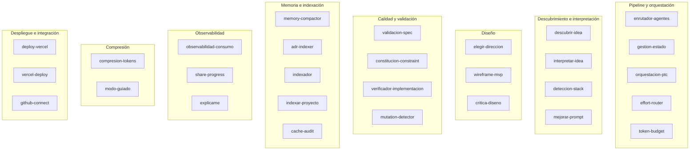

# Herramientas (Skills)

FORGE incluye 29 skills: capacidades reutilizables que los comandos invocan para realizar tareas específicas. Cada skill vive en su propia carpeta dentro de `.claude/skills/` y se define en un archivo `SKILL.md`.

---

## Qué es una skill

Una skill es una capacidad reutilizable encapsulada en un prompt estructurado. Difiere de un comando en que:

- **Los comandos** representan etapas del pipeline — tienen inicio, proceso y salida clara
- **Las skills** son utilidades que un comando puede invocar para hacer parte de su trabajo

Una skill puede ser invocada por múltiples comandos. Por ejemplo, `deteccion-stack` es usada tanto por `/sdd.descubrir` como por `/sdd.analizar`.

---

## Mapa de skills por categoría



---

## Referencia completa de skills

---

### adr-indexer

**Propósito:** Indexar decisiones arquitectónicas extraídas de comentarios en código y mantener el índice de ADRs del proyecto.

**Cuándo se invoca:** Automáticamente por `agent-memory.js` cuando detecta comentarios `// ADR:` en archivos escritos.

**Salida:** Actualización de `.sdd/arquitectura/ADR-*.md` y del índice en `.sdd/INDICE.md`.

---

### cache-audit

**Propósito:** Auditar los archivos de memoria de agentes para detectar oportunidades de aplicar `cache_control` y reducir el costo de tokens en llamadas repetitivas.

**Cuándo se invoca:** Manualmente, cuando se quiere optimizar el uso de caché de prompt.

**Nota:** No está conectado automáticamente al pipeline — requiere invocación explícita.

---

### compresion-tokens

**Propósito:** Aplicar reglas de compresión tipo "caveman" al texto de comandos y respuestas, reduciendo el uso de tokens sin pérdida de significado.

**Reglas típicas:**
- Eliminar artículos redundantes
- Abreviar términos técnicos comunes
- Compactar listas con separadores en lugar de frases completas

**Cuándo se invoca:** En modo `rapido` o `prototipo`, y cuando `compresion.enabled: true` en `sdd.config.yaml`.

---

### constitucion-constraint

**Propósito:** Verificar que una decisión, diseño o fragmento de código no viola ningún principio de la constitución del proyecto.

**Entradas:** Texto o código a evaluar, referencia a `constitucion.md`.

**Salida:** `PASA` o `FALLA` con la lista de principios violados.

**Cuándo se invoca:** Por `revisor`, `seguridad` y `post-write-conventions.js`.

---

### critica-diseno

**Propósito:** Evaluar un wireframe o diseño de pantalla en cinco dimensiones: claridad, usabilidad, consistencia visual, accesibilidad y alineación con el ProductDesign.

**Entradas:** Wireframe HTML o descripción de diseño.

**Salida:** Puntuación 1–5 por dimensión con comentarios específicos.

**Cuándo se invoca:** Por el agente `product-designer` después de generar un wireframe.

---

### deploy-vercel / vercel-deploy

**Propósito:** Desplegar el proyecto a Vercel usando el MCP de Vercel, con pre-checks de calidad y verificación post-despliegue.

**Pre-checks:**
- Tests pasando
- Variables de entorno configuradas
- Build exitoso localmente

**Post-deploy:**
- Health check del endpoint principal
- Verificación de que el despliegue está activo

**Cuándo se invoca:** Por el comando `/sdd.desplegar` cuando el destino es Vercel.

**Nota:** Existen dos skills (`deploy-vercel` y `vercel-deploy`) con estructura similar. Ambas apuntan al MCP de Vercel — es una redundancia conocida en la versión actual.

---

### descubrir-idea

**Propósito:** Ejecutar el formulario de discovery de cinco preguntas para extraer la intención real del usuario a partir de una descripción vaga.

**Las cinco preguntas:**
1. ¿Para quién es esto? (usuarios objetivo)
2. ¿Qué problema resuelve? (problema central)
3. ¿Cómo lo resuelven hoy? (solución actual)
4. ¿Qué hace que tu solución sea diferente? (propuesta de valor)
5. ¿Qué debería poder hacer alguien en su primera sesión? (MVP mínimo)

**Salida:** Respuestas estructuradas que alimentan a `interpretar-idea`.

---

### deteccion-stack

**Propósito:** Detectar automáticamente el stack tecnológico actual de un proyecto leyendo sus archivos de configuración.

**Archivos inspeccionados:**
- `package.json` → lenguaje, framework, dependencias
- `requirements.txt` / `pyproject.toml` → Python stack
- `go.mod` → Go modules
- `Dockerfile` → runtime de contenedor
- `*.config.{js,ts}` → herramientas de build

**Salida:** Objeto estructurado con `lenguaje`, `framework`, `base_de_datos`, `tests`, `despliegue`.

---

### effort-router

**Propósito:** Recomendar el nivel de esfuerzo (`low`, `medium`, `high`) y el modelo apropiado para cada fase del pipeline y cada agente.

**Tabla de referencia:**

| Fase | Nivel recomendado | Justificación |
|------|------------------|--------------|
| Descubrimiento | medium | Requiere comprensión contextual |
| Especificación | high | Decisiones de largo plazo |
| Planificación | high | Arquitectura crítica |
| Implementación (estratégico) | high | Opus para decisiones |
| Implementación (código) | medium | Sonnet para ejecución |
| Tests | medium | Sonnet es suficiente |
| Verificación | high | Opus para revisión final |

---

### elegir-direccion

**Propósito:** Presentar al usuario las cinco direcciones visuales disponibles y guiarlo para elegir una.

**Las cinco direcciones:**

| Dirección | Descripción |
|-----------|-------------|
| `minimal` | Espacio en blanco generoso, tipografía limpia, paleta reducida |
| `bold` | Tipografía grande, contrastes fuertes, energía visual |
| `warm` | Colores tierra, textura, sensación humana |
| `editorial` | Inspirado en revistas, jerarquía tipográfica fuerte |
| `brutalist` | Bordes visibles, rejilla expuesta, sin ornamentos |

---

### enrutador-agentes

**Propósito:** Decidir qué agente o agentes activar dado el tipo de tarea descrita.

**Entradas:** Descripción de la tarea, contexto del pipeline, lista de agentes activos.

**Lógica:** Mapeo semántico entre tipo de tarea y rol de agente. Si múltiples agentes son candidatos, decide si despachar secuencialmente o en paralelo.

---

### explicame

**Propósito:** Traducir el estado técnico actual del proyecto a lenguaje llano, sin jerga.

**Salida típica:**
```
El proyecto está en la fase de implementación.
Se completaron 8 de 12 tareas.
El agente "desarrollador-backend" está trabajando en la autenticación.
Queda aproximadamente 1 hora de trabajo.
```

**Cuándo se invoca:** Por `/sdd.estado` en modo `guiado`.

---

### gestion-estado

**Propósito:** Leer y actualizar `estado.json` y `.estado-tareas.json` de forma segura entre sesiones.

**Operaciones:**
- Leer el estado actual
- Actualizar `pipeline_step`
- Marcar tarea como completada/fallida
- Inicializar estado para una nueva spec

---

### github-connect

**Propósito:** Conectar el proyecto a GitHub: crear el repositorio remoto, configurar el remote y hacer el push inicial.

**Requisitos:** Variable de entorno `GITHUB_TOKEN` con permisos `repo`.

**Pasos:**
1. Crear repositorio via GitHub API
2. `git remote add origin {url}`
3. `git push -u origin main`

---

### indexador / indexar-proyecto

**Propósito:** Generar mapas estáticos del proyecto: estructura de directorios, símbolos exportados, dependencias entre módulos.

**`indexador`** — índice general (estructura + metadatos)
**`indexar-proyecto`** — índice AST de archivos JS/TS via `acorn`

**Salida:** `.sdd/INDICE.md` + datos para `ast-query.js`.

---

### interpretar-idea

**Propósito:** Transformar la salida del discovery en un IR estructurado (`ir.json`) con puntuación de confianza.

**Proceso:**
1. Parsear las respuestas del discovery
2. Inferir features core vs. nice-to-have
3. Calcular `confidence` (0.0–1.0)
4. Identificar ambigüedades que requieren aclaración
5. Escribir `ir.json`

→ Ver [Conceptos fundamentales — El IR](core-concepts.md#el-requisito-interpretado-ir) para el formato completo.

---

### mejorar-prompt

**Propósito:** Transformar una descripción vaga del usuario en una versión más clara, específica y accionable antes de pasarla al pipeline.

**Ejemplo:**
```
Entrada:  "hacer una app de recetas"
Salida:   "Aplicación web para gestionar recetas personales con búsqueda
           por ingredientes, lista de compras automática y modo offline.
           Usuarios objetivo: cocineros amateur, uso personal."
```

---

### memory-compactor

**Propósito:** Compactar archivos de memoria de agentes cuando superan el umbral de bytes configurado, preservando las entradas recientes y condensando las antiguas.

**Estrategia:**
- Mantiene las últimas N entradas intactas (recientes)
- Condensa entradas antiguas en un resumen por período
- Preserva todos los ADRs, nunca se comprimen

**Cuándo se activa:** Automáticamente desde `agent-memory.js` cuando `tamaño_archivo > memoria.umbral_bytes`.

---

### modo-guiado

**Propósito:** Adaptar la comunicación del pipeline al modo guiado: lenguaje llano, sin jerga, confirmaciones simples.

**Tabla de traducciones:**

| Término técnico | Traducción en modo guiado |
|----------------|--------------------------|
| `IR` | "resumen estructurado de tu idea" |
| `spec` | "documento de requisitos" |
| `ADR` | "registro de una decisión importante" |
| `pipeline_step: tasks` | "estamos desglosando el trabajo en pasos pequeños" |
| exit code 2 | "FORGE detuvo esta acción porque podría causar problemas" |

---

### mutation-detector

**Propósito:** Detectar cambios en archivos entre sesiones para hacer tracking de calidad y detectar regresiones.

**Cuándo se invoca:** Por `agent-memory.js` al registrar una escritura. Compara el hash del archivo nuevo con el del archivo anterior.

**Salida:** Entrada en `mutaciones.jsonl` con archivo, agente, timestamp y tipo de cambio (creación/modificación).

---

### observabilidad-consumo

**Propósito:** Generar un reporte legible de la actividad de agentes: invocaciones, archivos modificados, agentes más activos, picos de actividad.

**Cuándo se invoca:** Por el dashboard y por `/sdd.retro`.

**Salida típica:**
```
Resumen de actividad (última sesión):
  - 47 escrituras de archivo
  - Agente más activo: desarrollador-backend (23 escrituras)
  - Archivos más modificados: src/auth/ (12 cambios)
  - Duración estimada: 38 minutos
```

---

### orquestacion-ptc

**Propósito:** Despachar múltiples agentes en paralelo usando Programmatic Tool Calling (herramienta `Task`) y agregar sus resultados.

**Cuándo activa:** Cuando el comando decide que múltiples tareas son independientes entre sí y pueden ejecutarse simultáneamente.

**Protocolo de agrupación:**
1. Identifica tareas independientes
2. Despacha en paralelo via `Task`
3. Cada agente responde con `PASA/FALLA + diff mínimo`
4. El orquestador agrega los resultados
5. Reporta el resultado consolidado

**Beneficio:** Reducción de ~85% en tokens de orquestación.

---

### share-progress

**Propósito:** Generar un resumen compartible del estado del proyecto en Markdown, listo para copiar en un mensaje o reporte.

**Incluye:**
- Etapa actual del pipeline
- Porcentaje de completado
- Últimas 5 acciones realizadas
- Próximos pasos

---

### token-budget

**Propósito:** Estimar el presupuesto de tokens restante para completar las etapas pendientes del pipeline.

**Entradas:** Etapa actual, tareas pendientes, modelos asignados a cada tarea.

**Salida:** Estimación de tokens y costo aproximado para completar el pipeline.

---

### validacion-spec

**Propósito:** Validar que una especificación cumple los mínimos de calidad antes de proceder a la planificación.

**Criterios de validación:**
- Al menos 3 criterios de aceptación
- Ningún criterio contiene `[NECESITA_ACLARACION]` sin resolver
- Existe un alcance de MVP definido
- El modelo de datos está esbozado (si aplica)
- No hay contradicciones internas

**Salida:** `VÁLIDA` o lista de problemas que deben corregirse.

---

### verificador-implementacion

**Propósito:** Verificar el código implementado contra los criterios de aceptación de la spec activa.

**Proceso:**
1. Lee la spec activa y extrae criterios de aceptación
2. Para cada criterio, busca evidencia de implementación en el código
3. Clasifica cada criterio: `CUMPLIDO` / `PARCIAL` / `NO_CUMPLIDO`
4. Genera el reporte `verificacion.json`

---

### wireframe-mvp

**Propósito:** Generar un wireframe HTML de la pantalla P0 (la más importante del MVP) basado en el ProductDesign.

**Salida:** Archivo HTML con la estructura básica de la pantalla, sin estilos de producción pero con elementos y flujo correcto.

**Cuándo se invoca:** Por `product-designer` durante `/sdd.diseñar`.

---

## Crear una skill personalizada

Para añadir una skill que FORGE no incluye, crea el directorio y archivo:

```
.claude/skills/
└── mi-skill/
    └── SKILL.md
```

Estructura mínima de `SKILL.md`:

```markdown
# mi-skill

## Propósito
Descripción en una oración de qué hace esta skill.

## Cuándo invocar
Condiciones bajo las que un comando o agente debe invocar esta skill.

## Entradas
- `entrada_1`: descripción
- `entrada_2`: descripción

## Proceso
Instrucciones detalladas de lo que debe hacer la skill.

## Salida
Descripción del artefacto o resultado producido.
```

→ Ver [Extender FORGE](extending-forge.md) para el formato completo y ejemplos.
