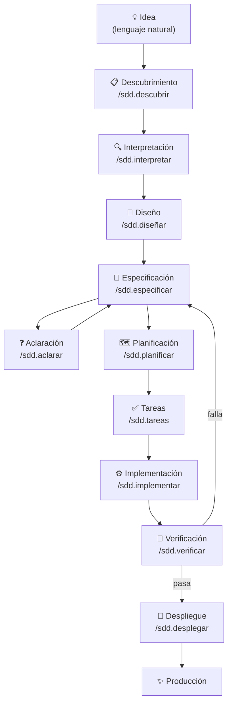
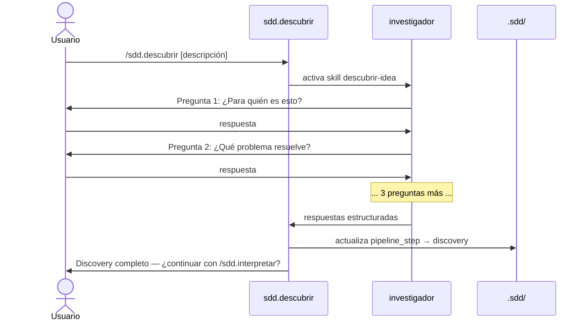
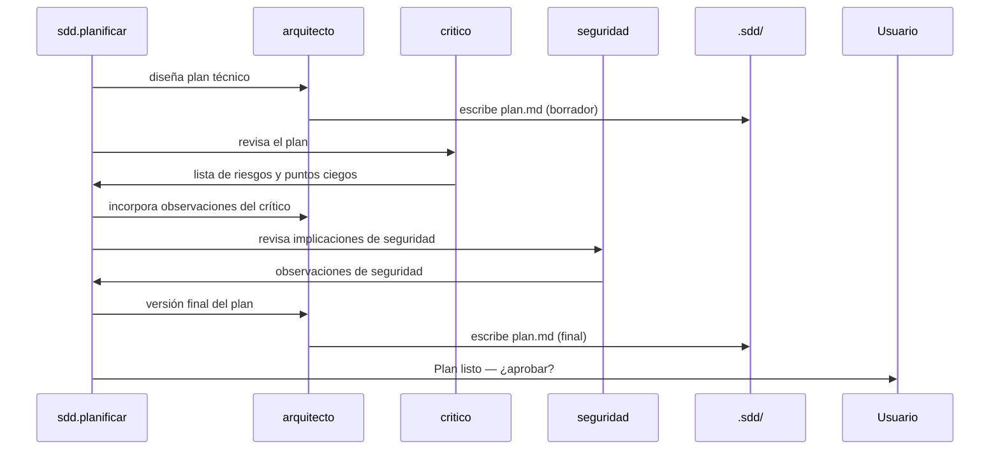
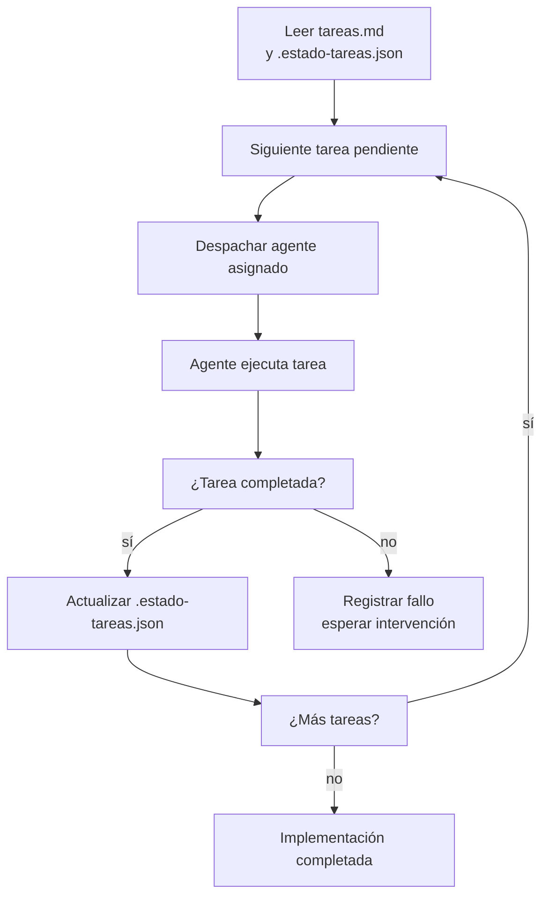
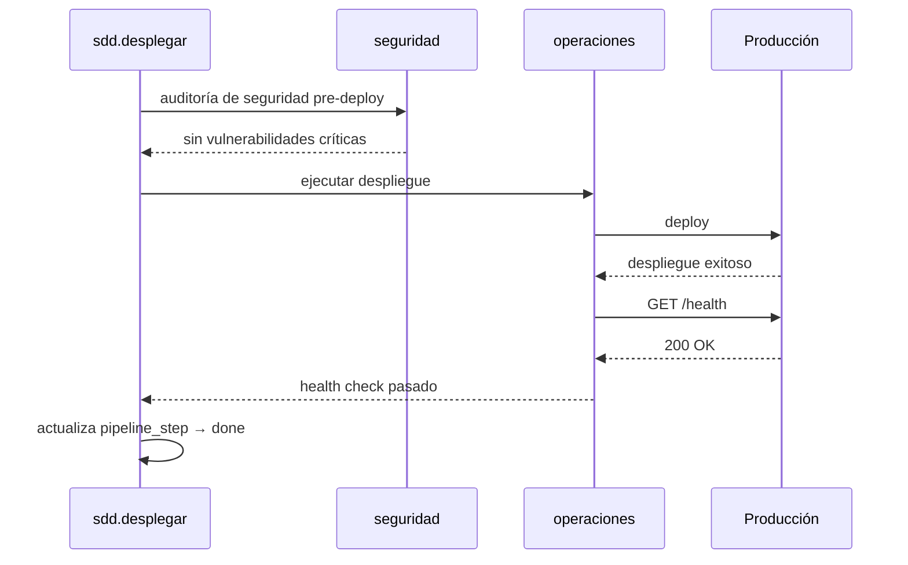

# Flujos de trabajo

Este documento describe cada etapa del pipeline de FORGE, los comandos disponibles, sus flags, entradas, salidas y cuándo usarlos.

---

## El pipeline completo



---

## Etapa 1 — Descubrimiento

### `/sdd.descubrir`

**Propósito:** Extraer la intención real del usuario desde una descripción inicial que puede ser vaga o incompleta.

**Agente:** `investigador`

**Proceso:**



**Salida:** Respuestas estructuradas almacenadas temporalmente; `pipeline_step` → `discovery`.

**Cuándo saltarla:** Si ya tienes una descripción detallada, puedes ir directamente a `/sdd.interpretar [descripción]` o a `/sdd.especificar` si ya tienes requisitos escritos.

---

### `/sdd.interpretar`

**Propósito:** Transformar la descripción o las respuestas del discovery en un IR estructurado con puntuación de confianza.

**Agente:** `investigador` + skill `interpretar-idea`

**Salida:** `.sdd/ir.json`

**Flags:**

| Flag | Descripción |
|------|-------------|
| *(ninguno)* | Lee el resultado del descubrimiento previo |
| `[descripción]` | Interpreta directamente desde el texto dado |

**Ejemplo:**
```
/sdd.interpretar plataforma de cursos online con pagos y certificados
```

**Cuándo el IR necesita aclaración:** Si `confidence < 0.7` o `requires_clarification: true`, FORGE sugiere ejecutar `/sdd.aclarar` antes de continuar. Puedes ignorar la sugerencia con `/sdd.diseñar forzar`.

---

## Etapa 2 — Diseño

### `/sdd.diseñar`

**Propósito:** Producir el diseño del producto: pantallas principales, flujo de usuario, dirección visual y stack tecnológico recomendado.

**Agentes:** `product-designer`, `architecture-designer`

**Proceso:**
1. `product-designer` lee el IR y define pantallas P0/P1/P2 y flujo de usuario
2. `architecture-designer` recomienda el stack y estima complejidad
3. La skill `elegir-direccion` presenta las 5 opciones visuales al usuario
4. El resultado se guarda en `product-design.json`

**Salida:** `.sdd/product-design.json`, wireframe HTML de pantalla P0

**Flags:**

| Flag | Descripción |
|------|-------------|
| *(ninguno)* | Flujo completo con elección de dirección visual |
| `aprobar` | Acepta la primera dirección visual propuesta sin preguntar |

---

## Etapa 3 — Especificación

### `/sdd.especificar`

**Propósito:** Producir la especificación del proyecto: criterios de aceptación, modelo de datos, contrato de API y definición de "hecho".

**Agentes:** `arquitecto`, `disenador-api`, `asesor-datos`

**Salida:** `.sdd/especificaciones/{YYYY-MM-DD-slug}/spec.md`

**Estructura de la spec:**

```markdown
# Especificación — TaskFlow Auth

## Criterios de aceptación

### AC-001: Login con email y contraseña
- DADO un usuario registrado
- CUANDO ingresa email y contraseña correctos
- ENTONCES recibe un JWT válido con expiración de 15 minutos
- Y se registra el evento en el log de auditoría

### AC-002: Refresh de token
...

## Modelo de datos
...

## Contrato de API
...

## Definición de "hecho"
- [ ] Todos los criterios de aceptación satisfechos
- [ ] Cobertura de tests ≥ 80%
- [ ] Sin vulnerabilidades de seguridad conocidas
```

**Flags:**

| Flag | Descripción |
|------|-------------|
| *(ninguno)* | Genera spec completa |
| `rapido` | Omite el agente `critico` en la revisión |
| `continuar` | Retoma una spec en progreso |

---

### `/sdd.aclarar`

**Propósito:** Resolver los marcadores `[NECESITA_ACLARACION]` que el proceso de especificación dejó pendientes.

**Proceso:** Para cada marcador, hace una pregunta específica al usuario y actualiza la spec con la respuesta.

**Cuándo se necesita:** Cuando la spec contiene `[NECESITA_ACLARACION]` — FORGE no puede proceder a la planificación hasta que estén resueltos (o se fuerce con `forzar`).

---

### `/sdd.checklist`

**Propósito:** Validar la calidad formal de la spec activa antes de proceder.

**Validaciones:**
- ≥ 3 criterios de aceptación definidos
- Sin marcadores `[NECESITA_ACLARACION]` sin resolver
- Alcance de MVP explícito
- No hay contradicciones entre criterios

---

## Etapa 4 — Planificación

### `/sdd.planificar`

**Propósito:** Producir el plan técnico de implementación: decisiones arquitectónicas, orden de trabajo, estimaciones y asignación de agentes.

**Agentes:** `arquitecto`, `critico`, `seguridad`

**Proceso:**



**Salida:** `.sdd/especificaciones/{id}/plan.md`

**Flags:**

| Flag | Descripción |
|------|-------------|
| *(ninguno)* | Flujo completo con crítica y seguridad |
| `rapido` | Omite agente `critico` |
| `prototipo` | Omite `critico`, `seguridad` y generación de ADRs |
| `aprobar` | Aprueba el plan automáticamente sin pedir confirmación |
| `revisión` | Activa modo de revisión más estricto |

---

### `/sdd.analizar`

**Propósito:** Auditoría cruzada entre la constitución, la spec, el plan y las tareas. Detecta inconsistencias antes de implementar.

**Agentes:** `revisor`, `critico`, `investigador`

**Cuándo usarlo:** Antes de `/sdd.implementar` en proyectos complejos, o cuando sospechas inconsistencias en los artefactos.

---

## Etapa 5 — Desglose de tareas

### `/sdd.tareas`

**Propósito:** Descomponer el plan en tareas atómicas con agente asignado, estimación y orden de ejecución.

**Agente:** `arquitecto`

**Formato de tarea:**

```markdown
## T-001 — Crear schema de base de datos

**Agente:** asesor-datos
**Estimación:** 45 min
**Dependencias:** ninguna
**Archivos afectados:** db/migrations/001_init.sql, src/types/models.ts

Crear el schema inicial de PostgreSQL con las tablas:
- `usuarios` (id, email, password_hash, created_at)
- `sesiones` (id, usuario_id, token, expires_at)
```

**Salida:** `.sdd/especificaciones/{id}/tareas.md`

---

## Etapa 6 — Implementación

### `/sdd.implementar`

**Propósito:** Ejecutar las tareas del plan despachando los agentes asignados a cada una.

**Proceso:**



**Flags:**

| Flag | Descripción |
|------|-------------|
| *(ninguno)* | Ejecuta desde la primera tarea pendiente |
| `continuar` | Reanuda desde el último checkpoint |
| `forzar` | Continúa aunque haya tareas marcadas como fallidas |

**Reanudación:** Si la sesión termina durante la implementación, `/sdd.implementar continuar` retoma desde la última tarea completada.

---

## Etapa 7 — Verificación

### `/sdd.verificar`

**Propósito:** Verificar que el código implementado satisface cada criterio de aceptación de la spec.

**Agentes:** `revisor`, `tester`

**Proceso:**
1. `revisor` lee cada criterio de aceptación
2. Busca evidencia de implementación en el código
3. `tester` ejecuta los tests relevantes
4. Se produce `verificacion.json` con resultado por criterio

**Salida:** `.sdd/especificaciones/{id}/verificacion.json`

**Si falla:** FORGE identifica los criterios no cumplidos y sugiere volver a `/sdd.especificar` para actualizar el alcance, o continuar implementando las partes faltantes.

---

## Etapa 8 — Despliegue

### `/sdd.desplegar`

**Propósito:** Gate de calidad final → despliegue → health check.

**Agente:** `operaciones`, `seguridad`

**Proceso:**



**Plataformas soportadas:** Vercel (skill `deploy-vercel`), Railway, Docker. La plataforma se detecta desde `sdd.config.yaml → control_versiones.despliegue`.

---

### `/sdd.canary`

**Propósito:** Monitoreo post-deploy con seguimiento de latencia y errores en los primeros minutos tras el despliegue.

**Cuándo usar:** Después de `/sdd.desplegar` en entornos de producción críticos.

---

## Comandos de mantenimiento y soporte

### `/sdd.estado`

Dashboard de progreso en texto plano. Muestra el estado actual del pipeline, spec activa, última tarea, modo de sesión.

```
FORGE v4.0.0 — Estado del proyecto

  Pipeline:     implementar (etapa 6/10)
  Spec activa:  2026-06-21-auth-jwt
  Progreso:     T-008 / T-012 (67%)
  Modo:         normal
  Tests:        52/52 ✅
  Último cambio: arquitecto — src/auth/jwt.service.ts (hace 3 min)
```

---

### `/sdd.modo`

Cambiar el modo de sesión sin editar el YAML.

```
/sdd.modo rapido      → activa modo rapido (omite critico)
/sdd.modo prototipo   → activa modo prototipo
/sdd.modo normal      → restaura modo normal
/sdd.modo             → muestra el modo actual
```

---

### `/sdd.configurar`

Visualizar y modificar `sdd.config.yaml` desde Claude Code.

```
/sdd.configurar show                          → muestra yaml completo
/sdd.configurar show agentes                  → solo sección agentes
/sdd.configurar set agentes.arquitecto.modelo opus
/sdd.configurar set sesion.modo rapido
/sdd.configurar set calidad.cobertura_tests_minima 90
```

---

### `/sdd.mapear`

Genera un índice completo del proyecto: estructura de directorios, símbolos, dependencias entre módulos. Útil al comenzar a trabajar en un proyecto existente.

---

### `/sdd.comprimir`

Comprime los archivos de memoria de agentes que superan el umbral de bytes.

```
/sdd.comprimir           → comprime solo los archivos que superan el umbral
/sdd.comprimir aplicar   → comprime todos los archivos de memoria
```

---

### `/sdd.adr`

Gestionar registros de decisiones arquitectónicas manualmente.

```
/sdd.adr nuevo     → crear un ADR
/sdd.adr listar    → ver todos los ADRs del proyecto
/sdd.adr ver ADR-003
```

---

### `/sdd.retro`

Retrospectiva del ciclo de desarrollo completado. Genera un resumen de qué funcionó bien, qué salió mal y qué se puede mejorar, basado en `consumo.jsonl` y `mutaciones.jsonl`.

---

### `/sdd.release`

Gestión de versión semántica y CHANGELOG.

```
/sdd.release patch   → bump de parche (correcciones)
/sdd.release minor   → bump menor (nueva funcionalidad)
/sdd.release major   → bump mayor (cambios incompatibles)
```

---

### `/sdd.snapshot`

Actualiza `SNAPSHOT.md` con una descripción del estado actual del producto, lista de features implementadas y métricas relevantes.

---

### `/sdd.glosario`

Gestionar el glosario del dominio del proyecto (`.sdd/dominio/glosario.md`).

```
/sdd.glosario añadir "tenant" "Organización cliente en arquitectura multi-tenant"
/sdd.glosario buscar jwt
/sdd.glosario listar
```

---

### `/sdd.defect-report`

Reportar y registrar un defecto encontrado en producción. Crea un ticket estructurado que alimenta el siguiente ciclo de especificación.

---

### `/sdd.ayuda`

Guía completa de todos los comandos disponibles, con ejemplos y casos de uso.

---

## Comandos de creación

### `/sdd.crear-agente`

Asistente interactivo para crear un nuevo agente especializado.

→ Ver [Extender FORGE](extending-forge.md).

### `/sdd.crear-app`

Genera una aplicación web o CLI completa desde una descripción. Ejecuta el pipeline completo de forma más automatizada.

### `/sdd.crear-mcp`

Genera un servidor MCP empaquetado como `.mcpb` para distribuir como plugin de Claude Code.

---

## Resumen de todos los comandos

| Comando | Etapa | Requiere aprobación |
|---------|-------|-------------------|
| `/sdd.descubrir` | Discovery | No |
| `/sdd.interpretar` | IR | No |
| `/sdd.diseñar` | Diseño | Sí (dirección visual) |
| `/sdd.especificar` | Spec | Sí |
| `/sdd.aclarar` | Aclaración | No |
| `/sdd.checklist` | Validación | No |
| `/sdd.planificar` | Plan | Sí |
| `/sdd.analizar` | Auditoría | No |
| `/sdd.tareas` | Tareas | Sí (configurable) |
| `/sdd.implementar` | Implementación | No (por tarea) |
| `/sdd.verificar` | Verificación | No |
| `/sdd.desplegar` | Despliegue | **Sí** (siempre) |
| `/sdd.canary` | Monitoreo | No |
| `/sdd.estado` | Utilidad | No |
| `/sdd.modo` | Utilidad | No |
| `/sdd.configurar` | Utilidad | No |
| `/sdd.comprimir` | Utilidad | No |
| `/sdd.adr` | Utilidad | No |
| `/sdd.retro` | Utilidad | No |
| `/sdd.release` | Utilidad | Sí |
| `/sdd.snapshot` | Utilidad | No |
| `/sdd.glosario` | Utilidad | No |
| `/sdd.mapear` | Utilidad | No |
| `/sdd.optimizar` | Utilidad | No |
| `/sdd.optimizar-memoria` | Utilidad | No |
| `/sdd.qa` | QA E2E | No |
| `/sdd.defect-report` | Incidencias | No |
| `/sdd.crear-agente` | Extensión | No |
| `/sdd.crear-app` | Creación | Sí |
| `/sdd.crear-mcp` | Creación | No |
| `/sdd.ayuda` | Documentación | No |
| `/sdd.constitucion` | Configuración | Sí |
| `/sdd.glosario` | Configuración | No |
| `/sdd.importar` | Integración | No |
| `/sdd.exportar` | Integración | No |
| `/sdd.compliance` | Auditoría | No |
| `/compact` | Alias | No |
